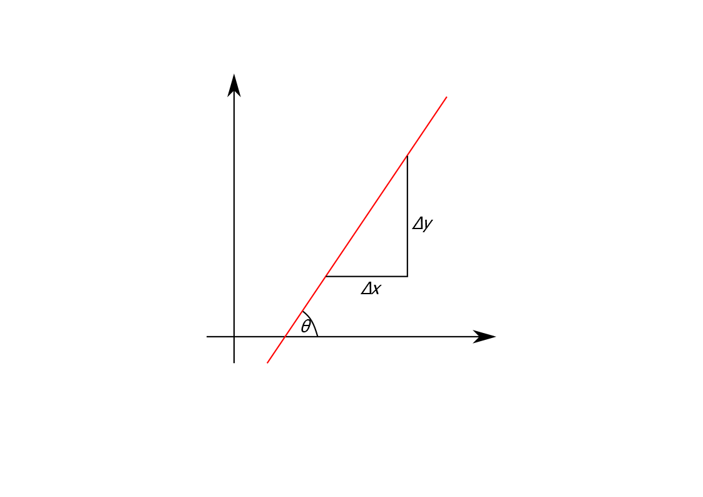
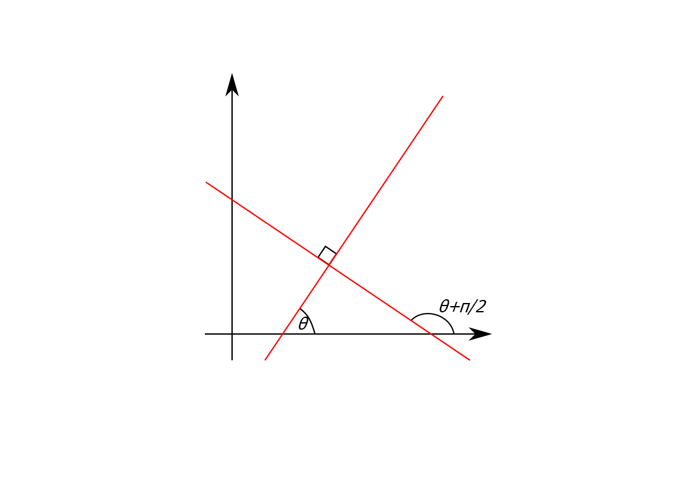
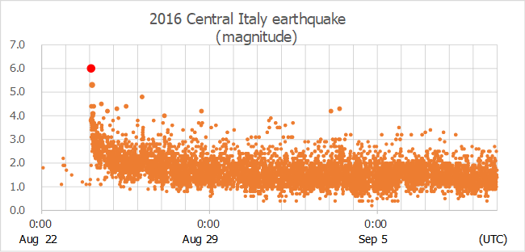
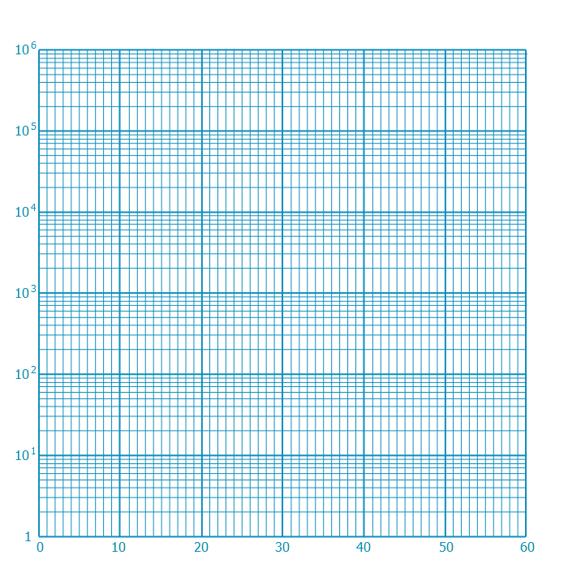

# Functions and Graphs

A function $f$ can be thought of as a machine that takes an input value $x$ and returns an output value $y$. The output value $y$ corresponding to the input $x$ is also denoted by $f(x)$ (read "$f$ of $x$"). We most commonly encounter functions whose input is a real number and output is a real number, but there are many other types of functions in mathematics. We are familiar with plotting such functions on a graph, where we draw the coordinates $(x,f(x))$, or $(x,y)$, against perpendicular axes -- this is known as the *Cartesian coordinate system*. In this section we shall take a look at some useful functions, their graphs, and some of their other interesting properties.

## Lines
Consider the set of coordinates $(x,y)$ that satisfy the equation
$$ax+by+c=0$$
for some fixed values $a,b$ and $c$. When $b\neq0$, solving the equation gives $y=-\dfrac{a}{b}x-\dfrac{c}{b}$, which is of the form
$$y=mx+d$$
i.e. it is a straight line with gradient $m$ which intercepts the $y$-axis at the value $d$.

On the other hand, when $b=0$ we have the solution $x=-\dfrac{c}{a}$. This is a straight vertical line; let's set the constant $A=-\dfrac{c}{a}$, then it is all of the coordinates where $x=A$, and since this equation does not depend on $y$ it includes all possible $y$ values. Note that we cannot write such a line in the form $y=mx+d$, since it effectively has an "infinite" gradient.

We can also have horizontal lines. This corresponds to an equation of the form $y=B$ (this happens when $a=0$ and where we have set $B=-\dfrac{c}{b}$), so that $y$ does not depend on $x$ and equals the constant value $B$ for all possible values of $x$.

```{r, lines, echo=FALSE, fig.cap="A general line $ax+by+c=0$ (red line) a line specified by a gradient and intercept $y=mx+d$ (blue line), a vertical line $x=A$ (green line) and a horizontal line $y=B$ (orange line). Adjust the sliders to change the constants and check which values of $m,d,A,$ and $B$ correspond to $a,b$ and $c$. [[Open graph in browser.]](https://www.desmos.com/calculator/ao47bht5xb)"}
knitr::include_url("https://www.desmos.com/calculator/ao47bht5xb")
```

Specifying a single point $(x_1,y_1)$ and a gradient $m$ is enough to define a (non-vertical) line and we can write the equation of this line as
$$
y-y_1=m(x-x_1).
$$

Also, a line can be defined by specifying any two points $(x_1,y_1)$ and $(x_2,y_2)$ that lie on the line. We can calculate the gradient of this line from
$$
m=\frac{y_2-y_1}{x_2-x_1}
$$
but there is a problem if $x_2=x_1$ and we have an "infinite" gradient -- since $x_1=x_2$ this, of course, corresponds to a vertical line, which we can write as the equation $x=x_1$.

The form $ax+by+c=0$ is a general way to express any line in the plane and includes both vertical and non-vertical lines. The $y=mx+d$ form is useful when thinking about non-vertical lines as we can easily identify the gradient and intercept. In section \@ref(linear) we will be using the more general form for solving simultaneous linear equations.

### Parallel lines

A line makes an angle $\theta$ from the positive $x$-axis, the *angle of inclination*. This is related to the gradient $m$ by
$$
m=\frac{\Delta y}{\Delta x}=\tan(\theta).
$$
Two lines are parallel if they have the same angle of inclination $\theta$, or same gradient $m$.

```{r inclination, echo=FALSE, fig.cap = "The angle of inclination of a line.", fig.alt = "Diagram showing the angle of inclination of a line."}

```

Hence if two (non-vertical) lines are parallel they are of the form
\begin{align*}
y&=mx + d_1\\
y&=mx + d_2
\end{align*}

### Perpendicular lines
	
Two lines are perpendicular, or *normal*, if they meet at a right angle. We have
\begin{align*}
m_1&=\tan(\theta)\quad\text{and,}\\
m_2&=\tan\Big(\theta + \frac{\pi}{2}\Big)=\frac{\sin(\theta + \frac{\pi}{2})}{\cos(\theta + \frac{\pi}{2})}\\
&=\frac{\sin(\theta)\cos(\frac{\pi}{2}) + \cos(\theta)\sin(\frac{\pi}{2})}{\cos(\theta)\cos(\frac{\pi}{2}) - \sin(\theta)\sin(\frac{\pi}{2})}\\
&=\frac{\cos(\theta)}{-\sin(\theta)}\\
&=-\cot(\theta)
\end{align*}

```{r perpendicular, echo=FALSE, fig.cap = "Perpendicular lines.", fig.alt = "Diagram showing a pair of perpendicular lines."}

```

Thus, two (non-vertical) lines are perpendicular if
\begin{equation*}
m_1m_2=-1
\end{equation*}
and hence they have the forms
\begin{align*}
y&=mx + d_1,\\
y&=-\frac{1}{m}x + d_2.
\end{align*}

Alternatively, if we describe a line by $ax+by+c=0$ then
\begin{align*}
ax+by+p&=0\quad\text{is a parallel line}\\
bx+ay+q&=0\quad\text{is a perpendicular line}
\end{align*}
where $p$ and $q$ are constants.

[Exercise: Verify this last statement.]


## Polynomials

A *polynomial* is a function made up of non-negative integer powers of the independent variable $x$ multiplied by constant coefficients, i.e. it has the form

$$f(x)=a_0 + a_1 x + a_2 x^2 + \dotsb + a_n x^n$$

where the fixed numbers $a_0,\dots,a_n$ are the coefficients (which could be positive, negative or zero). For example, the following are all polynomials:
\begin{align*}f(x)&=x^2\\
g(x)&=2+\frac{1}{3}x^4 - x^5\\
h(x)&=-3.6 + x^2 -2x^10
\end{align*}
The number $n$ corresponding to the highest power in the polynomial is called the *order* or *degree* of the polynomial. For the functions $f, g$ and $h$ above the degrees are $2, 5$ and $10$. We have a few special names for polynomials of low degree:

* Degree 1: a *linear* polynomial, since its graph is a line
* Degree 2: a *quadratic* polynomial
* Degree 3: a *cubic* polynomial
* Degree 4: a *quartic* polynomial
* Degree 5: a *quintic* polynomial

The higher the degree of the polynomial, the more "wavey" its graph can be; in fact, a degree $n$ polynomial can have at most $n-1$ turning points.

A polynomial which has only one term is called a *monomial*, for example

$$f(x)=2\\
g(x)=3x^2\\
h(x)=-4x^5
$$

are all monomials.

```{r, polynom, echo=FALSE, fig.cap="A plot of a polynomial of at most degree 5, $f(x)=a_0 + a_1 x + a_2 x^2 + a_3 x^3 + a_4 x^4 + a_5 x^5$. Adjust the sliders to change the coefficients $a_0$ to $a_5$ to get a feel for the possible shapes of a degree 5 polynomial; set the higher degree coefficients to $0$ to look at lower degree polynomials; also take a look at the monomials up to degree 5. [[Open graph in browser.]](https://www.desmos.com/calculator/fxiq9a83fp)"}
knitr::include_url("https://www.desmos.com/calculator/fxiq9a83fp")
```

We are often interested in finding the values of $x$ for which $f(x)=0$, known as the *roots* of a polynomial. We already know how to find roots of a quadratic using the quadratic formula (section \@ref(quad-eqs)). We will now look at the more general *factor theorem* that can help in finding roots of higher degree polynomials.

If we factorise the quadratic equation
$$x^2-3x-10=0$$
we obtain
$$(x+2)(x-5)=0.$$
If the product of two numbers is zero, then either one or both of the numbers must be zero. So the possible roots are
$$(x+2)=0 \quad \implies\quad x=-2$$
or
$$(x-5)=0\quad \implies\quad x=5.$$
More generally, a factor $(x-a)$ corresponds to a root $x=a$. Knowing the factors tells us the roots, and vice versa. It turns out this holds more generally for any degree polynomial.

::: {.theorem #factors name="Factor Theorem"}
The value $x=a$ is a root of the polynomial equation $f(x)=0$ if and only if $(x-a)$ is a factor of the polynomial $f(x)$.
:::

We already have a fool-proof way to solve quadratic equations -- use the quadratic formula. There are also formulae for [cubic](https://en.wikipedia.org/wiki/Cubic_equation#General_cubic_formula) and [quartic](https://en.wikipedia.org/wiki/Quartic_equation#The_general_case) polynomials, but these are a bit more complicated. Furthermore, it turns out it is **impossible** to derive a formula for [quintic](https://en.wikipedia.org/wiki/Abel%E2%80%93Ruffini_theorem) and higher degree polynomials! The factor theorem can be helpful in finding roots of polynomials greater than degree 2. Here is an example.

::: {.example #factorthmcubic name="Factor theorem applied to a cubic polynomial"}
Find the roots of the cubic polynomial $$f(x)=x^3-7x-6.$$

After a little trial and error with small integer values of $x$ we find
$$f(3)=3^3-7(3)-6=0$$
which by the factor theorem implies that $(x-3)$ is a factor. Now applying polynomial division by the factor $(x-3)$ we find
$$\frac{x^3-7x-6}{x-3}=x^2+3x+2$$
so that
$$x^3-7x-6=(x-3)(x^2+3x+2).$$
Now that we have taken out one linear factor we are left with a quadratic factor, which we know how to deal with. Factorising the quadratic factor yields
$$x^3-7x-6=(x-3)(x+1)(x+2).$$
Hence the roots are
$$x=3, x=-1,\,\text{ and } x=-2.$$
:::

## Rational functions

A *rational function* is one that can be expressed as the quotient of two polynomials, for example

$$f(x)=\frac{1+x}{2-x+3x^2}$$

is the quotient of a degree 1 polynomial and a degree 2 polynomial.

They often have values of $x$ where they are undefined due to the denominator evaluating to zero. Furthermore, they often have *asymptotes*, which means the graph approaches a straight line.

For example, the function $f(x)=\frac{x^{2}}{x^{2}-4}$ has asmptotes at the vertical lines $x=2$ and $x=-2$ and at the horizontal line $y=1$.

```{r, asymp, echo=FALSE, fig.cap="A plot of the rational function $f(x)=\\frac{x^{2}}{x^{2}-4}$ (solid red line) and its asymptotes (dashed blue lines). [[Open graph in browser.]](https://www.desmos.com/calculator/m4ssgias64)"}
knitr::include_url("https://www.desmos.com/calculator/m4ssgias64")
```

## Root functions

Taking the $n^\text{th}$ root of a number $\sqrt[n]{x}$ returns the answer to the question "what number multiplied by itself $n$ times equals $x$?". We saw in section \@ref(exponents) that this is the same as taking the power $x^\frac{1}{n}$. Taking the $n^\text{th}$ root can also be thought of as reversing the operation of taking the $n^\text{th}$ power (and vice versa). In this sense, the functions $f(x)=x^n$ and $g(x)=\sqrt[n]{x}$ are *inverse* functions -- they each "undo" the action of the other to return to the original value $x$. If we first apply $f$ and then $g$ (known as the *composition* of $f$ and $g$), or the other way around, then the result is to get back to $x$:

$$g(f(x)) = \sqrt[n]{x^n}=x$$
and
$$f(g(x)) = (\sqrt[n]{x})^n=x.$$

Note that when $n$ is even the root function only makes sense for positive values of $x$, whilst if $n$ is an odd number then it also makes sense for negative values of $x$ (Why? Think about this!). Graphically, the inverse of a function is the reflection in the line $y=x$ (Why?).

```{r, roots, echo=FALSE, fig.cap="The functions $f(x)=x^2$ (red line) $g(x)=\\sqrt{x}$ (blue) are reflections of each other in the line $y=x$ (dashed black). [[Open graph in browser.]](https://www.desmos.com/calculator/j3elzr5cks)"}
knitr::include_url("https://www.desmos.com/calculator/j3elzr5cks")
```


## Trigonometric functions

The three basic trigonometric functions are sine ($\sin$), cosine ($\cos$) and tangent ($\tan$), which we are familiar with from trigonometry for calculations involving angles. We shall explore trigonometry in more detail in section \@ref(trigonometry). For now, we will just look at some of their properties as functions.

Sine and cosine look similar, like "waves", with one graph shifted along the $x$ axis from the other. They oscillate between their maximum value of $1$ and minimum value of $-1$.

```{r, sincos, echo=FALSE, fig.cap="The functions $\\sin(x)$ (red curve) and $\\cos(x)$ (blue dashed line). [[Open graph in browser.]](https://www.desmos.com/calculator/gyj6vrtzbu)"}
knitr::include_url("https://www.desmos.com/calculator/gyj6vrtzbu")
```

In figure \@ref(fig:sincos) we have plotted the functions with the $x$ axis in units of *radians*. This is the natural mathematical choice of units, but in applications we tend to use *degrees*. We'll understand more about radians see how these units are related to degrees in section \@ref(trigonometry). Note the graphs repeat every $2\pi$ radians -- they are *periodic* functions with *period* $2\pi$.
We'll understand more about radians see how these units are related to degrees in section \@ref(trigonometry). Note the graphs repeat every $2\pi$ radians -- they are *periodic functions* with *period* $2\pi$.

The tangent function is defined via sine and cosine as:

\begin{equation}
\tan(x)=\frac{\sin(x)}{\cos(x)}
(\#eq:tan)
\end{equation}

It's graph looks rather different to sine and cosine.

```{r, tangent, echo=FALSE, fig.cap="The function $\\tan(x)$ (green curve). [[Open graph in browser.]](https://www.desmos.com/calculator/ncqey1cfus)"}
knitr::include_url("https://www.desmos.com/calculator/ncqey1cfus")
```

Like sine and cosine it is periodic with period $2\pi$. It is undefined at $x=\frac{\pi}{2}$ (and repeatedly every $2\pi$) since at this value $\cos(\frac{\pi}{2})=0$ so we have division by zero. Close to these points, where we are dividing by a very small value of $\cos$, it takes arbitrarily large positive and negative values and we have a vertical asymptote.

Close to these points, the value of $\cos(x)$ in the denominator of \@ref(eq:tan) is very small, whilst the value of $\sin(x)$ is close to $1$ or $-1$, which results in very large positive or negative values of $\tan(x)$ and we have vertical asymptotes at these points.

## Exponentials and logarithms

An exponential function is one of the form
$$
f(x)=a^x
$$
where the positive number $a$ is called the \emph{base}.

```{r, exponentialfunc, echo=FALSE, fig.cap="The function $f(x)=a^x$ for varying positive values of $a$. [[Open graph in browser.]](https://www.desmos.com/calculator/5d0shgjfag)"}
knitr::include_url("https://www.desmos.com/calculator/5d0shgjfag")
```

The term "exponential growth" corresponds to such functions; this is where the instantaneous rate of change of a quantity is proportional to its current magnitude and this is the characteristic property of exponential functions. More mathematically, the instantaneous rate of change is given by the derivative^[See section \@ref(derivatives).], so we have
\begin{equation}
\frac{d(a^x)}{dx}=ka^x
(\#eq:daxdx)
\end{equation}
where $k$ is the constant of proportionality^[The phrase "exponential growth" is sometimes used in a casual way to talk about anything that increases "quickly", but mathematicians, scientists and engineers are more precise and would only use the term in its strict mathematical sense, as relating to an exponential function!] (which we shall find in section \@ref(derivatives)).

Exponential growth is a common occurance in physical systems, at least in the early stages of a process. For example, it can describe the early stages of population growth well, when there are no limits on resources and a constant birth rate; in reality, limits (on food, space, impact of disease etc.) mean that uncurbed exponential growth cannot take place forever.

Any exponential function with any base $a>1$ will grow faster than any polynomial; although a polynomial can be larger for some small range of $x$ values, eventually the exponential graph will "overtake" the polynomial.

```{r, expvspoly, echo=FALSE, fig.cap="The functions $f(x)=a^x$ for varying $a>1$ (red curve) and the monomial $g(x)=x^n$ for varying power $n$ (blue dashed curve); for any value of $a$ and any value of $n$, if you scroll up far enough you will see that the red curve overtakes the dashed blue curve. [[Open graph in browser.]](https://www.desmos.com/calculator/g22ec0pwpq)"}
knitr::include_url("https://www.desmos.com/calculator/g22ec0pwpq")
```

There is a special value of the base $a$ for which the constant of proportionality is $k=1$. This is known as Euler's number and is denoted as $e$. It is an irrational number (has an infinite, never repeating decimal expansion):

$$e=2.71828182846...$$

The function $e^x$ is referred to as *the natural exponential function* or just *the exponential function*. It is also commonly denoted by $\exp(x)$. Since by definition $k=1$ we have:

$$\frac{de^x}{dx}=1e^x=e^x.$$

The inverse of an exponential function $f(x)=a^x$ is called the *logarithm to the base $a$*, denoted by $\log_a(x)$. Since it is the inverse, the exponential and logarithm "undo" the action of each other, so that
$$\log_a(a^x)=x$$
and
$$a^{\log_a(x)}=x$$.

For the base $a=e$, we call the logarithm $\log_e(x)$ the *natural logarithm* and use the notation

$$\ln(x)=\log_e(x)$$

$\ln(x)$ is usually spoken as *lun x* or *L.N. of x*.

```{r, expln, echo=FALSE, fig.cap="The functions $f(x)=a^x$ for varying $a>1$ (red curve) and the inverse $g(x)=\\log_a(x)$ (blue curve) together with the line $y=x$ to show the symmetry of the function and its inverse. [[Open graph in browser.]](https://www.desmos.com/calculator/wlp8muzfqk)"}
knitr::include_url("https://www.desmos.com/calculator/wlp8muzfqk")
```

In engineering applications it is also common to use base $2$ and base $10$. For base $10$, the following notation is sometimes used

$$\log(x)=\log_{10}(x)$$

but we should always check what the author intends as sometimes $\log(x)$ is used to mean $\ln(x)$. We have the following rules for manipulating logarithms (these follow from the laws of exponents; try to derive them yourself):

::: {.theorem #logrules name="Rules of Logarithms"}

1. $\log_a(xy)=\log_a(x)+\log_a(y)$
2. $\log_a(x^p)=p\log_a(x)$
3. $\log_a(\frac{x}{y})=\log_a(x)-\log_a(y)$
4. $\log_a(1)=0$
5. $\log_a(a)=1$
:::

We can also change between bases in logarithms with the following rule

::: {.theorem #changebase name="Change of Base Rule"}

Let $y=a^x$, then $x=\log_a(y)$. Also, $\log_b(y)=x\log_b(a)$, and so $x=\dfrac{\log_b(y)}{\log_b(a)}$. Therefore,
\begin{equation*}
\log_a(y)=\dfrac{\log_b (y)}{\log_b (a)}.
\end{equation*}
This allows us to calculate $\log_a$ of a number in terms of $\log_b$.
:::

An exponential function with base $a$ can be re-written in any other base $b$ with a constant factor in the argument as follows:
\begin{align*}
a^x&=b^{\log_b (a^x)} \quad \text{(note that $b^{\log_b y}=y$)} \\
&=b^{x\log_b (a)}\\
&=b^{kx},\quad \text{where }k=\log_b(a).
\end{align*}
The "natural" choice of base for mathematical use is $b=e$ and hence we usually only consider exponential functions in the form $e^{kx}$ where $k=\log_b(a)$.

### Logarthmic plots

When we have quatities that change over a large range of magnitudes, it can be more convenient to plot them on a "logarthmic scale" so that they do not take up so much space on the page. For example, the Ricther Magnitude Scale for measuring earthquakes is a logarthmic scale, which takes the logarithm to the base 10 of the amplitude of waves recorded by seismographs.

The following is a "semi-log" plot, where the $y$-axis is the logarithmic scale and the $x$-axis is a (normal) linear scale. This means that every unit moved up along the $y$-axis actually represents a power of 10 increase in the amplitude of the seismograph waves.

```{r earthquake, echo=FALSE, fig.cap = "Magnitude of the August 2016 Central Italy earthquake (red dot) and aftershocks (which continued to occur after the period shown here). From [Wikipedia - Phoenix7777](https://commons.wikimedia.org/w/index.php?curid=50891603).", fig.alt = "Plot showing 2016 Central Italy Earthquake Data."}

```

The logarithmic nature of the scale is sometimes made clearer by labelling the axis with an exponentially increasing scale and drawing in the minor gridlines. In figure \@ref(fig:semilog) the major grid lines on the $y$-axis increase by a power of $10$. The minor grid lines between $1$ and $10$ represent increments of $1$ unit, then the minor grid lines between $10$ and $10^2=100$ represent increments of $10$ units, and so on.

```{r semilog, echo=FALSE, fig.cap = "Semi log graph paper (base 10). From [wikimedia](https://commons.wikimedia.org/w/index.php?curid=79843775).", fig.alt = "Semi log graph paper (base 10)."}

```

## Hyperbolic functions

The hyperbolic functions are defined in terms of the exponential function. They are named after the trigonometric functions due to possessing some similar properties, although their graphs are quite different.

Hyperbolic sine, usually spoken as "shine" is defined as
$$\sinh(x)=\frac{e^x-e^{-x}}{2}$$

Hyperbolic cosine or "cosh" is defined as
$$\cosh(x)=\frac{e^x+e^{-x}}{2}$$

Hyperbolic tangent or "tanch" is defined as
$${\tanh(x)=\dfrac{\sinh(x)}{\cosh(x)}=\dfrac{e^x-e^{-x}}{e^x+e^{-x}}}$$

```{r, hyperbol, echo=FALSE, fig.cap="The functions $\\sinh(x)$ (red curve), $\\cosh(x)$ (blue curve) and $\\tanh(x)$ (green curve). [[Open graph in browser.]](https://www.desmos.com/calculator/xrpc0in171)"}
knitr::include_url("https://www.desmos.com/calculator/xrpc0in171")
```

The usual trigonometric identities also hold for the corresponding hyperbolic functions, except that where ever there is a $\sin^2$ we replace it with a $-\sinh^2$. For example:

\begin{align*}
&\text{Trigonometric}           &\text{Hyperbolic}\\
&\sin^2(x)+\cos^2(x)=1          &\cosh^2(x)-\sinh^2(x)=1          \\
&\sin(2x)=2\sin(x)\cos(x)       &\sinh(2x)=2\sinh(x)\cosh(x)       \\
&\cos(2x)=\cos^2(x)-\sin^2(x)   &\cosh(2x)=\cosh^2(x)+\sinh^2(x)   \\
&1+\tan^2(x)=\sec^2(x)          &1-\tanh^2(x)=\text{sech}^2(x)
\end{align*}

As an example of where these functions arise in the real-world, the shape formed by a flexible cable or chain hanging from its ends under its own weight has the general form
\begin{equation*}
y=a\cosh\left(\frac{x}{a}\right)
\end{equation*}
and is known as a *catenary curve*.

```{r catenary, echo=FALSE, fig.cap = "A chain hanging from points forms a catenary. From [Wikipedia - Kamel15](https://commons.wikimedia.org/w/index.php?curid=5609313)", fig.alt = "A chain hanging from points forms a catenary."}
knitr::include_graphics("figures/Kette_Kettenkurve_Catenary_2008_PD.jpg")
```