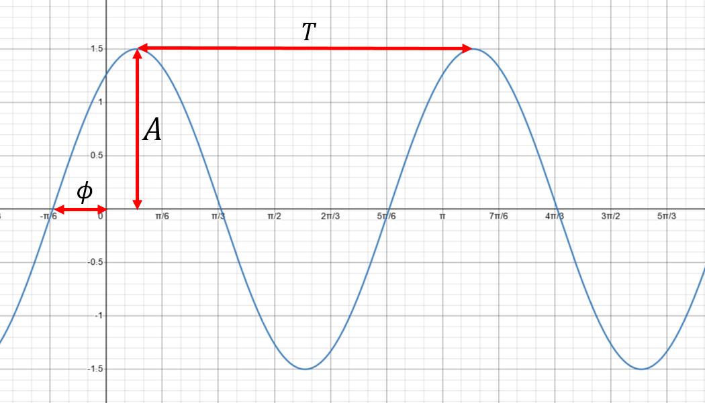

# Trigonometry

## Pythagoras

The most fundamental result in trigonometry is the Pythagorean Theorem:

::: {.theorem #pythag name="Pythagorean Theorem"}


In a right-angle triangle, the *hypotenuse* is the side opposite the right angle.

In any right-angle triangle, the square of the hypotenuse is equal to the sum of the squares of the other two sides.

With reference to figure \@ref(fig:pythag), we have

$$c^2=a^2+b^2$$

```{r pythag, echo=FALSE, fig.cap = "A right-angled triangle with sides $a, b$ and $c$, with $c$ being the hypotenuse.", fig.alt = "A right-angled triangle labelled with sides $a, b$ and $c$, with $c$ being the hypotenuse."}

```
:::

One particular application is finding the distance between two points in a Cartesian coordinate system.

## Degrees and radians

We can measure an angle in two different units: degrees or radians.

In *degrees*, we split a full circle into 360 segments and then call the angle bewteen each segment 1 degree, or $1^\circ$. Of course a full circle is $360^\circ$.

An alternative measure of angle is *radians*. In this case, we start from the fact that the circumference of a circle is given by
$$
C=2\pi r
$$
where $r$ is the radius of the circle. If we had a circle with radius $r=1$, then the circumference is $C=2\pi$. Now we consider this circle to be split into $2\pi$ segments^[Note this is not an integer number of segments! It is approximately 6.283 segments.], with each segment being 1 radian, or $1 \text{ rad}$. A full circle is then $2\pi \text{ rad} = 6.283 \text{ rad}$ (to 3 sig. fig.).

Sometimes it is more convenient to work in degrees, and other times it is more convenient to work in radians. We can easily convert between degrees and radians as follows. If we have an angle $D^\circ$ in degrees, then the corresponding angle in radians $R \text{ rad}$ is:
$$
R \text{ rad}=\frac{2\pi}{360}\times D^\circ
$$
and in the other direction
$$
D^\circ=\frac{360}{2\pi}\times R \text{ rad}.
$$

Where possible, we would state radians as multiples of $\pi$, so in particular:

|Degrees|Radians|
|---|---|
|$360^\circ$|$2\pi\text{ rad}$|
|$270^\circ$|$\frac{3}{2}\pi\text{ rad}$|
|$180^\circ$|$\pi\text{ rad}$|
|$120^\circ$|$\frac{2}{3}\pi\text{ rad}$|
|$90^\circ$|$\frac{\pi}{2}\text{ rad}$|
|$60^\circ$|$\frac{\pi}{3}\text{ rad}$|
|$45^\circ$|$\frac{\pi}{4}\text{ rad}$|
|$30^\circ$|$\frac{\pi}{6}\text{ rad}$|

Note that a scientific calculator will have a button to switch between using degrees and radians: make sure your calculator is in the correct mode!

## Trigonometric ratios

Calculating angles and side lengths of right-angled triangles is of fundamental importance in science and engineering applications.

```{r rh-triangle, echo=FALSE, fig.cap = "A right-angled triangle.", fig.alt = "A right-angled triangle labelled with the angle $\theta$ and corresponding sides: hypotenuse, opposite and adjacent."}

```

Recall that we can calculate relationships between angles and side lengths of a right-angled triangle (as described in figure \@ref(fig:rh-triangle)) using sine, cosine and tangent:

\begin{align*}
\sin(\theta)&=\frac{Opp.}{Hyp.}\\
\cos(\theta)&=\frac{Adj.}{Hyp.}\\
\tan(\theta)&=\frac{Opp.}{Adj.}
\end{align*}

A useful way to remember these relationships is the mnemonic "SOH CAH TOA":

SOH - Sine equals Opposite over Hypotenuse

CAH - Cosine equals Adjacent over Hypotenuse

TOA - Tan equals Opposite over Adjacent

These are most commonly used to determine angles by using the *inverse* functions:

\begin{align*}
\theta&=\sin^{-1}(\frac{Opp.}{Hyp.})\\
\theta&=\cos^{-1}(\frac{Adj.}{Hyp.})\\
\theta&=\tan^{-1}(\frac{Opp.}{Adj.})
\end{align*}

**WARNING**: the notation suggests we are taking $\sin$ to the power $-1$, so that $\sin^{-1}=\frac{1}{\sin}$, but this is NOT how the inverse is defined. Remember that the inverse "undoes" the action of the function. Scientific calculators will have buttons to apply these functions. The inverses are also sometimes called

\begin{align*}
\arcsin&=\sin^{-1},\\
\arccos&=\cos^{-1},\\
\arctan&=\tan^{-1}.
\end{align*}


::: {.example #inversetrig name="Applying inverse trig. functions"}
Calculate the angle $\theta$ in the following triangle.

```{r inversetrigexmp, fig.cap = "A right angled triangle with hypotenuse legth 14 units and adjacent length 8 units.", fig.alt = "A right angled triangle with hypotenuse legth 14 units and adjacent length 8 units."}

```

Since we have the lengths of the hypotenuse and adjacent, we can use $\cos^{-1}$ to find $\theta$. Using a calculator we find

$$\theta=\cos^{-1}\left(\frac{8}{14}\right)=55.15^\circ \text{(to 2 d.p.)}$$
:::


We also have special names for the reciprocal trigonometric functions:

\begin{align*}
\operatorname{cosec}(\theta)&=\frac{1}{\sin(\theta)},\\
\sec(\theta)&=\frac{1}{\cos(\theta)},\\
\cot(\theta)&=\frac{1}{\tan(\theta)}.
\end{align*}

## Sine and cosine rules

The Pythagorean Theorem and Trigonometric ratios above only apply to right-angle triangles. For general triangles, the sine and cosine rules give us useful relationsips between angles and side lengths.

```{r tri, echo=FALSE, fig.cap = "A general triangle with angles $A, B,$ and $C$ and the corresponding opposite sides as $a, b$ and $c$.", fig.alt = "A general triangle with angles $A, B,$ and $C$ and the corresponding opposite sides as $a, b$ and $c$."}

```

::: {.theorem #sinerule name="Sine Rule"}
Label a triangle with angles $A, B,$ and $C$ and the corresponding opposite sides as $a, b$ and $c$ (as in figure \@ref(fig:tri)). Then,

$$\frac{a}{\sin(A)}=\frac{b}{\sin(B)}=\frac{c}{\sin(C)}.$$

This is useful when we have:

1. one side and any two angles, or
1. two sides and an angle (but not the included angle).

:::

::: {.theorem #cosinerule name="Cosine Rule"}
Label a triangle with angles $A, B,$ and $C$ and the corresponding opposite sides as $a, b$ and $c$ (as in figure \@ref(fig:tri)). Then,

\begin{align*}
a^2&= b^2 +c^2 -2bc\cos(A)\quad\text{ or,}\\
b^2&=a^2+c^2-2ac\cos(B)\quad\text{ or,}\\
c^2&=a^2+b^2-2ab\cos(C).
\end{align*}

This is useful when we have:

1. two sides and the included angle, or
2. three sides.

:::


## Trigonometric waveforms

The trigonometric functions often arise in applications in the context of *waves*. Whilst there are different forms of waves, trigonometric waves are arguably the most ubiquitous. 

In general, a function of the form
$$
f(x)=A\sin(\omega x + \phi)
$$
with parameters $A,\omega$ and $\phi$ is known as a *sinusoidal function*.

```{r sinusoid, echo=FALSE, fig.cap = "A sinusoidal wave form plotted in radians.", fig.alt = "A sinusoidal wave form labelled with amplitude $A$, phase $\\phi$ and period $T$."}

```

* $A$ is called the *amplitude* -- this determines the range of values, from $-A$ to $A$;
* $\omega$ is the *angular frequency* -- the rate of change of the sine function argument in units of radians per second or degrees per second;
* $\phi$ is the *phase* -- this determines the offset of the sine function at $x=0$ in units of radians or degrees.
* $T=\frac{2\pi}{\omega}$ is the length of one cycle e.g. measured from peak to peak, or trough to trough. If $x$ represents time, then $T$ is called the *period*. If $x$ represents distance, then $T$ is usually denoted by $\lambda$ and called the *wavelength*.

```{r, sinusoidal, echo=FALSE, fig.cap="The function $f(x)=A\\sin(\\omega x + \\phi)$ (blue curve). [[Open graph in browser.]](https://www.desmos.com/calculator/l0f1omebm2)"}
knitr::include_url("https://www.desmos.com/calculator/l0f1omebm2")
```

## Trigonometric identities

Recall that there are a number of useful relationships between the trigonometric functions. Here are some key ones.


### Pythagorean identities

These follow from the Pythagorean theorem.

\begin{gather*}
\sin^2(\theta)+\cos^2(\theta)=1\\
1+\tan^2(\theta)=\sec^2(\theta)\\
\cot^2(\theta)+1=\operatorname{cosec}^2(\theta)
\end{gather*}

### Compound angle formulae

The following formulae allow us to manipulate sines, cosines and tangents of the sum or difference of two angles.

\begin{align*}
\sin(\theta+\phi)&=\sin(\theta)\cos(\phi)+\cos(\theta)\sin(\phi)\\
\sin(\theta-\phi)&=\sin(\theta)\cos(\phi)-\cos(\theta)\sin(\phi)\\
\cos(\theta+\phi)&=\cos(\theta)\cos(\phi)-\sin(\theta)\sin(\phi)\\
\cos(\theta-\phi)&=\cos(\theta)\cos(\phi)+\sin(\theta)\sin(\phi)\\
\tan(\theta+\phi)&=\frac{\tan(\theta)+\tan(\phi)}{1-\tan(\theta)\tan(\phi)}\\
\tan(\theta-\phi)&=\frac{\tan(\theta)-\tan(\phi)}{1+\tan(\theta)\tan(\phi)}
\end{align*}

### Double angle formulae

Setting $\phi=\theta$ in the compound angle formulae gives the following double angle formulae:

\begin{align*}
\sin(2\theta)&=2\sin(\theta)\cos(\theta)\\
\cos(2\theta)&=\cos^2(\theta)-\sin^2(\theta)\\
\tan(2\theta)&=\frac{2\tan(\theta)}{1-\tan^2(\theta)}
\end{align*}

### Product to sum formulae

From the compound angle formulae we can derive the following.

\begin{align*}
\sin(\theta)\cos(\phi)&=\frac{1}{2}[\sin(\theta+\phi)+\sin(\theta-\phi)]\\
\cos(\theta)\sin(\phi)&=\frac{1}{2}[\sin(\theta+\phi)-\sin(\theta-\phi)]\\
\cos(\theta)\cos(\phi)&=\frac{1}{2}[\cos(\theta+\phi)+\cos(\theta-\phi)]\\
\sin(\theta)\sin(\phi)&=-\frac{1}{2}[\cos(\theta+\phi)-\cos(\theta-\phi)]\\
\end{align*}

### Sum to product formulae

In the other direction (also derived from the compound angle formulae) we have the following.

\begin{align*}
\sin(\theta)+\sin(\phi)=2\sin\left(\frac{\theta+\phi}{2}\right)\cos\left(\frac{\theta-\phi}{2}\right)\\
\sin(\theta)-\sin(\phi)=2\cos\left(\frac{\theta+\phi}{2}\right)\sin\left(\frac{\theta-\phi}{2}\right)\\
\cos(\theta)+\cos(\phi)=2\cos\left(\frac{\theta+\phi}{2}\right)\cos\left(\frac{\theta-\phi}{2}\right)\\
\cos(\theta)-\cos(\phi)=-2\sin\left(\frac{\theta+\phi}{2}\right)\sin\left(\frac{\theta-\phi}{2}\right)
\end{align*}
