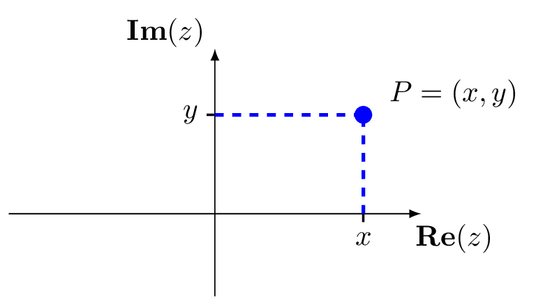
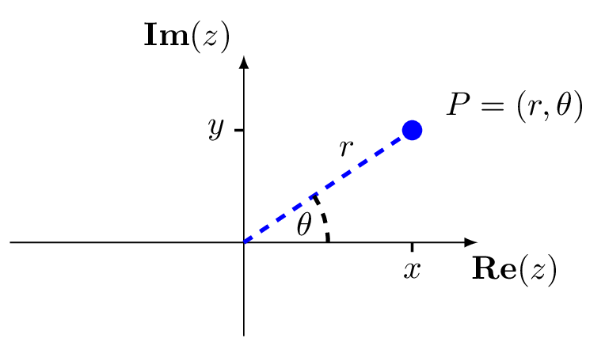
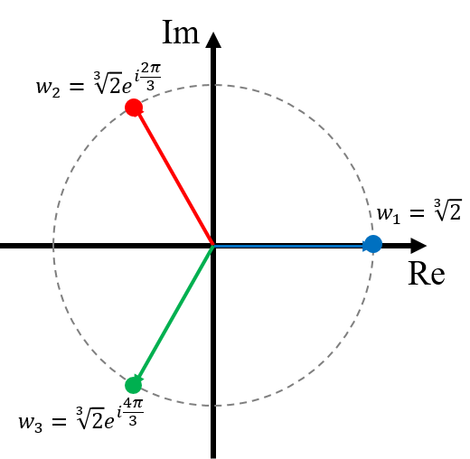

# Complex Numbers {#complex}

We are familiar with integers ($\dots, -5, -4, -3, -2, -1, 0, 1 \dots$), denoted by $\mathbb{Z}$, and rational numbers ($1/2, 4/5$, etc.), denoted by $\mathbb{Q}$. We also know about irrational numbers such as $e$, $\pi$ (the area of a circle with radius equal to $1$) or $\sqrt{2}$ --- one solution of the quadratic equation
$$
x^2 - 2 = 0.
$$
The collection of natural numbers, integers, rational and irrational numbers make up what we call the *real numbers*, denoted by $\mathbb{R}$.

But do we have "enough" numbers? The answer is no! We do not have to look hard for why we do not have enough numbers. The simple equation
$$
x^2 + 1 = 0
$$
does not have real solutions. The answer would be $\pm \sqrt{-1}$, if that would make sense. More generally, the quadratic equation
$$
a x^2 + b x + c = 0, \quad \text{with}\quad b^2 - 4 ac < 0
$$
does not have real number solutions! 

## $i$ and complex numbers

Our fix is to define the *imaginary number* $i$ by^[Engineers often use the notation $j$ instead of $i$.]
$$
i = \sqrt{-1},\quad \text{ so that }\quad i^2 = -1.
$$
With this definition in mind, consider the quadratic equation
$$
x^2 + 4 x + 13 = 0.
$$
Completing the square gives
$$
(x+2)^2 + 9 = 0 \quad \implies \quad
x+2 = \pm \sqrt{-9} = \pm 3 \sqrt{-1} = \pm 3 i \quad \implies \quad
x = 2 \pm 3 i.
$$

This leads us to *Complex Numbers*, denoted by $\mathbb{C}$, defined as the set of all numbers
$$
z = x + i y, \quad \text{where $x$ and $y$ are real numbers}.
$$
This form is also called the *Cartesian representation* of a complex number. It has a *real part* $\mathbf{Re}(z) = x$ and an *imaginary part* $\mathbf{Im}(z) = y$. We can then represent a complex number graphically by plotting the real and imaginary parts as coordinates in a Cartesian coordinate system, as in figure \@ref(fig:complexcart), known as the *complex plane*. The $x$-axis is called the *real axis* and the $y$-axis is called the *imaginary axis*.

```{r complexcart, echo=FALSE, fig.cap = "The complex number $z = x + iy$ in Cartesian coordinates.", fig.alt = "The complex number $z = x + iy$ in Cartesian coordinates."}

```

Note that any real number $x$ can also be considered as a complex number, since it is a complex number that happens to have $0$ imaginary part: $x = x +0i$; it is a complex number that lies on the real axis.

We know from experience that a quadratic equation can have at most 2 roots. Once we have accepted complex numbers as part of our everyday lives, we see that they complete the picture of roots of polynomials.

::: {.theorem #FTA name="Fundamental Theorem of Algebra"}
Every non-zero, complex, single variable, degree $n$ polynomial, has exactly $n$ roots.
:::

To clarify the above theorem, we are talking about a polynomial of the form
$$f(x)=a_0 + a_1 x + a_2 x^2 + \dotsb + a_n x^n$$
where the variable $x$ can be a complex number (so can also be a real number) and the coefficients $a_i$ are complex numbers (so can also be real numbers) and at least one of these coefficients is not $0$. Since we allow the single variable $x$ to be a complex number, the roots may be complex numbers. Note that some of the $n$ roots might be *repeated roots*, for example, according to the theorem the quadratic
$$x^2-4x+4=(x-2)(x-2)$$
must have two roots and in this case they happen to be repeated roots; we say the root is $x=2$ with *multiplicity* 2.

## Complex Arithmetic

We can add, subtract and multiply complex numbers $z = x+iy$ and $w = u+iv$, using usual algebraic rules for expanding brackets --- just remembering that $i^2 = -1$:
\begin{align*}
z + w &= (x + iy) + (u + iv) = (x+u) + i (y+v),\\
z - w &= (x + iy) - (u + iv) = (x-u) + i (y-v),\\
z \times w &= (x + iy) \times (u + iv) = x u + i x v + i yu + i^2 y v = (xu - yv) + i (xv + yu).
\end{align*}

::: {.example #complexarithmetic name="Complex Arithmetic"}
Let $z = 3 - 5i$ (that is, $z = 3 + (-5)i$) and $w = 2 + i$ then
$$
z + w = 5 - 4i, \qquad z - w = 1 - 6i,
$$
and
$$
z\times w = (3 - 5i)\times (2+i) = 6 + 3i - 10i - 5i^2 = 11 - 7i.
$$
Thus $\mathbf{Re}(z\times w) = 11$ and $\mathbf{Im}(z\times w) = -7$.
:::

The *complex conjugate* of $z = x + iy$ is the complex number
$$
\overline{z} = x - iy.
$$
This is the "mirror image" of $z$ in the real axis.

The *modulus* of $z = x + iy$ is
$$
|z| = \sqrt{x^2 + y^2} \qquad \text{(the non-negative square root).}
$$
Geometrically, this is the distance of $z$ (i.e. the point $P$) from the origin -- See figure \@ref(fig:complexcart). Note that if $b = 0$ (so that $z$ is actually a real number), then this definition of $|z|$ agrees with the usual modulus (absolute value) for real numbers.

::: {.example #conjugate name="Complex conjugate"}
For $z = 2 - i$, we have $\overline{z} = 2 + i$ and $|z| = \sqrt{2^2 + (-1)^2} = \sqrt{5}$.
:::

Some properties of modulus and conjugate: For any complex numbers $z, w$,

* $\overline{\overline{z}} = z$;
* $\overline{z \pm w} = \overline{z} + \overline{w}$;
* $\overline{z\times w} = \overline{z}\times \overline{w}$;
* $|z|$ is a positive real number unless $z = 0$ with $|0| = 0$;
* $z\times \overline{z} = |z|^2$;
* $|z\times w| = |z|\,|w|$.

What about division of complex numbers? This is made easy using the complex conjugate as follows:
$$\frac{z}{w}=\frac{z}{w}\frac{\overline{w}}{\overline{w}}=\frac{z\times \overline{w}}{|w|^2}.$$

::: {.example #complexdiv name="Complex division"}
Let $z = 2 + 3i$ and $w = 4 - 2i$.

\begin{align*}
\frac{z}{w}&=\frac{2 + 3i}{4 - 2i}\frac{4+2i}{4+2i}\\
&=\frac{8+4i+12i+6i^2}{16+4}\\
&=\frac{2+16i}{20}\\
&=\frac{1}{10}+\frac{4}{5}i
\end{align*}
:::

A useful fact: if a polynomial has *real* coefficients and has a complex root $z$, then its complex conjugate $\overline{z}$ is also a root; we say that complex roots appear in *complex conjugate pairs* in real polynomials.

## The argument, polar and exponential form for complex numbers

If we think of the complex number $z = x + iy$ as a point $P = z$ in the $(x,y)$-plane, then it is natural to think also of representing $P$ in *polar coordinates* $(r,\theta)$ -- see figure \@ref(fig:complexpolar).

```{r complexpolar, echo=FALSE, fig.cap = "The complex number $z = x + iy$ in polar coordinates.", fig.alt = "The complex number $z = x + iy$ in polar coordinates."}

```

Here, $r = |z| = \sqrt{x^2 + y^2}$ is the distance from the origin $O$ and $\theta$ is the angle between the positive real axis and the line $OP$. We call $\theta$ the *argument* of $z$, denoted $\theta = \arg(z)$. We have that
$$
P = (x,y) \quad \text{(in Cartesian coordinates)}\quad \text{or} \quad
P = (r,\theta) \quad \text{(in Polar coordinates)}
$$
with
$$\begin{array}{rrclcrcl}
& r &=& \sqrt{x^2 + y^2} & \quad\text{and}\quad & \tan(\theta) &=& \frac{y}{x},\\
\text{or} \qquad & x &=& r \cos(\theta) & \quad\text{and}\quad & y &=& r \sin(\theta).
\end{array}$$

Therefore, we can recover the Cartesian coordinates of $P$ from the polar form $(r, \theta)$ of a complex number $z$ as
$$
z = r \cos(\theta) + i (r \sin(\theta)) = r (\cos(\theta) + i \sin(\theta)),
$$

::: {.theorem #euler name="Euler's formula"}
For any real number $\theta$,
$$
e^{i\theta}=\cos (\theta) + i \sin(\theta).
$$
:::

This can be derived from the power series of $e^\theta, \sin(\theta)$ and $\cos(\theta)$. Eulers formula allows us to write any complex number $z$ in yet another form, the *exponential form* of $z$:
$$
z = r (\cos (\theta) + i \sin (\theta)) = re^{i\theta}.
$$

Note that since $\sin$ and $\cos$ are periodic with period $2\pi$, there are actually an infinite number of ways of expressing a complex number in polar or exponential form; for any integer value of $m$
$$re^{i(\theta+2m\pi)}=r(\cos(\theta+2m\pi)+i\sin(\theta+2m\pi))=r(\cos(\theta)+i\sin(\theta))=re^{i\theta}=w$$
so we can add any multiple of $2m\pi$ to $\theta$ and get the same complex number. Graphically, this corresponds to going around a full circle $m$ times in the complex plane and back to the same point.

```{r, complexpolargeo, echo=FALSE, fig.cap="A complex number $w=re^{i\\theta}$ plotted in the complex plane. Drag the sliders to vary $\\theta$ and $r$. [[Open graph in browser.]](https://www.geogebra.org/calculator/mvgafsek)"}
knitr::include_url("https://www.geogebra.org/calculator/mvgafsek")
```

The usual rules of exponents hold for complex exponentials, now using the rules of complex arithmetic. The exponential form is particularly nice when taking the product of two complex numbers. For $z = re^{i\theta}$ and $w = se^{i\phi}$, we have
\begin{align*}
u &= (re^{i\theta}) \times (se^{i\phi})\\
&= rs e^{i(\theta + \phi)} \\
&= R e^{i\alpha},
\end{align*}
where $R = rs$ is the distance of $u$ from the origin and $\alpha = \theta + \phi$ is the argument of $u$.

**Caution**: For $z = x + iy$ (with $x \neq 0$), if $\theta = \arg(z)$ then we always have $\tan (\theta) = y/x$. However, this does not mean that $\theta = \tan^{-1}(y/x)$. The $\tan^{-1}$ (or $\arctan$) function can only give values in the first and fourth quadrants (between $-\pi/2$ and $\pi/2$), but the argument of a complex number could be in any of the four quadrants (between $-\pi$ and $\pi$). Therefore, to find the argument of a complex number always draw a diagram. (A quick sketch is all that is needed.)

## Roots of complex numbers

We know that square roots of positive real numbers have two solutions, for example $\sqrt{4}=\pm 2$. This agrees with Theorem \ref@(thm:FTA) as we could formulate this as a solution to the equation

$$x^2=4$$

which is the quadratic

$$x^2-4=0$$

and so must have two roots. More generally, the $n^\text{th}$ root of any number $w$ can be formulated as the solutions to the polynomial equation

$$z^n-w=0.$$

Theorem \ref@(thm:FTA) implies that there are $n$ solutions, allowing for these to be complex numbers. Furthermore, it turns out that these roots will be distinct (no repeated roots). The easiest way to find these roots is using the exponential form. We can write $w$ as

$$w=re^{i\theta}$$

then the first $n^\text{th}$ root is

$$w^{\frac{1}{n}}=(re^{i\theta})^\frac{1}{n}=r^\frac{1}{n}e^{i\frac{\theta}{n}}$$

but where are the remaining $n-1$ roots? Well, since we can also write $w=re^{i(\theta+2m\pi)}$, so

$$w^{\frac{1}{n}}=r^{\frac{1}{n}}e^{i(\frac{\theta}{n}+\frac{2m}{n}\pi)}$$

and we have a distinct solution for all values of $m=0,\dotsc,n-1$. Once we reach $m=n$ we have gone full circle and are back to the original solution. To double check these are solutions, we can take them to the power $n$

\begin{align*}
(r^{\frac{1}{n}}e^{i(\frac{\theta}{n}+\frac{2m}{n}\pi)})^n&=re^{in(\frac{\theta}{n}+\frac{2m}{n}\pi)}\\
&=re^{i(\frac{n\theta}{n}+\frac{2mn}{n}\pi)}\\
&=re^{i(\theta+2m\pi)}\\
&=re^{i\theta}\\
&=w.
\end{align*}

Geometrically, these $n$ solutions are evenly spaced around a circle of radius $r^{\frac{1}{n}}$ in the complex plane, with an angle of $\frac{2}{n}\pi$ between them.

::: {.example #complexroots name="Complex roots"}
Find the cube roots of $z=2$ and sketch them in the complex plane.

We first write $z=2+0i$ in exponential form
$$z=2e^{i0}$$
then the solutions are
\begin{align*}
w_1&=\sqrt[3]{2}e^{i0}=\sqrt[3]{2}\\
w_2&=\sqrt[3]{2}e^{i(0+\frac{2\pi}{3})}=\sqrt[3]{2}e^{i\frac{2\pi}{3}}\\
w_3&=\sqrt[3]{2}e^{i(0+\frac{2(2)\pi}{3})}=\sqrt[3]{2}e^{i\frac{4\pi}{3}}
\end{align*}

```{r complexrootsexmp, echo=FALSE, fig.cap = "The cube roots of $2$ in the complex plane. Note they are evenly spaced around a circle of radius $\\sqrt[3]{2}$.", fig.alt = "The cube roots of $2$ in the complex plane. Note they are evenly spaced around a circle of radius $\\sqrt[3]{2}$."}

```
:::

## $e^{i\theta}$ and trig identities

There are many double angle, and similar, formulas relating the various trig functions. Remembering them can be quite a struggle. In fact we can recover them easily using complex numbers in polar form:
$$
e^{i \theta} = \cos \theta + i \sin \theta.
$$
So for arbitrary $\theta$ and $\phi$
$$
e^{i \theta} e^{i \phi} = \begin{cases} (\cos \theta + i \sin \theta) \times (\cos \phi + i \sin \phi) & \text{or} \\ 
e^{i (\theta + \phi)} = \cos (\theta + \phi) + i \sin (\theta + \phi). \end{cases}
$$
It follows that
\begin{align*}
(\cos \theta + i \sin \theta) \times (\cos \phi + i \sin \phi) 
&= \cos \theta \cos \phi - \sin \theta \sin \phi + i (\cos \theta \sin \phi + \sin \theta \cos \phi)\\
&= \cos (\theta + \phi) + i \sin (\theta + \phi)
\end{align*}
and equating real and imaginary parts on the left and right hand sides gives:
$$
\cos \theta \cos \phi - \sin \theta \sin \phi	= \cos (\theta + \phi) \qquad
\text{and}\qquad \cos \theta \sin \phi + \sin \theta \cos \phi = \sin (\theta + \phi)
$$