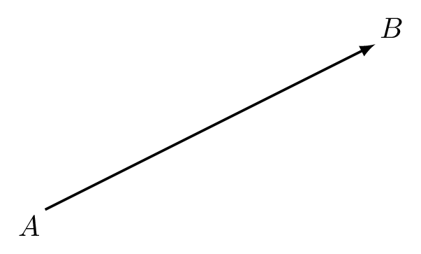
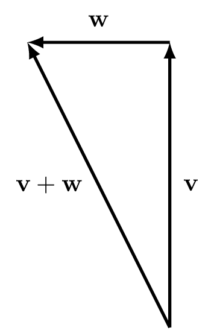
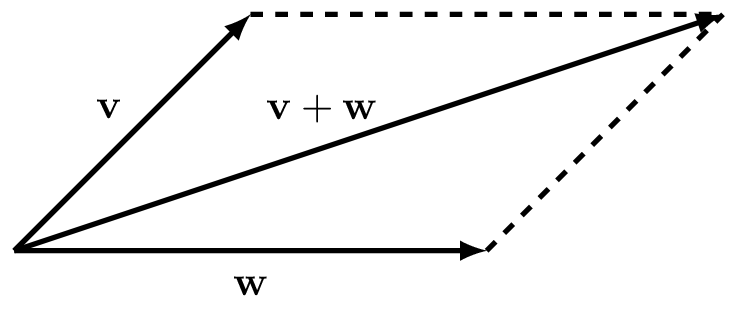
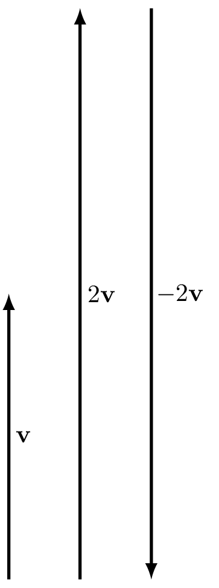
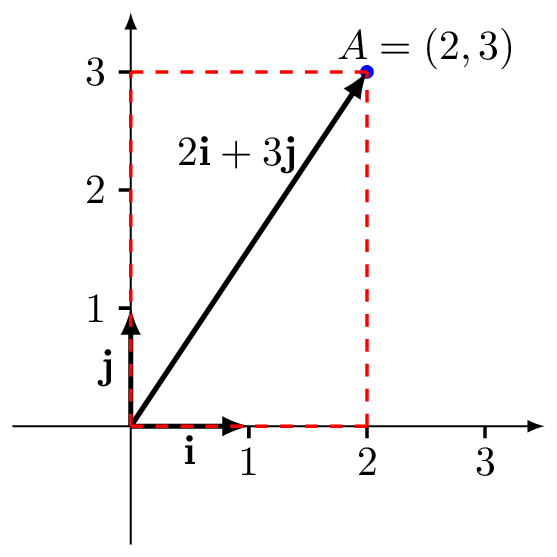
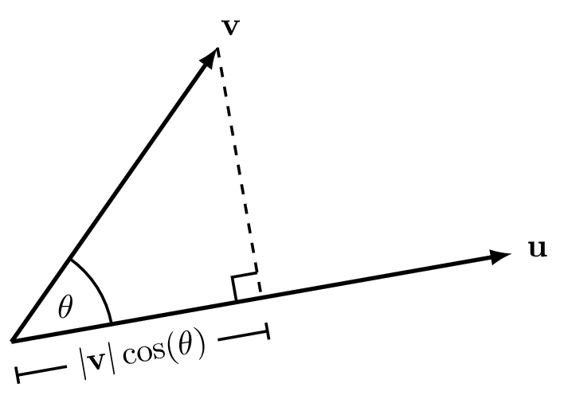
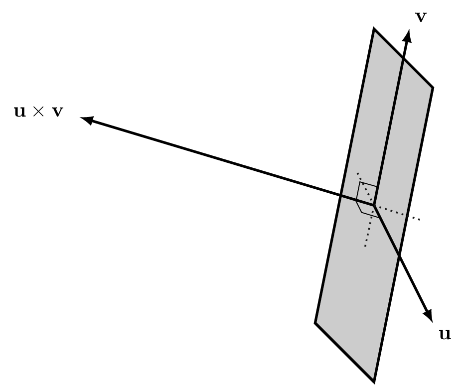
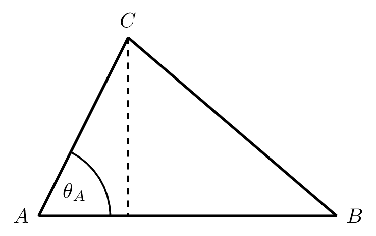

# Vectors

In physics, we distiguish between *scalar* quantities and *vector* quantities:

* Scalars are defined by a single numeric value. Examples include distance, speed, time, temperature, pressure, mass and energy.
* Vectors have associated both a numeric value and a direction. Examples include displacement, velocity, acceleration, force, and momentum.

We depict vectors by arrows whose length is proportional to the magnitude of the quantity in question and whose direction is that of the action of the quantity. In symbols, we will use bold typeface to indicate a vector, such as $\mathbf{v}$, and we will denote a vector from point $A$ to $B$ by $\overrightarrow{AB}$. See figure \@ref(fig:vector).

```{r vector, echo=FALSE, fig.cap = "The vector $\\mathbf{v} = \\overrightarrow{AB}$ is the vector from $A$ to $B$.", fig.alt = "A vector $\\mathbf{v}$ between points $A$ and $B$.", out.width= "40%"}

```


Next we develop the mathematics of vectors. They are invaluable tools in science and engineering and in particular they can make light work of some otherwise difficult geometric calculations.

## Vector addition

Geometrically, to add two vectors together we can place the tail of one vector at the head of the other and take the vector that goes from the starting point to the finish point.

```{r label, echo=FALSE, fig.cap = "Addition of two vectors $\\textbf{v}$ and $\\textbf{w}$ by aligning them tail to head.", fig.alt = "Geometric addition of two vectors $\\textbf{v}$ and $\\textbf{w}$ by aligning them tail to head.", out.width= "30%"}

```

::: {.example #vecadd name="Vector addition"}
A swallow is flying at 40 km/h due north with an easterly wind blowing at a speed of 20 km/h. The swallow's groundspeed can be found by adding the velocity vectors:
\begin{align*}
\mathbf{v} &= 40 \text{ km/h North}\\
\mathbf{w} &= 20 \text{ km/h West}\\
\mathbf{v}+\mathbf{w}&=20\sqrt{5} \text{ km/h North by North West}.
\end{align*}
:::

Alternatively, we can use the parallelogram rule (which amounts to the same thing): we draw a parallelogram with two of the non-parallel sides given by the vectors and take the diagonal as the resultant vector, as in figure \@ref(fig:vecaddpara).


```{r vecaddpara, echo=FALSE, fig.cap = "Parallelogram for addition of two vectors $\\textbf{v}$ and $\\textbf{w}$.", fig.alt = "Parallelogram for addition of two vectors $\\textbf{v}$ and $\\textbf{w}$.", fig.align = 'center', out.width= "40%"}

```

## Scalar multiplication

If we multiply a vector by a positive scalar, we change only the magnitude of the vector and keep its direction. For example, if the swallow in example \@ref(exm:vecadd) starts flying twice as fast, we have the velocity vector
$$2\mathbf{v} = 80 \text{ km/h North}.$$
If we multiply by a negative value, the vector now points in the opposite direction:
$$-2\mathbf{v} = 80 \text{ km/h South}.$$

```{r scalarmult, echo=FALSE, fig.cap = "Scalar multiplication of a vector $\\mathbf{v}$.", fig.alt = "Scalar multiplication of a vector $\\mathbf{v}$.", out.width= "25%"}

```

Finally, if we multiply by $0$, we get the *zero-vector* $\mathbf{0}$, which has magnitude $0$ and no direction:
$$0\mathbf{v}=\mathbf{0}$$.


## Vectors in Cartesian coordinates

We mostly deal with vectors in a Cartesian coordinate system. We then define vectors of length 1 that point out from the origin along the coordinate axes. In three dimensions we label these as $\mathbf{i}$ along the $x$-axis, $\mathbf{j}$ along the $y$-axis and $\mathbf{k}$ along the $z$-axis. In two dimensions we simply drop the $\mathbf{k}$ vector.

We can then write any vector $\overrightarrow{OA}$ from the origin $O$ to a point $A$ as some combination of the these vectors. For example, the vector in the plane from the origin to the point $A=(2,3)$ is given by:
$$\overrightarrow{OA}=2\mathbf{i} + 3\mathbf{j}.$$
We can reconcile this with our geometric understanding of addition of two vectors: we place the vector $2\mathbf{i}$ from the origin to the point $(2,0)$ and then place the tail of the vector $3\mathbf{j}$ at the head of $2\mathbf{i}$ to get to the point $(2,3)$; or, in terms of the parallelogram rule we have a rectangle with sides $2\mathbf{i}$ and $3\mathbf{j}$. See figure \@ref(fig:coordvecs).

```{r coordvecs, echo=FALSE, fig.cap = "The vector $2\\mathbf{i}+3\\mathbf{j}$.", fig.alt = "The vector $2\\mathbf{i}+3\\mathbf{j}$.", out.width= "40%"}

```

Yet another way to write this vector is as a *column vector*
$$\overrightarrow{OA}=
\begin{pmatrix}
2\\
3
\end{pmatrix}.
$$
Such a representation is called a *coordinate vector*.
More generally, the vector
$$\mathbf{v}=x\mathbf{i}+y\mathbf{j}+z\mathbf{k}$$
can be written as the column
$$\begin{pmatrix}
x\\
y\\
z
\end{pmatrix}.
$$

Now addition and scalar multiplication can be carried out component-wise as follows. If we have
$$\mathbf{v}=x\mathbf{i}+y\mathbf{j}+z\mathbf{k}$$
and
$$\mathbf{w}=x'\mathbf{i}+y'\mathbf{j}+z'\mathbf{k}$$
then
$$\mathbf{v}+\mathbf{w}=(x+x')\mathbf{i}+(y+y')\mathbf{j}+(z+z')\mathbf{k}$$
and with $a$ a scalar,
$$a\mathbf{v}=ax\mathbf{i}+ay\mathbf{j}+az\mathbf{k}.$$

Or, as column vectors with
$$
\mathbf{v} = 
\begin{pmatrix}
x\\
y\\
z
\end{pmatrix},
\qquad
\mathbf{w} = 
\begin{pmatrix}
x'\\
y'\\
z'
\end{pmatrix}
$$
we have
$$\mathbf{v}+\mathbf{w}= \begin{pmatrix}
x+x'\\
y+y'\\
z+z'
\end{pmatrix}.
$$
and
$$
a\mathbf{v} = 
\begin{pmatrix}
ax\\
ay\\
az
\end{pmatrix}.
$$

If points $A$ and $B$ have coordinates $(a_1,a_2,a_3)$ and $(b_1,b_2,b_3)$, respectively, then the vector from $A$ to $B$ is
$$\overrightarrow{AB} = \begin{pmatrix} b_1 - a_1 \\ b_2 - a_2\\ b_3 - a_3\end{pmatrix}.
$$
In 3-dimensional Cartesian coordinates, the *length* of the vector
$$\mathbf{v} = \begin{pmatrix} x\\ y\\ z\end{pmatrix}$$
is written as $|\mathbf{v}|$ and defined as
$$|\mathbf{v}| = \sqrt{x^2 + y^2 + z^2}$$.
This is essentially a three-dimensional version of the Pythagorean theorem.

A vector $\mathbf{u}$ is said to be a *unit vector* if it has unit length. That is, if $|\mathbf{u}| = 1$. For any non-zero vector $\mathbf{v}$, the vector
$$
\mathbf{u}=\frac{1}{|\mathbf{v}|} \mathbf{v}
$$
is a unit vector in the same direction as $\mathbf{v}$.

::: {.example #unitvec}
Let 
$$\mathbf{v} = \begin{pmatrix} 2\\ -3\\ 6\end{pmatrix}$$

Then the length of $\mathbf{v}$ is $|\mathbf{v}| = \sqrt{2^2 + 3^2 + 6^2} = 7$. So the unit vector $\mathbf{u}$ parallel to $\mathbf{v}$ is
$$
\mathbf{u}=\frac{1}{7}\begin{pmatrix} 2\\ -3\\ 6\end{pmatrix}.
$$
:::

## Vector products

We have seen how to add vectors and how to multiply vectors with a scalar. In the following, we see how to multiply two vectors with each other.

### Dot product

The *dot product* (also called the *scalar product* or *inner product*) of two vectors $\mathbf{u}$ and $\mathbf{v}$, denoted $\mathbf{u}\cdot\mathbf{v}$, is defined to be the quantity
\begin{equation}
\mathbf{u}\cdot\mathbf{v} = |\mathbf{u}||\mathbf{v}|\cos(\theta)
(\#eq:dotprod)
\end{equation}
where $\theta$ is the angle between the vectors $\mathbf{u}$ and $\mathbf{v}$. Note that the symmetry of the $\cos$ function means it does not matter which direction we measure the angle, i.e. clockwise or anticlockwise.

```{r dotproj, echo=FALSE, fig.cap = "The projection of $\\mathbf{v}$ onto $\\mathbf{u}$.", fig.alt = "The projection of $\\mathbf{v}$ onto $\\mathbf{u}$.", out.width= "40%"}

```
An immediate application of the scalar product is the projection of one vector onto another. Consider Figure \@ref(fig:dotproj), which shows the projection of the vector $\mathbf{v}$ onto the vector $\mathbf{u}$. We drop a line from the tip of $\mathbf{v}$ running at right angles to the direction of the vector $\mathbf{u}$. This is akin to thinking of the shadow that $\mathbf{v}$ would cast on the vector $\mathbf{u}$ if the Sun is shining at right angles to $\mathbf{u}$. The length of the shadow is the projection of $\mathbf{v}$ onto $\mathbf{u}$, or
$$|\mathbf{v}|\cos(\theta).$$
We have:
$$\mathbf{u} \cdot \mathbf{v} &= |\mathbf{u}| \times \text{projection of $\mathbf{v}$ onto $\mathbf{u}$}$$
Since there was nothing special about choosing the projection onto $\mathbf{v}$ -- we could have chosen the projection onto $\mathbf{u}$ -- it is also true that:
$$\mathbf{u} \cdot \mathbf{v}= |\mathbf{v}| \times \text{projection of $\mathbf{u}$ onto $\mathbf{v}$}.$$

::: {.example #work name="Work"}
An application of the dot product in physics is to the concept of *work*. We want to consider how much work is required to push a block over a certain distance $x$. By calculation or measurement, we can determine the force $F$ required to push the block. Then, by definition, the work done by the force is
$$W = Fx.$$
This is sufficient if the force acts in the same direction as the motion of the block. If, however, this is not the case (maybe the block is constrained to move on a rail), then it is the component of the force in the direction of motion that is important.

Suppose $\mathbf{F}$ is the force vector and $\mathbf{x}$ is the displacement vector of the block. Let $\theta$ be the angle between the two vectors. Then the component of $\mathbf{F}$ in the $\mathbf{x}$ direction is precisely the projection of $\mathbf{F}$ onto $\mathbf{x}$ (as described in Figure \@ref(fig:dotproj)). This is equal to
$$
|\mathbf{F}|\cos(\theta).
$$
So the total work done will be the product of this quantity with the magnitude of the displacement vector, that is
\begin{align*}
W &= |\mathbf{F}|\cos(\theta) \times |\mathbf{x}| \\
&= |\mathbf{F}||\mathbf{x}|\cos(\theta) \\
&= \mathbf{F}\cdot\mathbf{x},
\end{align*}
i.e. the dot product of $\mathbf{F}$ and $\mathbf{x}$.
:::

Note that if the dot product is $\mathbf{u}\cdot\mathbf{v}=0$ then either $\cos(\frac{\pi}{2})=0$ so that the two vectors are perpendicular, or one or both of $\mathbf{u}$ and $\mathbf{v}$ are the zero vector $\mathbf{0}$. When the dot product is zero, we say that the two vectors are *orthogonal*.

Some other properties of the dot product that follow from the definition are:

* $\mathbf{u} \cdot \mathbf{v} = \mathbf{v} \cdot \mathbf{u}$;
* $(a\mathbf{u}) \cdot \mathbf{v} = \mathbf{u} \cdot (a\mathbf{v})= a(\mathbf{u} \cdot \mathbf{v})$;
* $\mathbf{u} \cdot (\mathbf{v} + \mathbf{w}) = \mathbf{u} \cdot \mathbf{v} + \mathbf{u} \cdot \mathbf{w}$;
* $\mathbf{u}\cdot\mathbf{u} = |\mathbf{u}|^2$.


::: {.theorem #calcdot name="Calculating the dot product"}
In Cartesian coordinates, the dot product of two vectors
$$\mathbf{u} = x\mathbf{i} + y\mathbf{j} + z\mathbf{k} \qquad\text{and}\qquad \mathbf{v} = a\mathbf{i} + b\mathbf{j} + c\mathbf{k}$$
can be calulated as
\begin{equation*}
\mathbf{u}\cdot\mathbf{v} = (x\mathbf{i} + y\mathbf{j} + z\mathbf{k})\cdot(a\mathbf{i} + b\mathbf{j} + c\mathbf{k}) = xa + yb + zc.
\end{equation*}
:::

To see this, consider the full product:
\begin{align*}
\mathbf{u} \cdot \mathbf{v} &= xa \mathbf{i} \cdot \mathbf{i} + xb \mathbf{i} \cdot \mathbf{j} + xc \mathbf{i} \cdot \mathbf{k} \\
&\phantom{={}} + ya \mathbf{j} \cdot \mathbf{i} + yb \mathbf{j} \cdot \mathbf{j} + yc \mathbf{j} \cdot \mathbf{k} \\
&\phantom{={}} + za \mathbf{k} \cdot \mathbf{i} + zb \mathbf{k} \cdot \mathbf{j} + zc \mathbf{k} \cdot \mathbf{k} \\
&= xa + yb + zc,
\end{align*}
then noting that the unit vectors $\mathbf{i}$, $\mathbf{j}$ and $\mathbf{k}$ have unit length and are perpendicular to one another, we first have by the property $\mathbf{u}\cdot\mathbf{u}=|\mathbf{u}|^2$ that
$$
\mathbf{i}\cdot\mathbf{i} = \mathbf{j}\cdot\mathbf{j} =\mathbf{k}\cdot\mathbf{k}=1,
$$
and secondly, by orthogonality each of the following products are zero 
\begin{align*}
\mathbf{i} \cdot \mathbf{j}&,\; \mathbf{i} \cdot \mathbf{k}\\
\mathbf{j} \cdot \mathbf{i}&,\; \mathbf{j} \cdot \mathbf{k}\\
\mathbf{k} \cdot \mathbf{i}&,\; \mathbf{k} \cdot \mathbf{j}.
\end{align*}


::: {.example #dottriangle name="Geometry"}
Consider a triangle in three-dimensional space whose vertices are given by the points
$$
A = (2,4,-1),\quad B = (0,3,1), \quad C = (-3,1,5).
$$
We compute the side lengths and angles for the triangle $ABC$ above.
First note that
$$
\overrightarrow{AB} = \begin{pmatrix} 0\\ 3\\ 1\end{pmatrix} - \begin{pmatrix} 2\\ 4\\ -1\end{pmatrix}
= \begin{pmatrix} -2\\ -1\\ 2\end{pmatrix}
$$
and similarly
$$
\overrightarrow{BC} = \begin{pmatrix} -3\\ -2\\ 4\end{pmatrix} \quad\text{and}\quad
\overrightarrow{CA} = \begin{pmatrix} 5\\ 3\\ -6\end{pmatrix}.
$$
From this, we can immediately calculate the length of the sides, namely
\begin{align*}
AB &= |\overrightarrow{AB}| = \sqrt{(-2)^2 + (-1)^2 + 2^2} = 3, \\
BC &= |\overrightarrow{BC}| = \sqrt{(-3)^2 + (-2)^2 + 4^2} = \sqrt{29}, \\
CA &= |\overrightarrow{CA}| = \sqrt{5^2 + 3^2 + (-6)^2} = \sqrt{70}.
\end{align*}
The angles can then be computed using the dot product. For instance, the angle $\theta_A$ at the vertex $A$ can be computed via
$$
\cos(\theta_A) = \frac{\overrightarrow{AB}\cdot\overrightarrow{AC}}{AB\times AC}
= -\frac{\overrightarrow{AB}\cdot\overrightarrow{CA}}{AB\times CA},
$$
thus
$$
\cos(\theta_A) = -\frac{-2\times 5 - 1\times 3 + 2\times(-6)}{3\sqrt{70}}
= \frac{25}{3\sqrt{70}} = \frac{25\sqrt{70}}{3\times 70} = \frac{5\sqrt{70}}{42}.
$$
Similarly, we calculate
$$
\cos(\theta_B) = \frac{\overrightarrow{BA}\cdot\overrightarrow{BC}}{BA\times BC} = -\frac{16}{87}\sqrt{29}.
$$
and
$$
\cos(\theta_C) = \frac{\overrightarrow{CA}\cdot\overrightarrow{CB}}{CA\times CB} = \frac{9}{406}\sqrt{29}\sqrt{70}.
$$
:::


### Cross product 

Let $\mathbf{u}$ and $\mathbf{v}$ be vectors in a three-dimensional space and let $\theta$ be the angle between the vectors. Note there are potentially two choices for the angle between two vectors: both $\theta$ and $2\pi - \theta$. Unlike the case of the dot product, we need to be clear about our choice of angle $\theta$. We choose the angle $\theta$ such that $0 \le \theta < \pi$. The *cross product* (or *vector product*) $\mathbf{u}\times\mathbf{v}$ of two vectors $\mathbf{u}$ and $\mathbf{v}$ in three-dimensional space is defined to be the (unique) vector of length
$$
|\mathbf{u}||\mathbf{v}|\sin(\theta)
$$
that is orthogonal to both the vectors $\mathbf{u}$ and $\mathbf{v}$, such that $\mathbf{u}, \mathbf{v}$ and $\mathbf{u}\times\mathbf{v}$ form a *right-handed system*.

The last part of the definition needs some explanation. There are always two possible directions that are perpendicular to $\mathbf{u}$ and to $\mathbf{v}$, one being the opposite of the other. When we say that a set of three vectors $\{\mathbf{u}, \mathbf{v}, \mathbf{w}\}$ forms a right-handed system, we mean that if take our right hand and point our thumb in the direction of $\mathbf{u}$ and our index finger in the direction of $\mathbf{v}$, then our  middle finger points (roughly) in the direction of $\mathbf{w}$. From Figure \@ref(fig:crossprod) we see that $\{\mathbf{u}, \mathbf{v}, \mathbf{u}\times\mathbf{v}\}$ form a right-handed system.

```{r crossprod, fig.cap = "The cross product of $\\mathbf{u}$ and $\\mathbf{v}$.", fig.alt = "The cross product of $\\mathbf{u}$ and $\\mathbf{v}$.", out.width="40%"}

```

The cross product has the following properties:

* $\mathbf{u}\times\mathbf{v} = -(\mathbf{v} \times \mathbf{u})$;
* $\mathbf{u}\times\mathbf{v} = \mathbf{0}$ if and only if $\mathbf{u}$ and $\mathbf{v}$ are parallel, or $\mathbf{u} = \mathbf{0}$ or $\mathbf{v} = \mathbf{0}$;
* $|\mathbf{u}\times\mathbf{v}| = |\mathbf{u}||\mathbf{v}|$ if and only if $\mathbf{u}$ and $\mathbf{v}$ are orthogonal;
* $(a\mathbf{u})\times\mathbf{v} = \mathbf{u}\times(a\mathbf{v}) = a(\mathbf{u}\times\mathbf{v})$;
* $\mathbf{u}\times(\mathbf{v}+\mathbf{w}) = \mathbf{u}\times\mathbf{v} + \mathbf{u}\times\mathbf{w}$.

It follows that:
$$
\begin{array}{rclrclrcl}
	\mathbf{i}\times\mathbf{j} &=& \mathbf{k}, \qquad & \mathbf{j}\times\mathbf{k} &=& \mathbf{i}, \qquad & \mathbf{k}\times\mathbf{i} &=& \mathbf{j},\\
	\mathbf{j}\times\mathbf{i} &=& -\mathbf{k}, \qquad & \mathbf{k}\times\mathbf{j} &=& -\mathbf{i}, \qquad & \mathbf{i}\times\mathbf{k} &=& -\mathbf{j},\\
	\mathbf{i}\times\mathbf{i} &=& \mathbf{0}, \qquad & \mathbf{j}\times\mathbf{j} &=& \mathbf{0}, \qquad & \mathbf{k}\times\mathbf{k} &=& \mathbf{0}.
\end{array}
$$

Then we can compute the cross product of
$$
\mathbf{u} = u_1\mathbf{i} + u_2\mathbf{j} + u_3\mathbf{k} \qquad\text{and}\qquad \mathbf{v} = v_1\mathbf{i} + v_2\mathbf{j} + v_3\mathbf{k},
$$
as
$$
\mathbf{u} \times \mathbf{v} =  (u_2v_3 - u_3v_2)\mathbf{i} + (u_3v_1 - u_1v_3)\mathbf{j} + (u_1v_2 - u_2v_1)\mathbf{k}.
$$

An easy way to remember this is to compute the determinant:
$$
\mathbf{u}\times\mathbf{v} = \begin{vmatrix}  \mathbf{i} & \mathbf{j} & \mathbf{k}\\ u_1 & u_2 & u_3\\ v_1 & v_2 & v_3\end{vmatrix}.
$$


::: {.example #magnetic name="Magnetic fields"}
The vector product occurs in many equations in physics. For instance, consider a charged particle moving through a magnetic field. Let the charge on the particle be $q$ Coulombs, let its velocity vector be $\mathbf{v}$ metres per second and let the magnetic field be $\mathbf{B}$ Teslas. Then the force $\mathbf{F}$ Newtons experienced by the particle is
$$
\textbf{F} = q\mathbf{v}\times\textbf{B}.
$$
This formula expresses mathematically the fact that the force experienced by the particle is perpendicular to its direction of motion and to the magnetic field.
:::

::: {.example #crosstriangle name="Triangle area"}
What is the area of the triangle with vertices
$$
A = (2,4,-1), \qquad B = (0,3,1), \qquad C = (-3,1,5)?
$$
Note that this is the same triangle that we considered in Example \@ref{exm:dottriangle}, where we considered the lengths of the sides and the angles at the vertices.

```{r crosstriangle, fig.cap = "Computing the area of a triangle via the vector product.", fig.alt = "Computing the area of a triangle via the vector product.", out.width="40%"}

```   

The area of a triangle is half its base times its height. In view of the diagram in Figure \@ref(fig:crosstriangle), the base is $|\overrightarrow{AB}|$ and the height is $|\overrightarrow{AC}| \sin(\theta_A)$, so the area of the triangle is
$$
\frac{1}{2} |\overrightarrow{AB}||\overrightarrow{AC}| \sin(\theta_A).
$$
This quantity can be computed in terms of the vector product as
$$
\frac{1}{2} |\overrightarrow{AB}\times\overrightarrow{AC}|.
$$
Using the determinant method for computing the vector product, we obtain
\begin{align*}
\overrightarrow{AB}\times\overrightarrow{AC}
= \begin{vmatrix}  \mathbf{i} & \mathbf{j} & \mathbf{k}\\ -2 & -1 & 2\\ -5 & -3 & 6\end{vmatrix}
= (-6 + 6)\mathbf{i} - (-12 + 10)\mathbf{j} + (6 - 5)\mathbf{k}
= 2\mathbf{j} + \mathbf{k}.
\end{align*}
Thus,
$$
|\overrightarrow{AB}\times\overrightarrow{AC}| = \sqrt{2^2 + 1^2} = \sqrt{5},
$$
and we deduce that the area of the triangle $ABC$ is equal to $\frac{\sqrt{5}}{2}$.
:::