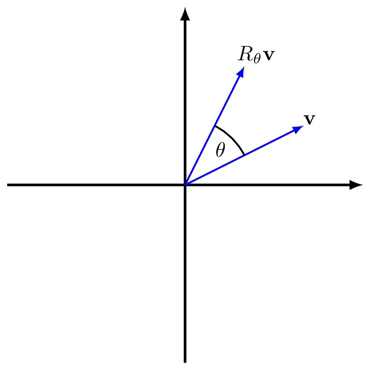

# Linear Transformations

We have seen that we can formulate a system of linear equations as a matrix-vector equation
$$A\mathbf{x}=\mathbf{b}$$
and viewed this in two ways:

1. as a compact way of expressing the system of linear equations: multiplying the vector $\mathbf{x}$ by the matrix $A$, each row in the resulting vector equation is one of the linear equations
2. as a vector equation with the l.h.s. being a linear combination of the columns of $A$

We now introduce a third point of view:

3. Multiplication by the matrix $A$ acts as a *function*, taking the (vector) input $\mathbf{x}$ and returning the (vector) output $\mathbf{b}$.

As a function, the matrix $A$ represents a *Linear Transformation*. This is a type of function $f$ whose inputs and outputs are vectors, with the following properties:

I.  $f(\mathbf{x}_1+\mathbf{x}_2)=f(\mathbf{x}_1)+f(\mathbf{x}_2)$ for any two vectors $\mathbf{x}_1$ and $\mathbf{x}_2$
II.  $f(\lambda\mathbf{x})=\lambda f(\mathbf{x})$ for any scalar $\lambda$ and vector $\mathbf{x}$

Translating this to matrices:

I.  $A(\mathbf{x}_1+\mathbf{x}_2)=A\mathbf{x}_1+A\mathbf{x}_2$ for any two vectors $\mathbf{x}_1$ and $\mathbf{x}_2$
II.  $A(\lambda\mathbf{x})=\lambda A\mathbf{x}$ for any scalar $\lambda$ and vector $\mathbf{x}$

**Exercise:** convice yourself that these properties hold by evaluating the left and right hand sides for a general $3\times 3$ matrix and confirming they are equal.


::: {.example #rotation name="Rotation about the origin"}
The following matrix rotates a vector by an angle $\theta$ anticlockwise about the origin.
$$R_\theta=\begin{pmatrix}
\cos(\theta)& -\sin(\theta)\\
\sin(\theta)& \cos(\theta)
\end{pmatrix}
$$

```{r rotmat, echo = FALSE, fig.cap = "The action of $R_\\theta$ on a vector $\\mathbf{v}$", fig.alt = "The action of $R_\\theta$ on a vector $\\mathbf{v}$", out.width="50%"}

```

We can understand that this is a linear transformation geometrically, since:

I.  adding two vectors and then rotating is the same as rotating two vectors and then adding;
II.  taking a scalar multiple of a vector and then rotating is the same as rotating and then scaling.

It turns out that all linear transformations can (in a certain sense) be decomposed as a rotation or reflection, followed by a coordinate scaling, followed by another rotation or reflection, as explained by the [Singular Value Decomposition theorem](https://en.wikipedia.org/wiki/Singular_value_decomposition).
:::


Of course not all functions have these special properties.

**Exercise:** convince yourself that $f(x)=x^2$ is **not** a linear transformation by finding values $x$ and $y$ (real numbers are 1-dimensional vectors) and a scalar $\lambda$ for which the above properties I. and II. do not hold.

Now, if we were trying to solve an equation involving a function, say $f(x)=b$, we would apply the inverse $f^{-1}$ to both sides to get
\begin{align*}
f(x)&=b\\
f^{-1}(f(x))&=f^{-1}(b)\\
x&=f^{-1}(b).
\end{align*}

Note this only works if $f^{-1}$ exists -- we know that not all functions have inverses^[Sometimes we make do with so called *partial inverses* as we have for the inverse trigonometric functions and the square root function.]. We will soon show a condition for the existence of the inverse of a matrix $A$, which we denote by $A^{-1}$ and that is itself another matrix. We will then have another way to solve linear equations by applying the inverse matrix:

\begin{align*}
A\mathbf{x}&=\mathbf{b}\\
A^{-1}(A\mathbf{x})&=A^{-1}\mathbf{b}\\
\mathbf{x}&=A^{-1}\mathbf{b}.
\end{align*}

First, we look at the algebra of matrices.

## Matrix Algebra

### Addition and Subtraction

We can add and subtract two matrices, so long as the have the same dimensions $m\times n$. Then the sum and difference of two matrices $A$ and $B$ are

$$A+B=(a_{ij}+b_{ij}),\qquad A-B=(a_{ij}-b_{ij}),$$

that is, we simply add or subtract the corresponding entries.

::: {.example #matadd name="Matrix Addition"}
Define the matrices $A$ and $B$ as
$$
A = \begin{pmatrix} 2 & 9 & 6 \\ -1 & 3 & 5 \end{pmatrix}
\qquad\text{and}\qquad
B = \begin{pmatrix} 0 & 3 & -1 \\ 2 & 7 & 8 \end{pmatrix}.
$$
Because the both matrices have dimensions $2 \times 3$, we may calculate
$$
A + B = \begin{pmatrix} 2 & 12 & 5 \\ 1 & 10 & 13 \end{pmatrix}
\qquad\text{and}\qquad
A - B = \begin{pmatrix} 2 & 6 & 7 \\ -3 & -4 & -3 \end{pmatrix}.
$$
Note, that matrix addition is *commutative*^[The technical term for the fact that we can swap the order.], that is
$$
A + B = B + A.
$$
:::

### Multiplication by a scalar

Let $A = (a_{ij})_{m\times n}$ be an $m\times n$ matrix and let $\lambda$ be a scalar. We define the matrix $\lambda A$ by
$$
(\lambda A)_{ij} = \lambda a_{ij},
$$
that is, we multiply every entry of $A$ by $\lambda$.

::: {.example #matscalar name="Scalar Multiplication"}
With $A$ as in Example \@ref(exm:mat_add), $\lambda = 2$ and $\mu = -1$, we have
$$
\lambda A = 2A = \begin{pmatrix} 4 & 18 & 12 \\ -2 & 6 & 10 \end{pmatrix}
\qquad\text{and}\qquad
\mu A = -A = \begin{pmatrix} -2 &-9 &-6 \\ 1 & -3 & -5\end{pmatrix}
$$
:::

### Matrix multiplication

We saw in section \@ref(linearrevisited) how to multiply a vector by a matrix. This idea extends naturally to multiplying two matrices together as follows.

Let $A = (a_{ij})_{m\times l}$ and $B = (b_{ij})_{l \times n}$. Then the *matrix product* $C = AB$ is defined to be the matrix $AB = (c_{ij})_{m\times n}$ such that $c_{ij}$ is the dot product of row $i$ of $A$ with column $j$ of $B$. That is, for all $i =1,\dotsc, m$ and all $j =1, \dotsc, n$,
$$
c_{ij} = a_{i1} b_{1j} + a_{i2} b_{2j} + \dots + a_{il} b_{lj}
$$

Note that the product $AB$ is defined only if the number of **columns** of $A$ is the equal to the number of **rows** of $B$. The product matrix has the same number of **rows** as $A$ and the same number of **columns** as $B$.

::: {.example #matmult name="Matrix Multiplication"}
Let
$$
A = \begin{pmatrix}	3 & 2 & -1\\ 0 & 5 & 4 \end{pmatrix}
\qquad\text{and}\qquad
B = \begin{pmatrix}	1 & 2 & 4 & 6\\ 5 & 3 & 0 & 7\\ -1 & -2 & 1 & 5 \end{pmatrix}.
$$
Then
$$
AB = \begin{pmatrix} 3 & 2 & -1\\ 0 & 5 & 4 \end{pmatrix}
\begin{pmatrix} 1 & 2 & 4 & 6\\ 5 & 3 & 0 & 7\\ -1 & -2 & 1 & 5	\end{pmatrix}
= \begin{pmatrix}	14 & 14 & 11 & 27\\ 21 & 7 & 4 & 55 \end{pmatrix}.
$$
Note that $A$ is $2\times3$, that $B$ is $3\times 4$ and that the product $AB$ is a $2\times 4$ matrix. We have skipped the intermediate steps of multiplying all rows of $A$ with all columns of $B$, but to give an example, the $1$--$3$ entry of $AB$ is 11, which must be the dot product of the $1^\text{st}$ row of $A$ and the $3^\text{rd}$ column of $B$:
$$
\begin{pmatrix} 3 & 2 & -1\end{pmatrix} \cdot \begin{pmatrix} 4\\ 0\\ 1\end{pmatrix}
= 3 \times 4 + 2 \times 0 - 1\times 1 = 11.
$$
:::

Unlike with ordinary (scalar) numbers, we do not normally have $AB = BA$, that is Matrix multiplication is **not** commutative. Indeed, in the above example, $BA$ is not even defined. The reason is that $B$ has $4$ columns, but $A$ has $2$ rows.


### Functional interpretations

Here we understand what the algebraic operations above mean when we are considering a matrix as a function. We let $A$ and $B$ be compatible matrices, $\mathbf{x}$ a vector and for comparison to other (non-linear) functions we take the examples $f(x)=x^2$ and $g(x)=x^3$.

**Addition/Subtraction**

$$(A+B)\mathbf{x}=A\mathbf{x}+B\mathbf{x}$$

This agrees with the usual definition of the sum of two functions, for example we have $(f+g)(x)=f(x)+g(x)=x^2+x^3$.

**Scalar multiplication**

$$(\lambda A)\mathbf{x}=\lambda (A \mathbf{x})$$

Again this agrees with the usual definition for functions, for example $(\lambda f)(x)=\lambda f(x)=\lambda x^2$.

**Matrix Multiplication**

$$(AB)\mathbf{x}=A(B\mathbf{x})$$

Matrix multiplication corresponds to *function composition*, that is, first apply matrix $B$ then apply matrix $A$. In our example for non-linear functions, $(f\circ g)(x)=f(g(x))=f(x^3)=(x^3)^2=x^6$ (where $\circ$ denotes function composition).

When we have repeated multiplication of a matrix with itself $n$ times we use the power notation:

$$A\dotsb A=A^n$$

for example, $AA=A^2$.

### Two special matrices

The $m\times n$ *zero matrix* $0_{m\times n}$ is defined as the $m\times n$ matrix which has only zero entries.

::: {.example #zeromat name="Zero Matrix"}

For $m = 2$ and $n = 3$, we have
$$
0_{m\times n} = 0_{2\times 3} = \begin{pmatrix} 0 & 0 & 0 \\ 0 & 0 & 0 \end{pmatrix},
$$
and (in contrast)
$$
0_{n\times m} = 0_{3\times 2} = \begin{pmatrix} 0 & 0\\ 0 & 0 \\ 0 & 0 \end{pmatrix}.
$$
:::

Note that for any vector $\mathbf{x}$ of length $n$, we have $0_{m\times n} \mathbf{x}=\mathbf{0}_m$.


The $n\times n$ *identity matrix* $I_n$, is defined by $I_n = (\delta_{ij})_{n\times n}$, where $\delta_{ij}$ is given as
$$\delta_{ij} = \begin{cases} 1 & \text{if $i = j$,} \\ 0 & \text{if $i \neq j$.} \end{cases}
$$
The function (or sometimes referred to as a "symbol") $\delta$ of the two variables $i$ and $j$ is called the *Kronecker delta* and pops up often in pure and applied mathematics.

::: {.example #identmat name="Identity Matrix"}
For $n = 3$, we have
$$
I_3 = \begin{pmatrix} 1 & 0 & 0 \\ 0 & 1 & 0 \\ 0 & 0 & 1 \end{pmatrix}.
$$
:::

Note that for any vector $\mathbf{x}$ of length $n$, we have
$$I_n\mathbf{x}=\mathbf{x}.$$


### Some further properties

Assuming the matrices $A, B, C$ all have compatible dimensions and with $\lambda, \mu$ being scalars, we have: 

1. $\lambda(A+B)=\lambda A + \lambda B$
1. $(\lambda + \mu)A=\lambda A +\mu A$
1. $I_m A = A$ and $A I_n=A$
1. $0_{l\times m}A=0_{l\times n}$ and $A0_{n\times p}=0_{m\times p}$
1. $(AB)C=A(BC)$
1. $A(B+C)=AB+AC$
1. $(A+B)C=AC+BC$

**Exercise:** pick some matrices and check that these hold.


## Matrix inverse

We are now ready to discuss the matrix inverse. By definition, the inverse $f^{-1}$ of a function $f$ is the function that satisfies
$$f^{-1}(f(x))=x\quad\text{and}\quad f(f^{-1}(y))=y$$
for all input values $x$ and output values $y$ (the function and its inverse "reverse" the action of one another.)
For a matrix, function composition is given by matrix mutiplication, so the definition of the inverse matrix $A^{-1}$ of a matrix $A$ requires
$$A^{-1}A\mathbf{x}=\mathbf{x}\quad\text{and}\quad AA^{-1}\mathbf{y}=\mathbf{y}$$
for all input vectors $\mathbf{x}$ and output vectors $\mathbf{y}$.

It turns out^[Due to the [rank-nullity theorem](https://en.wikipedia.org/wiki/Rank%E2%80%93nullity_theorem).] this will only work for *square* matrices, that is, a matrix $A$ with same number of rows and columns: an $n\times n$ matrix. This immediately implies that $A^{-1}$ is also an $n\times n$ matrix.

Now another way to express the matrix inverse is via the statement:
$$A^{-1}A=I_n=AA^{-1}$$
since applying $A$ and its inverse $A^{-1}$ has the same effect as applying the identity matrix.

**Exercise:** Show that the matrix
$$
B = \begin{pmatrix} 1 & 0 & 1 \\ 0 & 2 & 5 \\ 0 & 1 & 3 \end{pmatrix}
$$
is the inverse of the matrix
$$
A = \begin{pmatrix} 1 & 1 & -2 \\ 0 & 3 & -5 \\ 0 & -1 & 2 \end{pmatrix}.
$$
by computing $AB$ and $BA$ and observing that $AB = BA = I_3$. So $A$ is *invertible* and $B=A^{-1}$ is the *inverse*.

It is important to note that not all (square) matrices are invertible.

::: {.example #noinverse name="No inverse"}
Consider the matrix
$$
A = \begin{pmatrix} 1 & -1 \\ -1 & 1 \end{pmatrix}.
$$
Assume that there exist $a,b,c,d$, such that
$$
B = \begin{pmatrix} a & b \\ c & d \end{pmatrix}
$$
is an inverse of $A$. For this, we require that
$$
\begin{pmatrix} 1 & -1 \\ -1 & 1 \end{pmatrix} \begin{pmatrix} a & b \\ c & d \end{pmatrix}
= \begin{pmatrix} 1 & 0 \\ 0 & 1 \end{pmatrix}.
$$
That is, we require that
$$
\begin{pmatrix} a - c & b - d \\ -a + c & -b + d \end{pmatrix}
= \begin{pmatrix} 1 & 0 \\ 0 & 1 \end{pmatrix}.
$$
Comparing the entries in the left-most column of the matrices on the left- and right-hand sides of the above matrix equation, we deduce that, both
$$
a - c = 1 \qquad\text{and}\qquad -a + c = 0,
$$
which, adding both equations, gives $0 = 1$, which is not true. Thus, assuming that $A$ has an inverse leads to a contradiction, so there cannot be an inverse of $A$
:::

### Finding the inverse of a $2\times 2$ matrix

We start by presenting the formula for the inverse of a $2\times 2$ matrix, which is relatively straightforward. Then we will discuss how to find the inverse of a general $n\times n$ matrix, which is more involved, in the next section.

::: {.theorem #2by2inverse name="Inverse of a 2 x 2 matrix"}
Let $A$ be the $2\times 2$ matrix 
$$A=\begin{pmatrix}
a&b\\
c&d
\end{pmatrix}$$
with $\det(A)=ad-bc\neq 0$. Then $A$ is invertible, with inverse
$$A^{-1}=\frac{1}{\det(A)}\begin{pmatrix}
d&-b\\
-c&a
\end{pmatrix}.$$
:::

Note that the formula only makes sense if $\det(A)\neq 0$. It turns out that the condition $\det(A)\neq 0$ is precisely the condition that must be satisfied for invertibility (for any size matrix).

::: {.theorem #invertible name="Existence of matrix inverse"}
An $n\times n$ matrix $A$ is invertible if and only if $\det(A)\neq 0$. If $A$ is not invertible, then we say that $A$ is *singular*.
:::

This is an extension to not being able to divide by zero in the one-dimensional case: we cannot solve $ax=b$ if $a=0$. 

::: {.example #inverse name="2 x 2 inverse examples"}

1. Let
    $$A = \begin{pmatrix} 1 & 5 \\ 2 & 10 \end{pmatrix}.$$
    The determinant of $A$ is $\det(A) = 1\times 10 - 5\times 2 = 0$. Thus $A$ is singular.

2. Let
    $$M = \begin{pmatrix} 7 & 3 \\ 2 & 3 \end{pmatrix}.$$
    We have $\det(M) = 15$, hence, $M$ is invertible and its inverse is
    $$M^{-1} = \frac{1}{15} \begin{pmatrix} 3 & -3 \\ -2 & 7 \end{pmatrix}.$$

:::

### Finding the inverse of an $n\times n$ matrix

There does exist a formula that is a generalisation of that for $2\times 2$ matrices, based on [Cramer's Rule](https://en.wikipedia.org/wiki/Invertible_matrix#Analytic_solution). This is important in the theory of matrices, but not very useful in practice for large matrices. Hence we present a different way of computing the inverse, via Guassian elimination. 

For the moment, denote $X=A^{-1}$. We are looking for $X$ such that $AX=I_n$ and $XA=I_n$. It turns out that if $X$ satisfies either one of these equations then it is the unique inverse, so we shall just consider $AX=I_n$.

By the rules of matrix multiplication, the first column of $I_n$ is the result of taking the dot product of the rows of $A$ with the first column of $X$. Denoting the $i^\text{th}$ row of $A$ by $\mathbf{a}_i$ and the $j^\text{th}$ column of $X$ by $\mathbf{x}_j$, we have

$$
A\mathbf{x}_1=
\begin{pmatrix}
\mathbf{a}_1\cdot \mathbf{x}_1\\
\mathbf{a}_2\cdot \mathbf{x}_1\\
\vdots\\
\mathbf{a}_n\cdot \mathbf{x}_1\
\end{pmatrix}
=
\begin{pmatrix}
1\\
0\\
\vdots\\
0
\end{pmatrix}.
$$
More generally,
$$
A\mathbf{x}_j=
\begin{pmatrix}
\mathbf{a}_1\cdot \mathbf{x}_j\\
\mathbf{a}_2\cdot \mathbf{x}_j\\
\vdots\\
\mathbf{a}_n\cdot \mathbf{x}_j\
\end{pmatrix}
=
\begin{pmatrix}
\delta_{1j}\\
\delta_{2j}\\
\vdots\\
\delta_{nj}
\end{pmatrix}.
$$
These are just standard matrix--vector equations of the form "$A\mathbf{x}=\mathbf{b}$", which we can solve using Guassian elimination to find the columns $\mathbf{x}_j$. Moreover, instead of doing this one column at a time, we can solve for all columns at once, as in the following example.

::: {.example #gaussinverse name="Inverse via Gaussian elimination"}
Consider the matrix
$$
A = \begin{pmatrix} 1 & 0 & 1 \\ 0 & 2 & 5 \\ 0 & 1 & 3 \end{pmatrix}.
$$
We wish to find the inverse of $A$. That is, we wish to find a $3\times 3$ matrix $X$ such that $AX = I_3$.  Writing $\mathbf{x}_1, \mathbf{x}_2$ and $\mathbf{x}_3$ for the columns of $X$, this is equivalent to solving the $3$ matrix--vector equations
$$
A\mathbf{x}_1 = \mathbf{e}_1, \qquad A\mathbf{x}_2 = \mathbf{e}_2 \qquad\text{and}\qquad A\mathbf{x}_3 = \mathbf{e}_3
$$
where
$$\mathbf{e}_j=
\begin{pmatrix}
\delta_{1j}\\
\delta_{2j}\\
\delta_{3j}\\
\end{pmatrix}.
$$
Note $\mathbf{e}_1=\mathbf{i}, \mathbf{e}_2=\mathbf{j}, \mathbf{e}_3=\mathbf{k}$, the newly introduced indexed notation $\mathbf{e}_i$ is just more convenient for extending to arbitrary dimensions. We could set this up for Gaussian elimination via the $3$ augmented matrices
$$
\left(A\ |\ \mathbf{e}_1\right), \qquad \left(A\ |\ \mathbf{e}_2\right) \qquad\text{and}\qquad \left(A\ |\ \mathbf{e}_3\right)
$$
and then perform EROs to transform the above augmented matrices to the form
$$
\left(I_3\ | \mathbf{x}_1\right), \qquad \left(I_3\ |\ \mathbf{x}_2\right) \qquad\text{and}\qquad \left(I_3\ |\ \mathbf{x}_3\right),
$$
allowing us to read off the solutions $\mathbf{x}_1$, $\mathbf{x}_2$ and $\mathbf{x}_3$.

However, these will all require the same EROs, and so we can compute all three vectors $\mathbf{x}_1$, $\mathbf{x}_2$ and $\mathbf{x}_3$ *at the same time* by starting with the following augmented matrix
$$
\left(A\ |\ \mathbf{e}_1 \ \mathbf{e}_2 \ \mathbf{e}_3\right),
$$
and then perform EROs to bring it into the reduced echelon form
$$
\left(I_3\ |\ \mathbf{x}_1\ \mathbf{x}_2\ \mathbf{x}_3\right).
$$
For the above matrix $A$, the augmented matrix $(A\ |\ I_3)$ is given by
$$
\left(\begin{array}{rrr|rrr}
1 & 0 & 1 & 1 & 0 & 0 \\
0 & 2 & 5 & 0 & 1 & 0 \\
0 & 1 & 3 & 0 & 0 & 1
\end{array}\right).
$$
First, we swap rows $2$ and $3$, which gives
$$
\begin{array}{l}
\quad\\
\quad\\
R_2 \leftrightarrow R_3\colon \quad
\end{array}
\left(\begin{array}{rrr|rrr}
1 & 0 & 1 & 1 & 0 & 0 \\
0 & 1 & 3 & 0 & 0 & 1 \\
0 & 2 & 5 & 0 & 1 & 0
\end{array}\right).
$$
As there are only zeros below the leading entry in row $1$, we proceed to eliminate the entry under the leading entry in row $2$, that is
$$
\begin{array}{l}
\quad\\
\quad\\
R_3 \to R_3 - 2R_2\colon\quad
\end{array}
\left(\begin{array}{rrr|rrr}
1 & 0 & 1  & 1 & 0 & 0 \\
0 & 1 & 3  & 0 & 0 & 1 \\
0 & 0 & -1 & 0 & 1 & -2
\end{array}\right).
$$
Next, we eliminate the entries above the leading entry in row $3$, which yields
$$
\begin{array}{l}
R_1 \to R_1 + R_3\colon\quad \\
R_2 \to R_2 + 3R_2\colon\quad \\
\quad
\end{array}
\left(\begin{array}{rrr|rrr}
1 & 0 & 0  & 1 & 1 & -2 \\
0 & 1 & 0  & 0 & 3 & -5 \\
0 & 0 & -1 & 0 & 1 & -2
\end{array}\right).
$$
Finally, we multiply row $3$ by $-1$ to arrive at
$$
\begin{array}{l}
\quad \\
\quad \\
R_3 \to -R_3\colon\quad
\end{array}
\left(\begin{array}{rrr|rrr}
1 & 0 & 0 & 1 & 1 & -2 \\
0 & 1 & 0 & 0 & 3 & -5 \\
0 & 0 & 1 & 0 & -1 & 2
\end{array}\right).
$$
We read off the solutions
$$
\mathbf{x}_1 = \begin{pmatrix} 1\\ 0\\ 0\end{pmatrix}, \qquad
\mathbf{x}_2 = \begin{pmatrix} 1\\ 3\\ -1\end{pmatrix} \qquad\text{and}\qquad
\mathbf{x}_3 = \begin{pmatrix} -2\\ -5\\ 2\end{pmatrix}.
$$
This corresponds to
$$
X = \begin{pmatrix} 1 & 1 & -2 \\ 0 & 3 & -5 \\ 0 & -1 & 2\end{pmatrix}.
$$
It can easily be checked that $AX = I_3 = XA$, so $X$ is the inverse of $A$.
:::

Note that in the case of a singular matrix, this would be revealed in the above Gaussian elimination by yeilding an inconsistent set of equations.

The advantage of having the matrix inverse is that we can now compute the solutions to $A\mathbf{x}=\mathbf{y}$ for *any* vector $\mathbf{y}$ and we only had to perform the Guassian elimintation process once.

