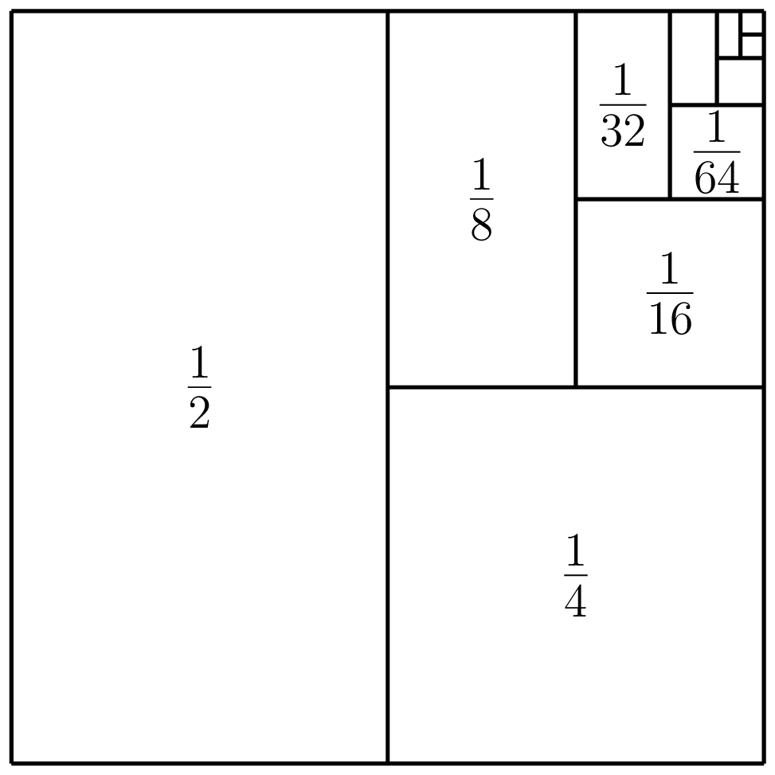
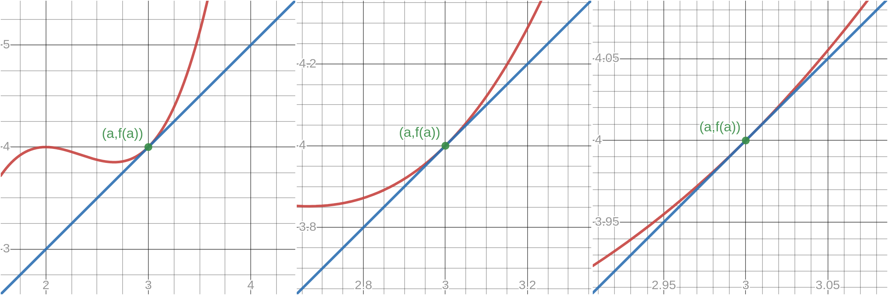

# Series {.unlisted .unnumbered}


A *series* is the sum of the terms of a sequence.


## Sigma Notation

Given a sequence $a_1,a_2,a_3,\dotsc$ the sum of the first $n$ terms is written
$$
\sum_{k=1}^{n}a_k=a_1+a_2+\dotsb+a_n
$$
(read as "the sum of $a_k$ from $k=1$ to $n$"). Such a sum is called a *series*.

Note that the summation index $k$ is a *dummy index* --- we can happily replace it with another label. We can also shift the starting value of the index, that is, we can *reindex* the series; this may be useful to give a simpler expression for the series. For example, we can equivalently write the above series as
\begin{align*}
\sum_{j=1}^{n}a_j,&&\sum_{k=0}^{n-1}a_{k+1},&&\sum_{p=100}^{n+99}a_{p-99},
\end{align*}

since these all sum the same values from the sequence.

We are quite often interested in summing the terms of a given sequence. The sum of the first $n$ terms of an arithmetic sequence is:
$$
\sum_{k=1}^{n}a_k=\frac{n}{2}\left(2a+(n-1)d\right) 
$$
and the sum of the first $n$ terms is:
$$
\sum_{k=1}^{n}a_k=\frac{a(1-r^n)}{1-r}
$$
for $r\neq1$, and
$$
\sum_{k=1}^{n}a_k=na
$$
for $r=1$.

## Infinite Series

Consider the sequence defined by $a_n=\dfrac{1}{2^n}$. What is the sum of all the terms of this sequence? That is, the sum
$$
\frac{1}{2}+\frac{1}{2^2}+\frac{1}{2^3}+\frac{1}{2^4}+\dotsb=\frac{1}{2}+\frac{1}{4}+\frac{1}{8}+\frac{1}{16}+\dotsb
$$
We can view the terms of the sequence geometrically as fractions of a square with total area one.

```{r geomsq, echo=FALSE, fig.cap = "The series $\\sum_{n=1}^\\infty\\dfrac{1}{2^n}$ can be viewed as summing up parts of a square with total area one.", fig.alt = "A square that has been repeatedly divided in half.", out.width="50%"}

```

We are effectively summing up parts of the square, whereby we keep adding half of what is left. Since after an "infinite number" of terms we will have included all parts of the square, it looks like
$$
\frac{1}{2}+\frac{1}{2^2}+\frac{1}{2^3}+\frac{1}{2^4}+\dotsb=1.
$$

This example is a *geometric series*, which is a sum of a *geometric sequence*. Here we have first term $a=\frac{1}{2}$ and common ratio $r=\frac{1}{2}$. The sum of the first $n$ terms of a geometric series is (for $r\neq1$):
$$
S_n=\sum_{k=1}^{n}ar^{k-1}=\frac{a(1-r^n)}{1-r}
$$
so we have
$$
S_n=\frac{\dfrac{1}{2}\left(1-\dfrac{1}{2^n}\right)}{1-\dfrac{1}{2}}=\left(1-\dfrac{1}{2^n}\right).
$$

The sum of the first $n$ terms of a series is called the *$n^\text{th}$ partial sum* of the series. We define the sum of an infinite series to be the limit of the partial sums. In this example we have

$$
\lim\limits_{n\to\infty}S_n=\lim\limits_{n\to\infty}\left(1-\dfrac{1}{2^n}\right)=1.
$$

Infinite series can be convergent (sum to a finite value) or divergent (to $+\infty$ or $-\infty$, or oscillate).


::: {.example #infiniteseries name="Some infinite series"}

1. Consider the sum of the first $n$ natural numbers:
    $$
    T_n=\sum_{k=1}^{n}k=1+2+3+\dotsb +n
    $$
    This is an \emph{arithmetic series}, i.e. the sum of an arithmetic sequence. The partial sum can be written as the general formula
    $$
    T_n=\frac{n(n+1)}{2}.
    $$
    We have $\displaystyle\sum_{k=1}^\infty k=\lim\limits_{n\to\infty} T_n=\infty$,
    and hence this infinite series diverges to infinity. Note that all arithmetic series diverge to $\pm\infty$ (why?).


1. Let $a_n=(-1)^n$ and consider the infinite series $\sum_{n=1}^{\infty}a_n$. This is a geometric series with $a=-1$ and $r=-1$. We have the partial sums
    \begin{align*}
    S_1&=-1\\
    S_2&=-1+1=0\\
    S_3&=-1+1-1=-1
    \end{align*}
    with general formula
    $$
    S_n=
    \begin{cases}
    -1&\text{if $n$ is odd,}\\
    0&\text{if $n$ is even.}
    \end{cases}
    $$
    Hence $\lim\limits_{n\to\infty}S_n$ does not exist (it oscillates) and the infinite series diverges.

1. We have seen an example of a convergent geometric series $\sum_{n=1}^\infty\frac{1}{2^n}=1$, a divergent geometric series $\sum_{n=1}^{\infty}(-1)^n$ which oscilates$. We can also have divergent series that diverge to $\pm\infty$. We'll now look at the general behaviour of a geometric series $\sum_{k=1}^{\infty}ar^{k-1}$. Recall that the partial sums are given by
    $$
    S_n=\sum_{k=1}^{n}ar^{k-1}=\frac{a(1-r^n)}{1-r}
    $$
    and note that the only term that depends on $n$ is $r^n$.
    
    If $-1< r <1$, then $r^n\to 0$ as $n\to infty$ and the sum will be convergent with
    $$
    S=\lim\limits_{n\to\infty}S_n=\frac{a}{1-r}
    $$

    If $r=1$ then the partial sums become $S_n=\sum_{k=1}^{n}a=na$, which clearly diverges to infinity.

    If $r>1$, then $r^n$\to\infty$ and hence $S_n\to\infty$.

    If $r=-1$, then we have a similar situation to the previous example with $S_n$ alternating between $+a$ and $-a$. The series oscillates (a type of divergence).

    If $r<-1$ then we alternately add and subtract numbers which are getting bigger and bigger in absolute value, so the series oscillates between increasingly larger positive and negative values.


1. The \textit{harmonic series}
    $$
    \sum_{n=1}^{\infty}\frac{1}{n}
    $$
    diverges to infinity, that is, $\lim\limits_{n\to\infty}\sum_{k=1}^{n}\frac{1}{k}=\infty$. To see this we collect together some terms
    $$
    \sum_{n=1}^{\infty}\frac{1}{n}=1+\frac{1}{2}+\left( \frac{1}{3}+\frac{1}{4}\right) +\left( \frac{1}{5}+\frac{1}{6}+\frac{1}{7}+\frac{1}{8}\right) +\dotsb
    $$
    and by comparing the terms in brackets with those in the following series, we can see that the harmonic series must be greater than this series
    \begin{align*}
    &1+\frac{1}{2}+\left( \frac{1}{4}+\frac{1}{4}\right) +\left( \frac{1}{8}+\frac{1}{8}+\frac{1}{8}+\frac{1}{8}\right) +\dotsb\\
    &=1+\frac{1}{2}+\left( \frac{1}{2}\right) +\left(\frac{1}{2}\right) +\dotsb
    \end{align*}
    Since the second series clearly diverges to infinity, so must the harmonic series. It actually diverges incredibly slowly --- here are some of the partial sums:
    $$
    S_{10}\approx 2.93,\qquad S_{20}\approx 3.40,\qquad S_{1000}\approx 7.49,\qquad S_{100000}\approx 12.09
    $$
    This example shows in particular that even if the terms are shrinking towards zero the series need not converge --- the speed at which they shrink is also important. On the other hand, if the terms in a series *don't* shrink to zero then the series will obviously diverge!
    
1. Interestingly a series of the form
    $$
    \sum_{n=1}^{\infty}\frac{1}{n^p}
    $$
    where $p$ is a real constant diverges if $p\leq 1$ and converges if $p>1$, so the terms $\frac{1}{n}$ in the harmonic series are decreasing only just too slowly to give a convergent series.
    In particular it can be shown that
    $$
    \sum_{n=1}^{\infty}\frac{1}{n^2}=\frac{\pi}{6}
    $$
    This curious result was found by Leonhard Euler in 1734: see [The Basel Problem](https://en.wikipedia.org/wiki/Basel_problem). It is not easy to solve with the techniques considered in these notes and is best tackled with more powerful mathematical tools, like *Fourier Series*.
:::

## Power Series

Let $t$ be a fixed real number. A *power series* is a series of the form
$$
\sum_{n=0}^{\infty}a_n(x-t)^n
$$
where $(a_n)_{n=0}^{\infty}$ is a sequence and $x$ is a real number.
Power series can be thought of as "polynomials with infinite degree", but technically they are not polynomials, which must have finite degree.

Consider the power series
$$
\sum_{n=0}^{\infty}\frac{x^n}{n+1}=1+\frac{x}{2}+\frac{x^2}{3}+\frac{x^3}{4}+\dotsb
$$
For $x=-1$ this gives the alternating harmonic series, which converges. For $x=1$ this gives the harmonic series, which diverges. So convergence of a power series can depend on the value of $x$.

The binomial series is another example of a power series
$$
(1+x)^\alpha=1+\alpha x+\frac{\alpha(\alpha-1)}{2!}x^2+\frac{\alpha(\alpha-1)(\alpha-2)}{3!}x^3+\dotsb
$$
which converges for any real value of $\alpha$ as long as $|x|<1$.


## Taylor Series

### Linearisation

It is often useful to approximate a complicated function by something that is easier to work with.

The simplest way to do this at a differentiable point $a$ of a function $f$ is to approximate the values of the function $f$ near $a$ by the tangent line
$$
y=f(a)+f'(a)(x-a).
$$
In this context, we call the tangent line the \emph{linearisation} of $f$ at $a$, and write it as the function
$$
L_a(x)=f(a)+f'(a)(x-a).
$$

At values of $x$ sufficiently close to $a$, $L_a(x)$ gives a good approximation to $f(x)$. We can see this should be true since the derivative is obtained as a limit of the slope of secant lines passing through nearby points and since this limit converges, if we zoom in on the graph of $f$ at $(a,f(a))$ it should look more and more like a straight line, i.e. it is approximately linear.
```{r linearapprox, echo=FALSE, fig.show="hold", out.width="100%", fig.cap = "Zooming in on the tangent line at $(a,f(a))$.", fig.alt = "Three figures showing progressive zooming in on the tangent line at $(a,f(a))$."}

```

More mathematically we have
$$
\lim\limits_{x\to a}\frac{f(x)-L_a(x)}{(x-a)}=\lim\limits_{x\to a}\frac{f(x)-f(a)}{x-a}-f'(a)=0
$$
where the second equality uses the definition of the derivative.

This says that as $x$ approaches $a$ not only does the difference $f(x)-L_a(x)$ become small, but it becomes small faster than $x-a$.

Whether or not the linearisation is a good enough approximation depends on the application, and in particular how wide a range of $x$ values we are interested in near the point.

Next we look at a better (but necessarily more complicated) way of obtaining a local approximation to a differentiable function by using polynomials.


### Taylor Polynomials

Consider a general polynomial function
$$
p(x)=a_0+a_1 x+\dotsb +a_n x^n.
$$
The coefficients $a_k$ can be expressed in terms of the value of $p$ and its derivatives at $0$ as follows
\begin{align*}
p(x)&=a_0+a_1 x+\dotsb +a_n x^n & p(0)&=a_0\\
p'(x)&=a_1+2a_2x+\dotsb +n a_n x^{n-1}& p'(0)&=a_1\\
p''(x)&=2a_2+6a_3 x+\dotsb +n(n-1)a_n x^{n-2}&p''(0)&=2a_2
\end{align*}
and in general
$$
p^{(k)}(0)=k!a_k\qquad\text{or}\qquad a_k=\frac{p^{(k)}(0)}{k!}
$$
for $0\leq k \leq n$, with the definitions $p^{(0)}=p$ and $0!=1$.

We could perform a similar analysis (exercise) for a polynomial in $(x-a)$
$$
p(x)=a_0+a_1(x-a)+\dotsb +a_n (x-a)^n
$$
and arrive at
$$
a_k=\frac{p^{(k)}(a)}{k!}.
$$


Suppose that $f$ is any function such that the derivatives $f^{(1)}(a),\dotsc, f^{(n)}(a)$ all exist. Then letting
$$
a_k=\frac{f^{(k)}(a)}{k!}
$$
we define the *Taylor Polynomial of degree $n$ for $f$ at $a$* as
$$
P_{n,a}(x)=a_0+a_1(x-a)+\dotsb +a_n (x-a)^n.
$$


The Taylor Polynomial $P_{n,a}$ has been defined so that it has the same $k^\text{th}$ derivative as $f$ at $a$:
$$
P_{n,a}^{(k)}(a)=f^{(k)}(a)\qquad\text{for all }0\leq k\leq n
$$
(Exercise: check this) and in fact is clearly the unique polynomial with degree $\leq n$ with this property. Also note that the first degree Taylor Polynomial $P_{1,a}$ is the same as the linearisation $L_a$.

We now want to show that a Taylor Polynomial can provide a good approximation to a function and in particular that the higher the degree of the polynomial the better the approximation.

::: {.example #taylorpoly name="Taylor Polynomial"}
We find the $n^\text{th}$ degree Taylor Polynomial of $\sin$ at $0$. The first few derivatives at $0$ are:
\begin{align*}
\sin(0)&=0\\
\sin^{(1)}(0)&=\cos(0)=1\\
\sin^{(2)}(0)&=-\sin(0)=0\\
\sin^{(3)}(0)&=-\cos(0)=-1\\
\sin^{(4)}(0)&=\sin(0)=0
\end{align*}
and we can see that higher order derivatives will cycle through $0,1,0,-1$. The coefficients $a_k=\dfrac{\sin^{(k)}(a)}{k!}$ are therefore: $0,1,0,-\frac{1}{3!},0,\frac{1}{5!},\dotsc$, so there are no even powers of $x$. We can list just odd numbers by considering $2n+1$ for any natural number $n$. Then the Taylor Polynomial $P_{2n+1,0}$ of degree ${2n+1}$ for $\sin$ at $0$ is:
$$
P_{2n+1,0}(x)=x-\frac{x^3}{3!}+\frac{x^5}{5!}-\frac{x^7}{7!}+\dotsc+(-1)^n\frac{x^{2n+1}}{(2n+1)!}
$$

By plotting the first few Taylor polynomials of $\sin$ at $0$, it appears that adding more terms provides a better approximation of $\sin$
```{r taylorsin, fig.cap = "First few Taylor polynomials of $\\sin(x)$ at $0$", fig.alt = "First few Taylor polynomials of $\\sin(x)$ at $0$"}
knitr::include_url("https://www.desmos.com/calculator/znq0rrfiqr")
```

As another example, consider the $n^\text{th}$ degree Taylor Polynomial of $e^x$ at $0$:
$$
P_{n,0}=1+x+\frac{x^2}{2!}+\frac{x^3}{3!}+\dotsb+\frac{x^n}{n!}
$$

If we plot $P_{n,0}$ for the first few $n$ it does indeed appear that $P_{n,0}(x)$ is closer to $e^x$ at zero for higher values of $n$.
:::

We will now make this idea more precise.

::: {.theorem #label name="theorem name"}
Let $P_{n,a}$ be the Taylor polynomial of degree $n$ of a function $f$ at a point $a$. Then
$$
\lim\limits_{x\to a}\frac{f(x)-P_{n,a}(x)}{(x-a)^n}=0,
$$
that is, $P_{n,a}$ is equal to $f$ up to order $n$ at $a$. Moreover, $P_{n,a}$ the unique polynomial of degree $n$ with this property.
:::

This says that $P_{n,a}$ is the unique degree $n$ polynomial that best approximates $f$ at $a$, in the sense that as $x\to a$ the difference between $f$ and $P_{n,a}$ tends to zero relatively quickly (faster than $(x-a)^n$, which goes to zero faster for increasing values of $n$). So, the higher the degree of the Taylor Polynomial the faster the values converge to the original function at the point $a$.


### Taylor Series

So far we have considered approximating functions by Taylor polynomials, that is, for a function $f$ we defined the $n^\text{th}$ degree Taylor polynomial
$$
P_{n,a}(x)=\sum_{k=0}^{n}\frac{f^{(k)}(a)}{k!}(x-a)^k.
$$

We saw that taking higher degree Taylor polynomials can give better approximations of a function. Now, what if we let $n\to\infty$? That is, if we consider the power series
$$
\sum_{k=0}^{\infty}\frac{f^{(k)}(a)}{k!}(x-a)^k=\lim\limits_{n\to\infty}P_{n,a}(x).
$$
We might expect that in the limit we in fact get
$$
\displaystyle\sum_{k=0}^{\infty}\frac{f^{(k)}(a)}{k!}(x-a)^k=f(x).
$$
Is this the case? The short answer is: not always, but it does for "everyday" functions at least on some interval around $a$ (such as trigonometric functions, hyperbolic functions, roots, exponentials and logarithms).

We call a power series of the form
$$
\sum_{k=0}^{\infty}\frac{f^{(k)}(a)}{k!}(x-a)^k
$$
the *Taylor series for $f$ at $a$*. When a Taylor series is formulated at the point $a=0$, it is often referred to as a *Maclaurin series*.

A Taylor series is a type of power series. In the previous section we saw that a power series might only converge for certain values of $x$. Generally, the Taylor series of a functino will either converge to the function for all values of $x$ or within some interval. Here we list some commonly used Taylor series derived at $a=0$, which you should familiarise yourself with. The Validity column states the interval around $0$ for which the Taylor series is equal to the original function.

|Series|Validity|
|---|---|
| $\frac{1}{1-x}=1+x+x^2+x^3+\dotsb=\sum_{n=0}^{\infty}x^n$ | $-1< x < 1$ |
| $e^x=1+x+\frac{x^2}{2!}+\frac{x^3}{3!}+\dotsb = \sum_{n=0}^{\infty}\frac{x^n}{n!}$ | $-\infty\leq x \leq \infty$ |
| $\cos(x)=1-\frac{x^2}{2!}+\frac{x^4}{4!}-\dotsb= \sum_{n=0}^{\infty}(-1)^n\frac{x^{2n}}{(2n)!}$ | $-\infty\leq x \leq \infty$ |
| $\sin(x)=x-\frac{x^3}{3!}+\frac{x^5}{5!}-\dotsb=\sum_{n=0}^{\infty}(-1)^n\frac{x^{2n+1}}{(2n+1)!}$ | $-\infty\leq x \leq \infty$ |
|$\ln(x+1)=x-\frac{x^2}{2!}+\frac{x^3}{3!}-\dotsb= \sum_{n=1}^{\infty}(-1)^{n+1}\frac{x^{n}}{n!}$ | $-1< x \leq 1$ |
| $\tan^{-1}(x)=x-\frac{x^3}{3}+\frac{x^5}{5}-\dotsb= \sum_{n=0}^{\infty}(-1)^n\frac{x^{2n+1}}{2n+1}$ | $-1\leq x \leq 1$ |

