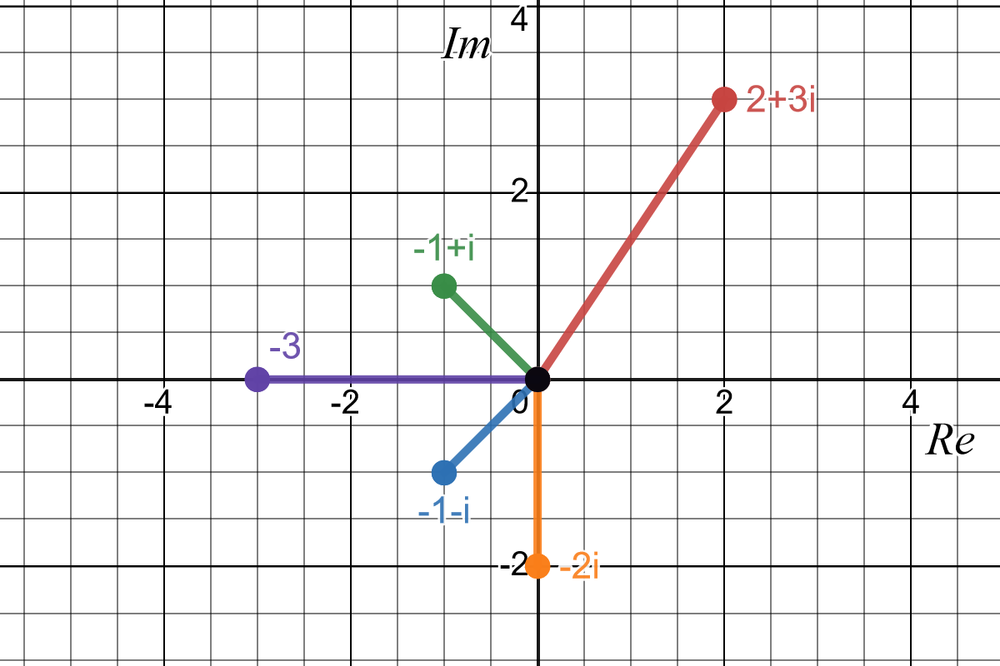

# Exercise Set 4 Answers {.unlisted .unnumbered}

1. Let $u=2+3i$ and $v=5+8i$. Determine the following.
    a. $u+v$
    a. $u-v$
    a. $uv$
    a. $vu$
    a. $\frac{u}{v}$
    a. $\frac{v}{u}$
    a. $u^2$
    a. $v^2$
    a. $u^2+v^2$

    Answers:

    a. $u+v = (2 + 3i) + (5 + 8i) = (2 + 5) + i(3 + 8) = 7 + 11i$
    
    b. $u - v = (2+3i) - (5 + 8i) = -3 - 5i$
    
    c. $$uv = (2 + 3i)(5+8i) = (2\times 5) + i(8\times 2) + i(3\times 5) + i^2(2\times 8)\\
        = 10 + 16i + 15i + i^2 24\\
        = 10 + 31i - 24\\
        = -14 + 31i$$
    
    d. $vu = (5+8i)(2 + 3i) = -14 + 31i$, the same as $uv$
    
    e. $$
    \frac{u}{v} = \frac{2+3i}{5 + 8i}
    $$
    rationalise the denominator by multiplying numerator and denominator by the complex conjugate of the denominator, $\overline{v}=5-8i$
    $$
    \frac{2 + 3i}{5+8i} = \frac{(2+3i)(5-8i)}{(5+8i)(5-8i)} = \frac{(2+3i)(5-8i)}{5^2 + 8^2} = \frac{10 - 16i + 15i - 24i^2}{89}\\
    = \frac{10-i + 24}{89} = \frac{34 - i}{89} = \frac{34}{89} - \frac{i}{89} = 0.382 - 0.011 i
    $$
    
    f. Similarly
    $$\frac{v}{u} = \frac{34}{13} + \frac{i}{13} = 2.615 + 0.077 i
    $$
    
    g. $u^2 = (2 + 3i)^2 = -5 + 12i$
    
    h. $v^2 = (5 + 8i)^2= -39 + 80i$
    
    i. $u^2 + v^2 = -44 + 92i$

1. State the complex conjugates of the following numbers. Also caclulate their modulus.
    a. $3-4i$
    a. $2+2i$
    a. $2+15i$
    a. $3i$
    a. $i$
    a. $5$

    Answers:
    
    a. $z = 3-4i,\quad \bar{z} = 3 + 4i,\quad |z| = 5$
    
    b. $z = 2+2i,\quad \bar{z} = 2 -2i,\quad |z| = \sqrt{8} = 2\sqrt{2} = 2.83$
    
    c. $z = 2+ 15i,\quad \bar{z} = 2 - 15i,\quad |z| = \sqrt{229} = 15.13$
    
    d. $z=3i, \quad \bar{z} = -3i,\quad |z| = 3$
    
    e. $z = i, \quad \bar{z} = -i,\quad |z| = 1$
    
    f. $z = 5, \quad \bar{z} = 5,\quad |z| = 5$

1. Let $z=3-i$. Find $z^2+7z+13$ in Cartesian form.

    Answers:
    
    $z^2 + 7 z + 13 = 42 - 13 i$

1. Find the roots of the following quadratic equations.
    a. $z^2+2z+26=0$
    a. $z^2-2z+3=0$
    a. $3z^2-7z+13=0$

    Answers:

    Using the quadratic formula:

    a. $z_1=-1-5i$, $z_2=-1+5i$

    b. $z_1 = 1 - i \sqrt{2}$, $z_2 = 1 + i \sqrt{2}$

    c. $z_1 = 7/6 - \frac{i \sqrt{107}}{6}$, $z_2 = 7/6 - \frac{i \sqrt{107}}{6}$

    Note that in all cases, $z_1=\overline{z}_2$. This is not a coincidence! Extra exercise: show that if $z_1$ is a root of a quadractic, then so is $\overline{z}_1$ (use the rules of complex conjugates). By the Fundamental Theorem of Algebra, these are then the only two roots of the quadratic.

1. Express the following complex numbers in polar form and exponential form.
    a. $1+i$
    a. $-1+i$
    a. $\sqrt{3}-i$
    a. $z_1=2-3i$
    a. $z_2=3+4i$
    a. $\frac{z_1-2}{z_2}$
    a. $z_1z_2-\frac{z_1-z_2}{z_2}$
    a. $w_1=-\sqrt{2}+\sqrt{2}i$
    a. $w_2=-\frac{1}{2}+\frac{\sqrt{3}}{2}i$
    a. $w_1w_2$
    a. $\frac{w_1}{w_2}$

    Answers:

    The polar form is
    $$z=r(\cos(\theta)+i\sin(\theta))$$
    and the exponential form is
    $$z=re^{i\theta}.$$
    Note these both contain the polar coordinates $(r,\theta)$ but the exponential form is more compact. In the answers below we will just state the values of $r$ and $\theta$.

    a. This is in the first quadrant.
        $r=\sqrt{x^2+y^2}=\sqrt{1^2+1^2}=\sqrt{2}$
        $\theta=\tan^{-1}\left(\frac{x}{y}\right)=\tan^{-1}\left(\frac{1}{1}\right)=\frac{\pi}{4}$

    b. This is in the second quadrant.
        $r=\sqrt{2}$, $\theta=$\pi$-\tan^{-1}\left(\frac{1}{1}\right)=\frac{3\pi}{4}$.

    c. This is in the fourth quadrant.
        $r=2$, $\theta=2\pi - \tan^{-1}\left(\frac{1}{\sqrt{3}}\right)=\frac{11\pi}{6}.$

    d. This is in the fourth quadrant.
        $r_1=\sqrt{13}$, $\theta_1=2\pi - \tan^{-1}\left(\frac{3}{2}\right)=5.30$ to 2 d.p.
    
    e. This is in the first quadrant.
        $r_2=5$, $\theta_2=\tan^{-1}\left(\frac{4}{3}\right)=0.93$ to 2 d.p.

    f. In Cartesian form: $\frac{z_1-2}{z_2}=-\frac{12}{25}-\frac{9}{25}i$.
    This is in the third quadrant.
    $r=\frac{3}{5}$, $\theta=\pi + \tan^{-1}\left(\frac{9/25}{12/25}\right)=3.79$ to 2 d.p.

    g. $z_1z_2=-1-7i$. Using the result from the previous part we have
    $$z_1z_2-\frac{z_1-2}{z_2}=-1-7i +\frac{12}{25}+\frac{9}{25}i= -\frac{13}{25}-\frac{166}{25}i$$
    This is in the third quadrant.
    $r=\frac{\sqrt{1109}}{5}$, $\theta=4.63$ to 2 d.p.

    h. This is in the second quadrant.
        $r_1=2$, $\theta_1=\pi-\tan^{-1}\frac{\sqrt{2}}{\sqrt{2}}=\frac{3\pi}{4}$.
    
    i. This is in the second quadrant.
        $r_2=1$, $\theta_2=\frac{2\pi}{3}.$
    
    j. $w_1w_2$ is easy to calculate in exponential form:
    $w_1w_2=r_1e^{i\theta_1}r_2e^{i\theta_2}=r_1r_2e^{i(\theta_1+\theta_2)}=2e^{i(\frac{17\pi}{12})}$.

    k. $\frac{w_1}{w_2}$ is easy to calculate in exponential form:
    $\frac{w_1}{w_2}=r_1e^{i\theta_1}/r_2e^{i\theta_2}=\frac{r_1}{r_2}e^{i(\theta_1-\theta_2)}=2e^{i(\frac{\pi}{12})}$.

1. Express the following complex numbers in Cartesian form.
    a. $2e^{i\frac{\pi}{12}}$
    a. $5e^{i 23^\circ}$
    a. $2e^{i (-45^\circ)}$

    Answers:

    a. $\frac{1 + \sqrt{3}}{\sqrt{2}} + \frac{\sqrt{3}-1}{\sqrt{2}}i$

    b. $4.60+1.95i$ to 2 d.p.

    c. $\sqrt{2} - \sqrt{2} i$


1. Find the following roots and express them in Cartesian form.
    a. $1^\frac{1}{3}$
    a. $1^\frac{1}{4}$
    a. The cube roots of $\sqrt{2}-\sqrt{2}i$
    a. The square roots of $3-4i$

    Answers:

    a. In exponential form the roots are:
    $$1^\frac{1}{3}=
    \begin{cases}
    e^{i0}\\
    e^{i\frac{2\pi}{3}}\\
    e^{i\frac{4\pi}{3}}
    \end{cases}.
    $$
    These translate to the Cartesian forms:
    $$1^\frac{1}{3}=
    \begin{cases}
    1\\
    -\frac{1}{2} + \sqrt{3}/2 i\\
    -\frac{1}{2} - \sqrt{3}/2 i
    \end{cases}.
    $$

    b. In exponential form the roots are:
    $$1^\frac{1}{4}=
    \begin{cases}
    e^{i0}\\
    e^{i\frac{2\pi}{4}}=e^{i\frac{\pi}{2}}\\
    e^{i\frac{4\pi}{4}}=e^{i\pi}\\
    e^{i\frac{6\pi}{4}}=e^{i\frac{3\pi}{2}}\\
    \end{cases}.
    $$
    These translate to the Cartesian forms:
    $$1^\frac{1}{4}=
    \begin{cases}
    1\\
    i\\
    -1\\
    -i
    \end{cases}.
    $$

    c. In exponential form the roots are:
    $$(\sqrt{2}-\sqrt{2}i)^\frac{1}{3}=
    \begin{cases}
    \sqrt[3]{2}e^{i(-\frac{\pi}{12})}\\
    \sqrt[3]{2}e^{i(-\frac{\pi}{12}+\frac{2\pi}{3})}=\sqrt[3]{2}e^{i\frac{7\pi}{12}}\\
    \sqrt[3]{2}e^{i(-\frac{\pi}{12}+\frac{4\pi}{3})}=\sqrt[3]{2}e^{i\frac{5\pi}{4}}
    \end{cases}.
    $$
    These translate to the Cartesian forms:
    $$(\sqrt{2}-\sqrt{2}i)=
    \begin{cases}
    \frac{1 + \sqrt(3)}{2^{7/6}} - \frac{\sqrt{3} - 1}{2^{7/6}}i\\
    \frac{1 - \sqrt(3)}{2^{7/6}} - \frac{1+\sqrt{3}}{2^{7/6}}i\\
    -\frac{1}{2^{1/6}} + \frac{1}{2^{1/6}}i\\
    \end{cases}.
    $$

    d. This one can be factorised (relatively) easily:
    $$3-4i=4-4i+i^2=(2-i)^2$$
    so that
    $$\sqrt{3-4i}=\pm(2-i)=\begin{cases}
    2-i\\
    -2+i
    \end{cases}.$$

1. Sketch the following complex numbers in the complex plane.
    a. $2+3i$
    a. $-1-i$
    a. $-1+i$
    a. $-2i$
    a. $-3$

    Answers:

```{r complexsketch, fig.cap = "The numbers in Question 8 in the complex plane.", fig.alt = "Sketch of the numbers in Question 8 in the complex plane."}

```

1. What is $i^i$ in Cartesian form?

    Hint: start by writing $i$ in exponential form.

1. Find all complex numbers $z$ such that $\overline{z}=z^2$.

    Hint: start by writing $z$ in exponential form.