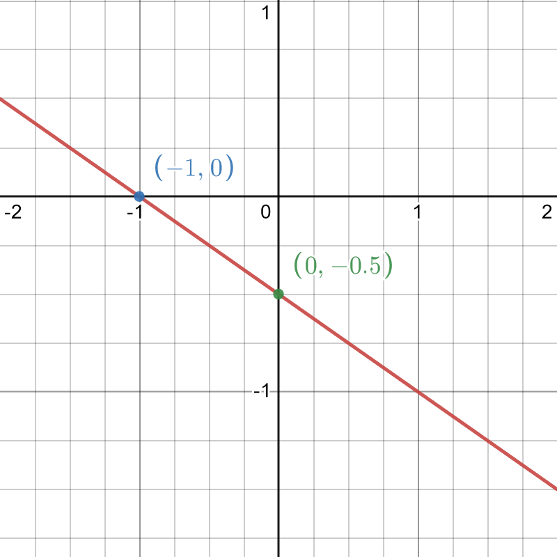
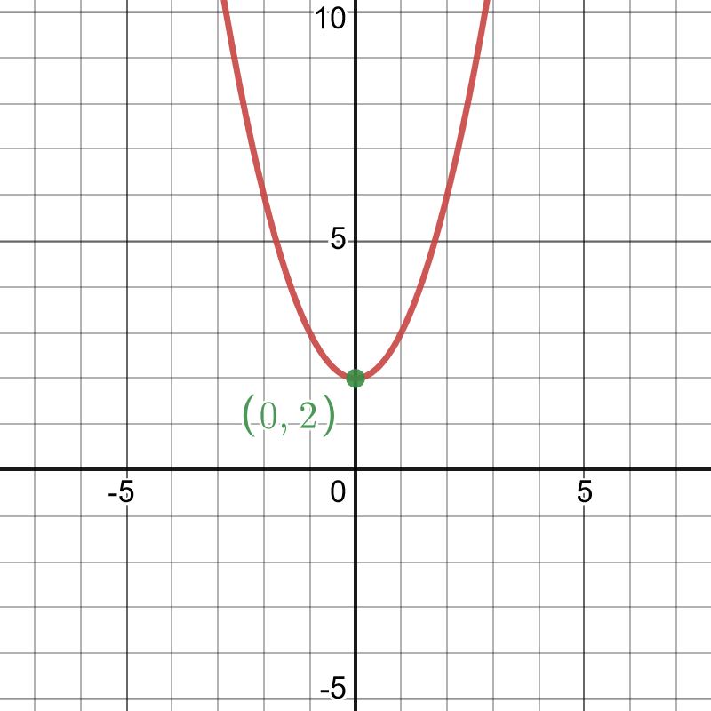
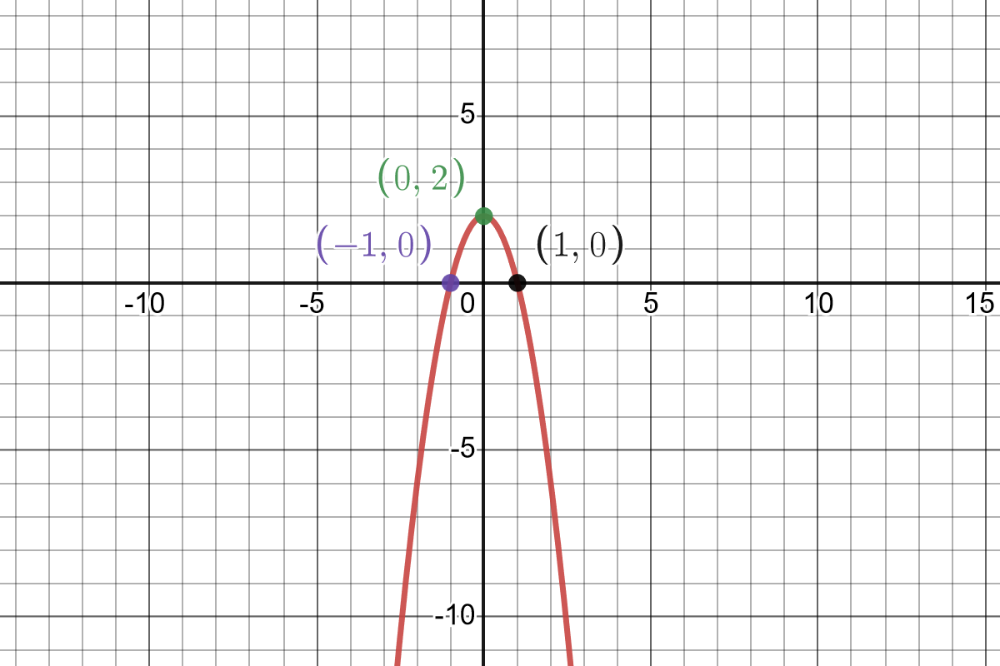
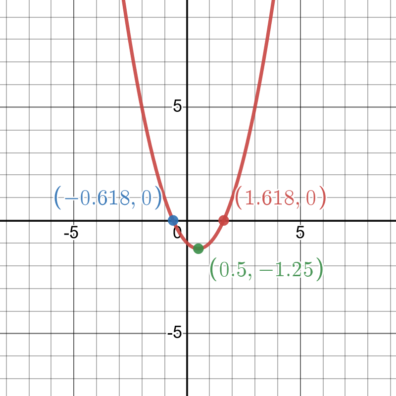
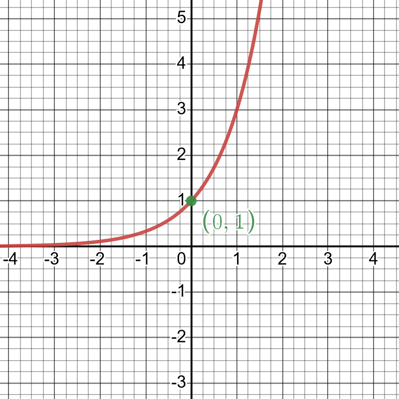
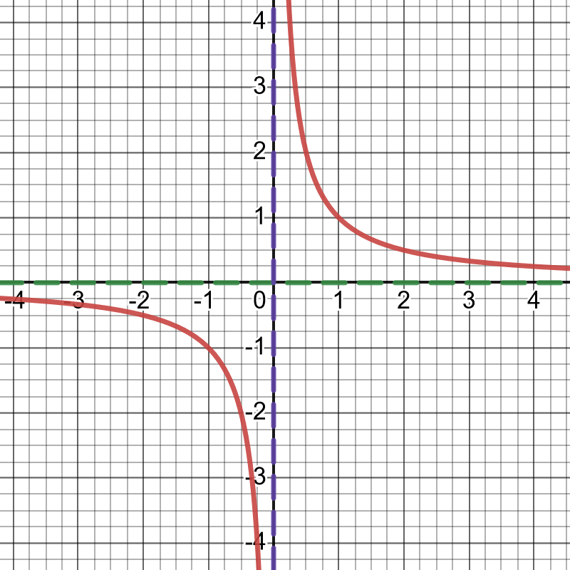
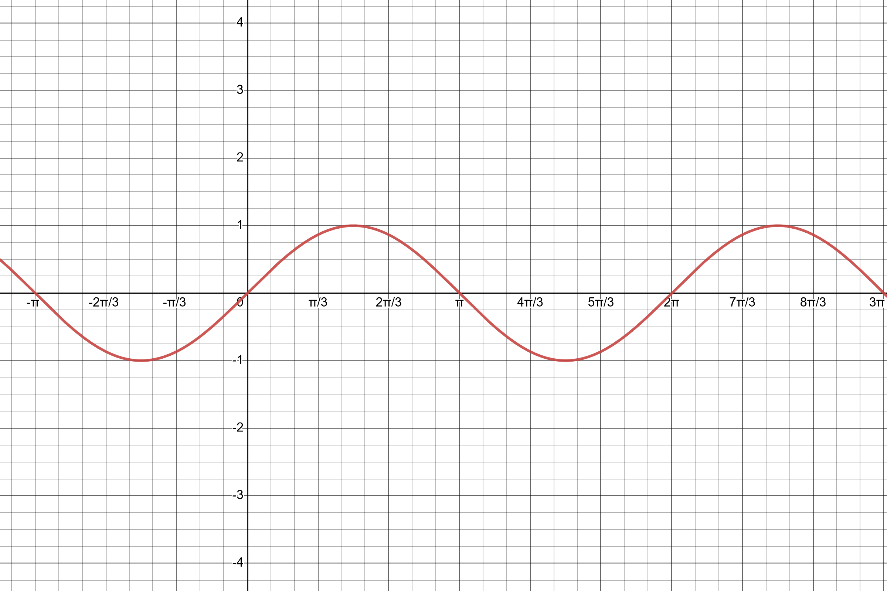
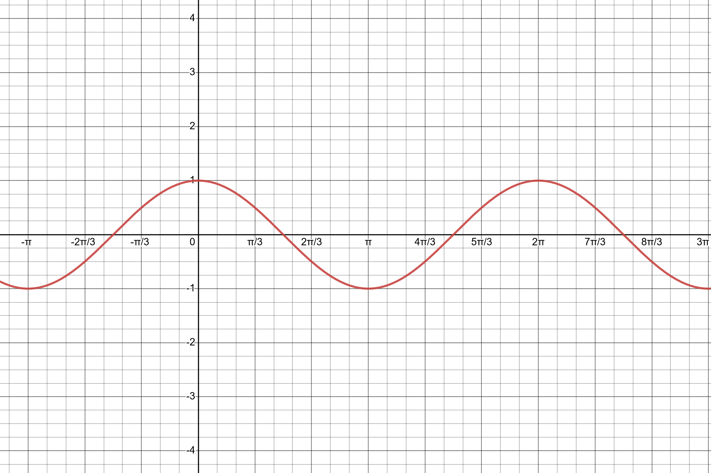
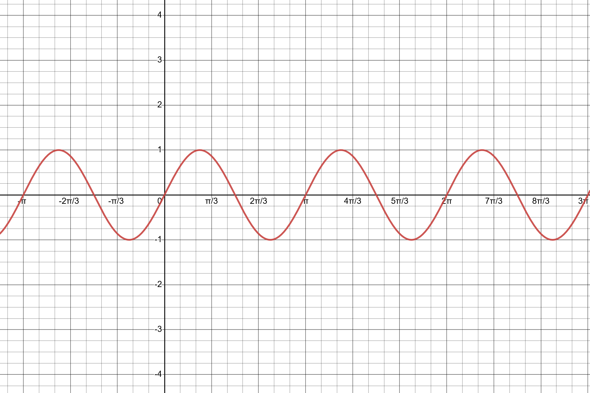
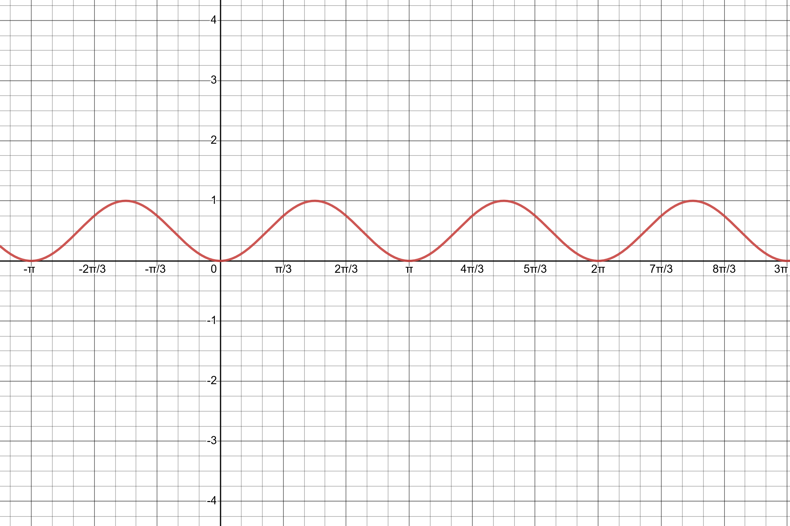

# Exercise Set 2 Answers {.unlisted .unnumbered}

These exercises cover the topics of Functions and Graphs.

1. Sketch the graphs of the following functions on the interval $-2\le x \le 2$.
    a. $y=-\frac{1}{2}(x+1)$
    a. $y=x^2+2$
    a. $y=-2x^2+2$
    a. $y=x^2-x-1$
    a. $y=3^x$
    a. $y=\frac{1}{x}$

    Tips: find where the functions cross the axes; use completing the square to find the maximum or minimum of quadratics; identify any asymptotes.

    Answers:
    a. Expanding: $y=-\frac{1}{2}x-\frac{1}{2}$ which we recognise as a line with gradient $-\frac{1}{2}$ and y intercept $-\frac{1}{2}$. Solving for $y=0$ gives the x intercept as $(-1,0)$.
```{r, out.width="50%"}

```

    a. This is a parabola shifted up by 2 units.
```{r, out.width="50%"}

```

    a. This is an "upside down" parabola, shifted up by two units.
```{r, out.width="50%"}

```

    a. Completing the square $y=(x-\frac{1}{2})^2-\frac{5}{4}$. Since the squared term is always non-negative, it is smallest when it is zero at $x=\frac{1}{2}$. This is the position of the minimum, and at this point $y=-\frac{5}{4}$. Factorising: $(x-\frac{1+\sqrt{5}}{2})(x-\frac{1-\sqrt{5}}{2})$, so the curve crosses the x axis at $x=\frac{1+\sqrt{5}}{2}$ and $x=\frac{1-\sqrt{5}}{2}$. Since the coefficient of $x^2$ is positive, the parabola opens upwards.
```{r, out.width="50%"}

```

    a. This is an exponential $a^x$ with $a>1$. All exponential functions cross the y axis at $a^0=1$ and the do not cross the $x$ axis.
```{r, out.width="50%"}

```

    a. This is a rational function with a vertical asymptote at $x=0$. It is small and positive for large positive values of $x$ and it is small and negative for large negative values of $x$: the line $y=0$ is a horizontal asymptote.
```{r, out.width="50%"}

```

1. Sketch the following graphs (with $x$ in radians):
    a. $y=\sin(x)$
    a. $y=\sin(x+\frac{\pi}{2})$ (does this look familiar?)
    a. $y=\sin(2x)$
    a. $y=\sin^2(x)$

    Answers:
    a. You should be familiar with this graph and the location of maxima, minima and axis intercepts.
```{r, out.width="50%"}

```

    a. Note that $\sin(x+\frac{\pi}{2})=\cos(x)$.
```{r, out.width="50%"}

```

    a. This is double the angular frequency of the usual sine function.
```{r, out.width="50%"}

```

    a. Note that all the y values are non-negative.
```{r, out.width="50%"}

```

1. If we had the graph of a function $f(x)$, describe what would change qualitatively for the graph of $f(a\times x)$ where $a$ is a constant. Consider the cases:
    a. $a>1$
    a. $0 < a < 1$
    a. $-1 < a < 0$
    a. $a<-1$

    Answers:

    a. For $a>1$, the graph is "squeezed" along the x axis, with the value at $x=0$ remaining unchanged.
    b. For $0 < a <1$, the graph is expanded along the x axis, again with the value at $x=0$ unchanged.
    c. For $-1 < a <0$, the graph is again expanded, along the x axis, but the minus sign in $a$ also means that the graph is reflected in the y axis.
    d. For $a<-1$, the graph is squeezed horizontally and reflected in the y axis.

 1. If we had the graph of a function $f(x)$, describe what would change qualitatively for the graph of $f(x+b)$ where $b$ is a constant. Consider the cases:
    a. $b>0$
    a. $b<0$

    Answers:
    a. For $b>0$, the $f(x+b)$ is the graph of $f(x)$ translated to the left by distance $b$
    b. For $b<0$, the whole graph is translated to the right by distance $b$


 1. If we had the graph of a function $f(x)$, describe what would change qualitatively for the graph of $f(x)+c$ where $c$ is a constant. Consider the cases:
    a. $c>0$
    a. $c<0$
    
    
    Answers:
    a. For $c>0$, $f(x)+c$ is the graph of $f(x)$ shifted vertically up along the y axis
    b. For $c<0$, $f(x)+c$ is the graph of $f(x)$ shifted vertically down along the y axis
