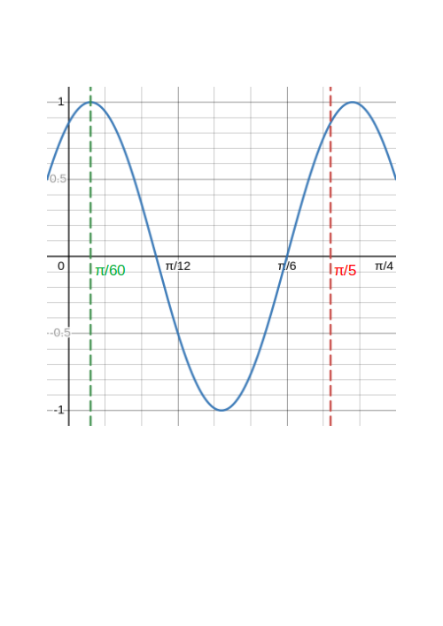

# Exercise Set 4 Answers {.unlisted .unnumbered}

These exercises cover the topic of Trigonometry.

Tip: always start by drawing a labelled diagram in trigonometry questions.

1. Consider the smaller of the two angles between the hour hand and minute hand of a clock (remembering that the hour hand moves continuously!). Write the angles at the following times in both degrees and radians (in terms of $\pi$).
    a. 6:00
    a. 3:00
    a. 4:00
    a. 4:30
    a. 6:45

    Answers:
    a. $180^\circ$, $\pi\text{ rad}$
    a. $90^\circ$, $\frac{\pi}{2}\text{ rad}$
    a. $60^\circ$, $\frac{2\pi}{3}\text{ rad}$
    a. $45^\circ$, $\frac{\pi}{4}\text{ rad}$
    a. $67.5^\circ$, $\frac{3\pi}{8}\text{ rad}$


1. Convert the following angles from degrees to radians. Give answers both in terms of $\pi$ and to 2 d.p.
    a. $330^\circ$
    a. $22.5^\circ$
    a. $27^\circ$
    a. $35^\circ$

    Answers:
    a. $\frac{11}{6}\pi\text{ rad}$
    a. $\frac{\pi}{8}\text{ rad}$
    a. $\frac{3}{20}\pi\text{ rad}$ or $0.47\text{ rad}$
    a. $\frac{7}{36}\pi\text{ rad}$ or $0.61\text{ rad}$


1. A *bearing* is the angle measured clockwise from North to the direction of interest (note how this differs to how we measure angles in the coordinate plane).
    A point $K$ is 12km due west of a second point $L$ and 25km due south of a third point $M$. Calculate the bearing of $L$ from $M$.

    Answers:

    Drawing a right angled triangle $MKL$ the angle $\angle KML$ is
    $$\tan(\angle KML)=\frac{12}{25}\quad\implies\quad \angle KML=\tan^{-1}\frac{12}{25}=25.6^\circ$$
    The bearing of $L$ from $M$ is the angle clockwise from a line pointing North from $M$, so the bearing is:
    $$180^\circ -25.6^\circ=154.4^\circ.$$

1.  Solve (i.e. find all unknown angles and side lengths) the triangle $ABC$ where $A = 53^\circ$, $B = 61^\circ$ and $a = 12.6$cm.

    Answers:

    We first find angle $C$:

    $$C=180^\circ-61^\circ-53^\circ=66^\circ.$$

    Now using the sine rule:

    $$b=\frac{a}{\sin(A)}\sin(B)=\frac{12.6}{\sin(53^\circ)}\sin(61^\circ)=13.8\text{ cm}$$

    and

    $$c=\frac{a}{\sin(A)}\sin(C)=\frac{12.6}{\sin(66^\circ)}\sin(53^\circ)=14.4\text{ cm}.$$

1.  Solve (i.e. find all unknown angles and side lengths) the triangle $ABC$ where $a=10.2$m, $c=14.6$m and $C = 32.5^\circ$.

    Answer:

    We have $C$, $c$ and $a$, so we can use the sine rule to find $A$:

    $$\sin(A)=\frac{a\sin(C)}{c}=\frac{10.2\times 0.537}{14.6}=0.375,$$
    $$A=\sin^{-1}(0.375)=22.05^\circ.$$

    Now we can find the angle $B$

    $$B=180^\circ -A-C= 180^\circ-22.05^\circ-32.5^\circ=125.45^\circ.$$

    Finally, we find $b$ using the sine rule again:

    $$b=\frac{c\sin(B)}{\sin(C)}=\frac{14.6\times 0.815}{0.537}=22.16\text{m}.$$

1.  Let $AOB$ be a triangle. $OA = 60$mm, $AB = 180$mm and $OB = 200$mm. Find angle $A$.

    Answers:

    Using the cosine rule:
    \begin{align*}\cos(A)&=\frac{b^2+c^2-a^2}{2bc}\\
    &=\frac{60^2+180^2-200^2}{2\times 60\times 180}\\
    &=-0.185
    \end{align*}
    which gives
    $$A=\cos^{-1}(-0.185)=101^\circ.$$

1. An *angle of elevation* is an angle that an imaginary straight line must be raised from the horizontal ground to line up with a point of interest above the ground.
An observer is standing at a point $O$ which is $30$m from the base of a tower. On top of the tower is a vertical mast. If the angles of elevation of the top of the tower and the top of the mast from $M$ are $40^\circ$ and $50^\circ$ respectively, calculate the height of the mast.

    Answers:

    Let the base of the tower be point $B$, the top of the tower point $T$ and the top of the mast point $M$. Then there are two right-angled triangles: $OBT$ and $OBM$. We have $OB=30$m, angle $\angle BOT=40^\circ$ and angle $\angle BOM=50^\circ$. We need to calculate $TM$. Using trig. ratios:

    $$BT=OB\tan(\angle BOT)=30\tan^{-1}(40^\circ)=25.2\text{ m}$$
    $$BM=OB\tan(\angle BOM)=30\tan^{-1}(50^\circ)=35.8\text{ m}$$

    and hence

    $$TM=OM-OT=35.8-25.2=10.6\text{ m}.$$


1. The small hand of a clock is 75% the length of the long hand, which has length $x$. Calculate the distance between the ends of the hands at 5 o'clock.

    Answers:

    Let the distance between the ends of the hands be $d$ and the length of the long hand $x$. Then the length of the short hand is $0.75x$. The angle at 5 o'clock is $150^\circ$. Using the cosine rule:

    $$d^2=(0.75x)^2+x^2-1.5x^2\cos(150^\circ)=2.86x^2$$
    and
    $d=1.69x.$

1. A student $1.8$m tall is standing $24$m away from a tree and using an eye level instrument to measure the angle of elevation. The angle measured to the top of the tree is $12^\circ 34'$, calculate the height of the tree. (Degrees can be further subdivided in to *minutes* denoted $x'$ and *seconds* denoted $x''$, with $1'$ being $1/60$ of a degree and $1''$ being $1/60$ of a minute. To use a calculator you will first need to convert minutes and seconds to decimals.)

    Answers:

    Let the student be at position $O$ with eye-level $E$, the base of the tree at position $B$ and the top of the tree at position $T$. Drawing a line parallel to $OB$ from $E$ to the tree, let the intersection point be $S$. We have $OE=BS=1.8\text{ m}$ (or perhaps more realistically we could use 1.7m for eye-level), $OB=ES=24\text{ m}$ and $\angle SET=12^\circ 34'$. First, we convert the angle to decimal:
    $$12^\circ 34'=12^\circ + \frac{34}{60}=12^\circ + 0.57^\circ=12.57^\circ.$$
    Now,
    $$ST=ES\tan(\angle SET)=24\tan(12.57^\circ)=5.4\text{ m}$$
    so
    $$BT=BS+ST=5.4+1.8=7.2\text{ m}.$$

1.  The angles of elevation of a navigation balloon that is flying in between two points on the ground $A$ and $B$ are $48^\circ$ and $62^\circ$ respectively. If $A$ and $B$ are $0.3$km apart, calculate the height of the balloon. 

    Answers:

    Let the ballon be at point $C$, then we have a triangle $ABC$. Angle $C$ is $C=180-48-62=70^\circ$. We now find the length of $BC$ using the sine rule:

    $$BC=\frac{AB}{\sin(C)}\sin(A)=\frac{0.3}{\sin(70^\circ)}\sin(48^\circ)=0.237\text{ km}$$
    Now dropping a perpendicular from $C$ to the ground at a point $D$ (on the line $AB$) we have a right angled triangle $BDC$. Using $\sin(\theta)=Opp./Hyp.$ the height is then
    $$DC=BC\sin(C)=0.237\sin(62^\circ)=0.21\text{ km}.$$


1.  The figure below shows a tetrahedron with an equilateral triangle of side 2m forming the base and isosceles triangles of equal side 3m forming the slanting 
faces. Calculate:

    a. The height of the tetrahedron $ND$;
    b. The angle that edge $DA$ makes with the plane $ABC$;
    c. The angle between the planes $ACD$ and $ACB$.

    ```{r tetra_ans, out.width="30%"}
    
    ```

    Answers:

    a. $ABC$ is an equilateral triangle, so each of its angles are $60^\circ$. By symmetry, $N$ is in the centre of triangle $ABC$. Therefore $\angle ANB=120^\circ$ and $\angle BAN=30^\circ$. Using the sine rule:

        $$AN=\frac{2}{\sin(120^\circ)}\sin(30^\circ)=1.15\text{ m}.$$

        Now using Pythagoras on right-angled triangle $AND$:

        $$ND=\sqrt{AD^2-AN^2}=\sqrt{3^2-1.15^2}=\sqrt{7.68}=2.77\text{ m}$$

    a. This is given by angle $\angle NAD$, which can be found using $\cos(\theta)=Adj./Hyp.$

        $$\cos(\angle NAD)=\frac{1.15}{3}=0.385\implies \angle NAD=\cos^{-1}(0.385)=67.4^\circ.$$

    a. By similar reasoning to the above, this is left for the reader to verify as being $78.2^\circ$.

1. This is a harder question using trigonometric identities. Here we shall derive a special (slightly simpler) case of the sum of two sinusoidal waves of the same frequency that was shown in lectures. We will consider two waves of the form
$$y_1=A_1\sin(\omega t),\qquad y_2=A_2\cos(\omega t)$$.
    a. First assume we can write $y_1+y_2$ in the form $A\sin(\omega t+\phi)$. Then using the trigonometric identity
    $$\sin(\theta+\phi)=\sin(\theta)\cos(\phi)+\cos(\theta)\sin(\phi)$$
    deduce that $A_1=A\cos(\phi)$ and $A_2=A\sin(\phi)$.
    a. Now using the trigonometric identity $\sin^2(\theta)+\cos^2(\theta)=1$ show that $A^2=A_1^2+A_2^2$.
    a. Finally, using $\tan(\theta)=\frac{\sin(\theta)}{\cos(\theta)}$, show that $\tan(\phi)=\frac{A_2}{A_1}$.

    Answers:

    a. We assume $A\sin(\omega t+\phi)=y_1+y_2=A_1\sin(\omega t)+A_2\cos(\omega t)$
       Now using the trig. identity on the l.h.s.
        $$A\sin(\omega t+\phi)=A(\sin(\omega t)\cos(\phi)+\cos(\omega t)\sin(\phi))=A\cos(\phi)\sin(\omega t)+A\sin(\phi)\cos(\omega t)$$
        and comparing this to the r.h.s and equating coefficients of $\sin(\omega t)$ and $\cos(\omega t)$, we must have
        $A_1=A\cos(\phi)$ and $A_2=A\sin(\phi)$.

    a. We have:    
        $$A_1^2+A_2^2=A^2\cos^2(\phi)+A^2\sin^2(\phi)=A^2(\cos^2(\phi)+\sin^2(\phi))=A^2(1)=A^2$$
        as required.

    a. We have:
        $$\tan(\phi)=\frac{\sin(\phi)}{\cos(\phi)}=\frac{A\sin(\phi)}{A\cos(\phi)}=\frac{A_2}{A_1}$$
        as required.


1. Write the following in the form $R\cos(\omega t\pm \beta)$.
    a. $-2\sin(\omega t) + 5\cos(\omega t)$
    a. $-5\cos(\omega t) + 5 \sin(\omega t)$

    Answers:
    a. Using $A=\sqrt{A_1^2+A_2^2}$, we have
        $$A=\sqrt{(-2)^2+5^2}=\sqrt{29}.$$
        Now using $\tan(\phi)=\frac{A_2}{A_1}$
        $$\tan(\phi)=\frac{5}{-2}$$
        hence we are in the second quandrant and
        $$\phi=\tan^{-1}\left(\frac{5}{-2}\right)+180^\circ=111.80^\circ.$$
        Finally we have,
        $$-2\sin(\omega t) + 5\cos(\omega t)=\sqrt{29}\sin(\omega t+111.80)$$

    a. Using $A=\sqrt{A_1^2+A_2^2}$, we have
        $$A=\sqrt{5^2+(-5)^2}=\sqrt{2\times 5^2}=5\sqrt{2}.$$
        Now using $\tan(\phi)=\frac{A_2}{A_1}$
        $$\tan(\phi)=\frac{-5}{5}$$
        hence we are in the fourth quandrant and
        $$\phi=\tan^{-1}\left(\frac{-5}{5}\right)=-45^\circ.$$
        Finally we have,
        $$-5\cos(\omega t) + 5\sin(\omega t)=5\sqrt{2}\sin(\omega t-45)$$

1. In a spring-mass system the motion of the mass is described by
$$x=A_1\sin(\omega t)+A_2\cos(\omega t)$$
where $x$ is the distance of the mass from its equilibrium position, $\omega$ is the natural frequency of oscillations, and $A$ and $B$ are constants. For $A_1=1$, $A_2=\sqrt{3}$ and $\omega=10\,\text{rad s}^{-1}$:
    a. Write $x$ in the form $A\sin(\omega t-\phi)$ and state the amplitude of $x$.
    a. Sketch one complete cycle of $x$, labelling $A$, $\phi$ and the period $T$

    Answers:
    a. Using $A=\sqrt{A_1^2+A_2^2}$, we have
        $$A=\sqrt{1^2+\sqrt{3}^2}=\sqrt{4}=2.$$
        Now using $\tan(\phi)=\frac{A_2}{A_1}$
        $$\tan(\phi)=\frac{\sqrt{3}}{1}$$
        hence we are in the first quandrant and
        $$\phi=\tan^{-1}\left(\sqrt{3}\right)=\frac{\pi}{3}\,\text{rad}.$$
        Finally we have,
        $$x(t)=\sin(10 t) + \sqrt{3}\cos(10 t)=2\sin(10 t+\frac{\pi}{3})$$

        From this we can read off the amplitude as $A=2$.

    a. The period is $T=\frac{2\pi}{10}=\frac{\pi}{5}$.

        ```{r coswave, out.width="50%"}
        
        ```