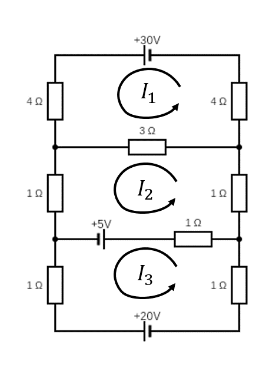
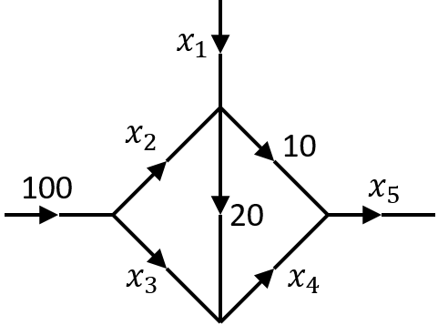

# Exercise Set 6 {-}

These exercises cover solving linear equations by Gaussian elimination.

1. Use Gaussian elimination (elementary row operations) to determine whether or not the following systems of equations have solutions, and, when they do, to find *all solutions*. In the cases where there is more than one solution, find the general solution and also give one particular solution. (Tip: Choosing the elementary row operations carefully can minimise the use of fractions).
	
    a. $$\begin{align*}
    x + y - z &= -3, \\
    2x + 2y - z &= -2, \\
    3x + 2y - 3z&= -7;
    \end{align*}$$

    a. $$\begin{align*}
    2x - 2y + 3z&= 5, \\
    3x - 2y + 4z&= 6, \\
    4x + y  + 2z&= 2;
    \end{align*}$$

    a. $$\begin{align*}
    3x + 2y + 13z&= 2, \\
    4x + 2y + 16z&= 1, \\
    x  + y  + 5z &= 1;
    \end{align*}$$

    a. $$\begin{align*}
    2x + z &= 3, \\
    x  + y  + z &= 2, \\
    x  + 3y + 2z&= 3;
    \end{align*}$$

    a. $$\begin{align*}
    2x + 4y  + z  - 3t&= 7, \\
    5x + 10y + 6z - 4t&= 14, \\
    7x + 14y + 5z - 9t&= 23;
    \end{align*}$$

    a. $$\begin{align*}
    3x + 4y &= 1, \\
    2x - 4y + 2z&= 4, \\
    3x + z &= 2, \\
    x - 2y + z &= 2;
    \end{align*}$$

    a. $$\begin{align*}
    3x - y  + 2z + t&= 3, \\
    x  + 2y - z  + t&= -3, \\
    3x + y  + z  + t&= 0, \\
    3x + 2y + t&= -1.
    \end{align*}$$

1. *Balancing chemical equations.* In the combustion of propane gas, propane ($C_3H_8$) combines with oxygen ($O_2$) to form carbon dioxide ($CO_2$) and water ($H_2O$) according to the equation
$$x_1 C_3H_8 + x_2 O_2\to x_3CO_2+x_4H_2O.$$
To balance this equation, we must find natural numbers $x_1, x_2, x_3, x_4$ such that the total numbers of $C$, $H$ and $O$ atoms are equal on both sides. Formulate this problem as a set of linear equations and solve using Guassian elimination.


1. *Electrical networks.* Consider the circuit diagram below.

    ```{r, out.width="30%"}
    
    ```

    The voltage drop across a resistor is (by Ohm's law) $V=IR$ where $V$ is in volts, the current $I$ is in amps and the resistance $R$ is in ohms.
    Kirchhoff's junction law: the sum of currents flowing into a junction is equal to the sum of currents flowing out of that junction.
    Kirchoff's Voltage law: The sum of the voltage drops in one direction around a loop equals the sum of the voltage sources in the same direction around the loop.
    Using these laws it is possible to derive the following set of linear equations for the currents $I_1, I_2, I_3$:

    \begin{align*}
    11I_1-3I_2&=30\\
    -3I_1+6I_2-I_3&=5\\
    -I_2+3I_3&=-25.
    \end{align*}

    Determine the currents. (Extra challenge: derive the equations!).

1. *Network analysis*. The diagram below represents the traffic flow in a one-way road network. Each directed edge represents a one-way road and is labelled with the flow through that road. The nodes represent road junctions.

    ```{r, out.width="30%"}
    
    ```

    By considering the flow in and out of each node and the total flow in and out of the network, formulate a system of linear equations for the unknown flows $x_1,\dotsc,x_5$ and solve them by Gaussian elimination. You will find there is a "free variable", but the requirement for non-negative flows puts some restrictions on the variables. In particular, what are the restrictions on $x_1$ and $x_5$?