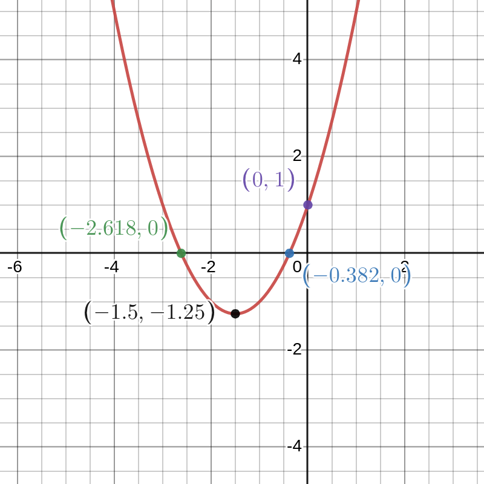
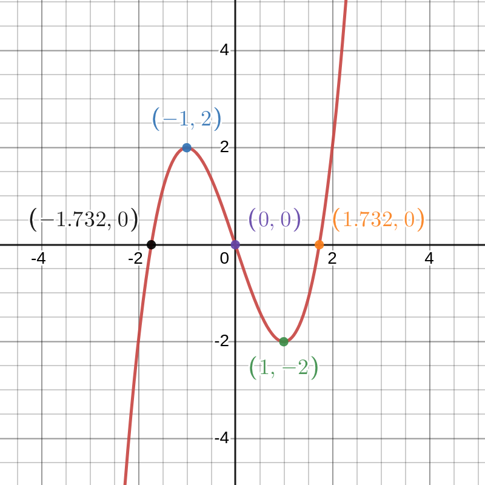

# Exercise Set 8 Answers {.unlisted .unnumbered}

1. Find the first and second dervatives of the following expressions.
    a. $y=3x^5+2x-1$
    a. $y=4x^{-1}$
    a. $y=x^{\frac{1}{2}}+x^{\frac{1}{3}}$
    a. $y=x^7+\sin(x)$
    a. $y=e^x+5$

    Answers:

    a. \begin{align*}
        y &= 3x^5 + 2x -1$\\
        \frac{dy}{dx} &= 15x + 2\\
        \frac{d^2y}{dx^2} &= 15
        \end{align*}
    
    a. \begin{align*}
            y&=4x^{-1}\\
        \frac{dy}{dx} &= -4x^{-2}\\
        \frac{d^2y}{dx^2} &= 8x^{-3}
        \end{align*}

    a. \begin{align*}
            y &= x^\frac{1}{2} + x^\frac{1}{3}\\
            \frac{dy}{dx} &= \frac{1}{2}x^{-\frac{1}{2}} + \frac{1}{3}x^{-\frac{2}{3}}\\
            \frac{d^2y}{dx^2} &= -\frac{1}{4}x^{-\frac{3}{2}} + -\frac{2}{9}x^{-\frac{5}{3}}
            \end{align*}

    a. \begin{align*}
            y &= x^6 \sin(x)\\
            \frac{dy}{dx} &= 7x^6 + \cos (x)\\
            \frac{d^2y}{dx^2} &= 42x^5 - \sin(x)
            \end{align*}

    a. \begin{align*}
            y &= e^x + 5\\
            \frac{dy}{dx} &= e^x\\
            \frac{d^2y}{dx^2} &= e^x
            \end{align*}


1. Find the derivative of $(1+2x)(x-x^2)$ in two ways: first, expand and find the derivative; second, use the product rule. Your answers should agree!

    Answer:
        
    Method 1, expand and find the derivative:
    \begin{align*}
    y &= (1+2x)(x-x^2)\\
    &=x - x^2 + 2x^2 - 2x^3\\
    &=-2x^3 + x^2 + x\\
    \frac{dy}{dx} &= -6x^2 + 2x + 1
    \end{align*}

    Method 2, product rule. Let $y=h(x) = f(x)g(x)$ where $f(x) = (1+2x)$ and $g(x) = (x-x^2)$
    \begin{align*}
    y &= (1+2x)(x-x^2)\\
    y' &= 2(x-x^2)+(1+2x)(1-2x)\\
    &=-6x^2 + 2x + 1
    \end{align*}
    And as expected, we have obtained the same answer with both methods.

1. Use the product rule to show that $(af)'(x)=af'(x)$ for any differentiable function $f$ and number $a$.

    Answer:

    We wish to show that $(af)'(x) = a f(x)$, or in Leibniz notation, $\frac{d}{dx}af(x)=a \frac{d}{dx}f(x)$. This can be shown using product rule, where one of the functions is $f(x)$ and the other is simply the constant function $g(x)=a$
    \begin{align*}
    (gf)'(x) &= g(x)' f(x) + g(x)f'(x)\\
    &= 0f(x)+g(x)f'(x)\\
    &=a f'(x)
    \end{align*}
    or in Leibniz notation
    \begin{align*}
    \frac{d}{dx}(g(x)f(x))&=\frac{d}{dx}(g(x))f(x)+g(x)\frac{d}{dx}f(x)\\
    &=0f(x)+g(x)\frac{d}{dx}f(x)\\
    &=a\frac{d}{dx}f(x)
    \end{align*}
    using $g'(x)=\frac{d}{dx}g(x)=0$ because the derivative of a constant function is zero.

1. Use the chain rule to show that $(f(ax+b))'=af'(ax+b)$ for any differentiable function $f$ and numbers $a$ and $b$.

    Answer:

    To show $(f(ax+b))' = a f'(ax+b)$, we can recognise the derivative as an application of chain rule: $(f(g(x)))' = g'(x)f'(g(x))$, where $g(x) = ax+b$. Since $g'(x) = a$, we have that
    $$(f(ax+b))'= a (f'(ax+b))$$

1. Find the derivatives of the following functions (you may like to use the additional rules you have just derived in the previous two questions).
    a. $f(x)=\sqrt{2}\sin(x)$
    a. $f(x)=\ln(2)\ln(x)$
    a. $f(x)=\cos(3x)$
    a. $f(x)=\sin(5x+2)$
    a. $f(x)=3e^{2x}$
    a. $f(x)=3e^{2x+1}$

    Answers:

    a. $$f(x)= \sqrt{2} \sin (x)\\
        f'(x) = \sqrt{2} \cos (x)$$
    a. $$f(x) =  \ln (2) \ln(x)\\
        f'(x) = \frac{\ln 2}{x}$$
    a. $$f(x) = \cos (3x)\\
        f'(x) = -3 \sin (3x)$$
    a. $$f(x) = \sin (5x+2)\\
        f'(x) = 5 \cos (5x+2)$$
    a. $$f(x) = 3e^{2x}\\
        f'(x) = 6e^{2x}$$
    a. $$f(x) = 3e^{2x+1}\\
        f'(x) = 6e^{2x+1}$$


1. Find the derivatives of the following functions using the product rule.
    a. $f(x)=3x^2\sin(x)$
    a. $f(x)=\sin(x)\cos(x)$
    a. $f(x)=(x^3-x)e^x$
    a. $f(x)=x\ln(x)$

    Answers:

    a. $$f(x) = 3x^2 \sin (x)\\
        f'(x) = 6x \sin(x) + 3x^2 \cos(x)$$
    a. $$ f(x) = \sin(x)\cos(x) \quad(=\frac{1}{2}\sin(2x))\\
        f'(x) = \cos^2(x) - \sin^2(x) = \cos(2x)$$
    a. $$f(x) = (x^3 - x)e^x\\
        f'(x) = (3x^2 - 1)e^x + (x^3 - x)e^x\\
        = (x^3 + 3x^2 - x - 1)e^x$$
    a. $$f(x) = x \ln (x)\\
        f'(x) = \ln(x) + 1$$

1. Find the derivatives of the following functions using the chain rule.
    a. $f(x)=\cos(x^2)$
    a. $f(x)=\sin(\cos(x))$
    a. $f(x)=e^{\sin(x)}$
    a. $f(x)=\sin^{100}(x)$

    Answers:

    These are all applications of chain rule for taking derivatives of functions of the from $f(x) = h(g(x))$

    a. This is a composition of two functions, $h(x) = \cos(x)$, $g(x) = x^2$
        $$f'(x) = -2x \sin(x^2)$$
    a. Taking the derivative of $h(g(x))$ where $h(x) = \sin(x)$ and $g(x) = \cos(x)$
        $$f'(x) = -\sin(x)\cos(\cos(x))$$
    a. $f'(x) = (h(g(x)))'$ where $h(x) = e^x$ and $g(x) = \sin(x)$
        $$f'(x) = \cos(x)e^{\sin(x)}$$
    a. Here, $h(x) = x^{100}$ and $g(x) = \sin(x)$
        $$f'(x) = 100\cos(x)\sin^{99}(x)$$


1. Find the derivatives of the following functions using the quotient rule.
    a. $f(x)=\dfrac{1}{1+x^2}$
    a. $f(x)=\dfrac{x^2}{1+x^2}$
    a. $f(x)=\dfrac{x^3}{e^{3x}}$
    a. $f(x)=\dfrac{x-\sqrt{x}}{x^2}$
    a. $f(x)=\dfrac{\sin(x)}{\cos(x)}$

    Answers:

    a. $f(x) = \frac{1}{1+x^2}$. Applying quotient rule:
        $$f'(x) = \frac{-2x}{(1+x^2)^2}$$
    a. $f(x) = \frac{x^2}{1+x^2}$.
        $$f'(x) = \frac{2x(1+x^2) - x^2(2x)}{(1+x^2)^2} = \frac{2x}{(1+x^2)^2}$$
    a. $f(x) = \frac{x^3}{e^{3x}}$
        $$f'(x) = \frac{3x^2 \times e^{3x} - x^3\times 3e^{3x}}{e^{6x}} = \frac{3(x-1)x^2}{e^{3x}}$$
    a. $f(x) = \frac{x-x^{\frac{1}{2}}}{x^2}$
        $$f'(x) = \frac{(1-\frac{1}{2}x^{-\frac{1}{2}})\times x^2 - (x-x^\frac{1}{2})\times 2x}{x^4}\\
        = \frac{x^2 - \frac{1}{2}x^{\frac{3}{2}}  - 2x^2 + 2x^{\frac{3}{3}}}{x^4}\\
        =\frac{-x^2 + \frac{3}{2}x^{\frac{3}{2}}}{x^4} = -x^{-2} + \frac{3}{2}x^{-\frac{5}{2}}$$
    a. $f(x) = \frac{\sin(x)}{\cos{x}}$
    $$f'(x) = \frac{\cos^2(x) + \sin^2(x)}{\cos^2 (x)} = \frac{1}{\cos^2(x)} = \sec^2(x)$$


1. Find the derivatives of the following functions.

    a. $f(x)=\sin^2(\sin(x))$
    a. $f(x)=\ln(x^2)$
    a. $f(x)=a^x$ for any $a>0$
    a. $f(x)=e^x\sin(x^2)$

    Answers:

    a. We recognise this as a composition of three functions $f(x)=s(t(u(x)))$ with
        $u(x)=\sin(x)$
        $t(x)=\sin(x)$
        $s(x)=x^2$
        First applying the chain rule to $s$ and $t$
        $$\frac{df(x)}{dx}=\frac{ds(t)}{dt}\frac{dt(u(x))}{dx}$$
        Then applying the chain rule to $t$ and $u$
        $$\frac{df(x)}{dx}=\frac{ds(t)}{dt}\left(\frac{dt(u)}{du}\frac{du(x)}{dx}\right)$$
        so we have
        $$\frac{df(x)}{dx}=2\sin(\sin(x))\times \cos(\sin(x))\times\cos(x).$$

    a. We could first turn the power into a product to obtain $f(x)=2\ln(x)$, then the derivative is
        $$\frac{df(x)}{dx}=2\frac{1}{x}.$$

        Alternatively, we could use the chain rule. Letting $u(x)=x^2$ we have
        \begin{align*}
        \frac{df(x)}{dx}&=\frac{\ln(u)}{du}\frac{du(x)}{dx}\\
        &=\frac{1}{u}2x\\
        &=\frac{2x}{x^2}\\
        &=\frac{2}{x}.
        \end{align*}

    a. We can use the natural logarithm to obtain
        $$f(x)=e^{\ln(a^x)}=e^{x\ln(a)}.$$
        Then
        $$\frac{df(x)}{dx}=\ln(a)e^{x\ln(a)}=\ln(a)e^{\ln(a^x)}=\ln(a)a^x.$$

    a. We have $f(x)=s(x)t(u(x))$ with $s(x)=e^x$, $t(x)=\sin(x)$, $u(x)=x^2$. We have a product and a composition. First applying the product rule
        $$\frac{df(x)}{dx}=\frac{ds(x)}{dx}t(u(x))+s(x)\frac{dt(u(x))}{dx}.$$
        Then appying the chain rule
        $$
        \frac{df(x)}{dx}=\frac{ds(x)}{dx}t(u(x))+s(x)\frac{dt(u)}{du}\frac{du(x)}{dx}.$$
        So, we have
        \begin{align*}
        \frac{df(x)}{dx}&=e^x\sin(x^2)+e^x\cos(x^2)2x\\
        &=e^x(\sin(x^2)+2x\cos(x^2))
        \end{align*}


1. Show that $\frac{d}{dx}\sinh(x)=\cosh(x)$ and $\frac{d}{dx}\cosh(x)=\sinh(x)$.

    Answer:

    $\dfrac{d}{dx}\sinh(ax)=\dfrac{d}{dx}\dfrac{e^{ax}-e^{-ax}}{2}=\dfrac{ae^{ax}-(-a)e^{-ax}}{2}=a\dfrac{e^{ax}+e^{-ax}}{2}=a\cosh(ax)$
    and
    $\dfrac{d}{dx}\cosh(ax)=\dfrac{d}{dx}\dfrac{e^{ax}+e^{-ax}}{2}=\dfrac{ae^{ax}+(-a)e^{-ax}}{2}=a\dfrac{e^{ax}-e^{-ax}}{2}=a\sinh(ax)$.

1. Find all local maxima and minima of the following functions. Are there any global maxima or minima? Also sketch their graphs.
    a. $f(x)=x^2+3x+1$
    a. $f(x)=x^3-3x$

    Answers:
    
    For graph sketching we want to find the following:
    * Where the curve crosses the $x$-axis and $y$-axis.
    * The coordinates of any local maxima and minima.
    * The general shape of the curve.
    * Any asymptotes.

    a. We have $f'(x)=2x+3$. Stationary points are where $f'(x)=0 \implies x=\frac{-3}{2}$.
    
        To check for local maxima and minima we find the second derivative: $f''(x)=2$.
        Since this is always postive, we only have one local minimum at $x=\frac{-3}{2}$, $y=-\frac{5}{4}$.
        From the dominant $x^2$ term being positive, we see this is a parabola which opens upwards, hence this minimum will be the global minimum and there are no local or global maxima.

        The curve crosses the $x$-axis where $f(x)=0$. Using the quadratic formula:
        $$x=\frac{-3\pm\sqrt{9-4}}{2}=\frac{-3\pm\sqrt{5}}{2}$$
        so the approximate solutions are $x_1=-2.618$ and $x_2=-0.382$.

        The curve crosses the $y$-axis at $f(0)=1$.

        Sketch:

        ```{r quadsketch, echo=FALSE}
                
        ```

    a. We have $f'(x)=3x^2-3$. Stationary points are where $f'(x)=0 \implies x=\pm 1$.
    
        To check for local maxima and minima we find the second derivative: $f''(x)=6x$.
        This implies that $(-1,2)$ is a local maximum and $(1,-2)$ is a local minimum.
        From the dominant $x^3$ term, we see that $f(x)$ can take arbitrarily large positive and negative values, hence there are no global maxima or minima.

        The curve crosses the $x$-axis where $f(x)=0$. Factorising the cubic, we have:
        $$f(x)=x(x-\sqrt{3})(x+\sqrt{3})$$
        so the solutions are $x_0=0$ and approximately $x_1=-1.732$, $x_2=1.732$.

        The curve crosses the $y$-axis at $f(0)=0$.

        Sketch:

        ```{r cubicsketch, echo=FALSE}
                
        ```


1. A particle moving in a straight line has displacement $x$ as a function of time $t\geq 0$ given by
    $$x=-t^{3}+5t^{2}+t.$$
    a. Find the velocity $v$ and acceleration $a$.
    a. What is the initial velocity?
    a. What is the largest positive displacement?
    a. At what time does the particle return to the origin?

    Answers:

    a. \begin{align*} x &= -t^3 + 5t^2 + t\\
        v &= \frac{dx}{dt} = -3t^2 + 10t + 1\\
        a &= \frac{dv}{dt} = \frac{d^2x}{dt^2} = -6t + 10
        \end{align*}
    
    a. $v(0) = 1$
  
    a. To find the largest positive displacement, we must find the turning points of $x$. These times are found by solving for $v(t) = 0$
        $$v = -3t^2 + 10t + 1 = 0\\
        \text{solved by } t = \frac{5}{3}\pm \frac{2\sqrt{7}}{3}$$
        The solution $\frac{5}{3}-\frac{2\sqrt{7}}{3}$ is in negative time, and the shape of the dominant $-t^3$ term in $x$ suggests that the maximum will be at time $\frac{5}{3}+\frac{2\sqrt{7}}{3}$, but it is prudent to check the second derivative of $x$ (which is $a$).
        $$a(\frac{5}{3}-\frac{2\sqrt{7}}{3}) = 4\sqrt{7}\\
        a(\frac{5}{3}+\frac{2\sqrt{7}}{3}) = -4\sqrt{7}$$
        And hence the maximum displacement does indeed occur at time $t=\frac{5}{3}+\frac{2\sqrt{7}}{3}$, and $x(\frac{5}{3}+\frac{2\sqrt{7}}{3}) \approx 21.9$
    
    a. To find when the particle returns to the origin, we must solve for $x(t) = 0$.
        $$-t^3 + 5t^2 + t = 0\\
        -t^2 + 5t + 1 = 0\\
        t = \frac{5 \pm \sqrt{29}}{2}$$
        Where one solution is for a negative $t$, so the particle returns to the origin at $t = \frac{5 +\sqrt{29}}{2} \approx 5.19$


1. Find the points of inflection of the following functions.
    a. $f(x)=\dfrac{x^3}{3}-\dfrac{x^2}{2}-2x+5$
    a. $f(x)=x+\sin(x)$

    Answer:

    a. To find points of inflection, we find the points at which the second derivative is zero and the third derivative is non-zero.
        $$f(x) = \frac{x^3}{3} - \frac{x^2}{2} - 2x + 5\\
        f'(x) = x^2 - x - 2\\
        f'(x) = 0 = x^2 - x- 2 = (x+1)(x-2)\\
        f''(x) = 2x-1\\
        f'''(x)=2$$
        The second derivative is zero at $x=\frac{1}{2}$, and the second derivative also changes signs either side of this point. Alternatively we simply note that $f''(x=\frac{1}{2}) = 0$ and $f'''(x=\frac{1}{2})\neq 0$, so it is an inflection point by the Third Derivative Test for Inflection Points.
        
    a. $$f(x) = \sin (x) + x\\
        f'(x) = \cos(x)+1$$
        So there are stationary points at $x = \frac{\pi}{2} + 2\pi k$ for any integer $k$. $f''(x) = -\sin(x)$, which is zero whenever $x = k\pi$ for integer $k$. The third derivative, $f'''(x) = -\cos(x)$ is non zero whenever $x \neq \frac{\pi}{2} + 2\pi k$. So the points of inflection, by the Third Derivative Test, are whenever $x=2\pi k$ for integer $k$. Note that half of these are also stationary points.

1. A rectangular box with no lid is made from a thin sheet of metal. The base is $2x\text{ mm}$ long and $x\text{ mm}$ wide, and the volume is $48000\text{ mm}^3$. Show that the area $A$ of metal used is given by
    $$A=2x^2+144000x^{-1} \text{ mm}^2.$$
    Find the value of $x$ for which the minimum area of metal is used along with the value of the minimum area.

    Answer:

    The volume of the box is given by $2x\times x \times h = 48000\text{ mm}^3$. We write the height in terms of volume and base area: $h = \frac{48000}{2x^2}$
    The area of metal used is given by
    $$A = 2x^2 + 2\times 2x\times \frac{48000}{x^2} + 2 \times x \times \frac{48000}{2x^2}\\
    =2x^2 + \frac{96000}{x} + \frac{48000}{x}\\
    = 2x^2 + \frac{144000}{x}$$
    We wish to minimise the area of metal used to create the appropriate volume of box. This requires finding the minimum of the Area function.
    $$A' = 4x - \frac{144000}{x^2}\\
    A' = 0 \Rightarrow 4x^3 = 144000\\
    \Rightarrow x = 33.019mm$$
    We check this is a minimum by looking at the second derivative
    $$A''=4+\frac{288000}{x^3}$$
    which is positive for any postive $x$ value, hence we do have a minimum by the second derivative test.
    The corresponding area is
    $$ A= 6541.63\text{mm}^3.$$
