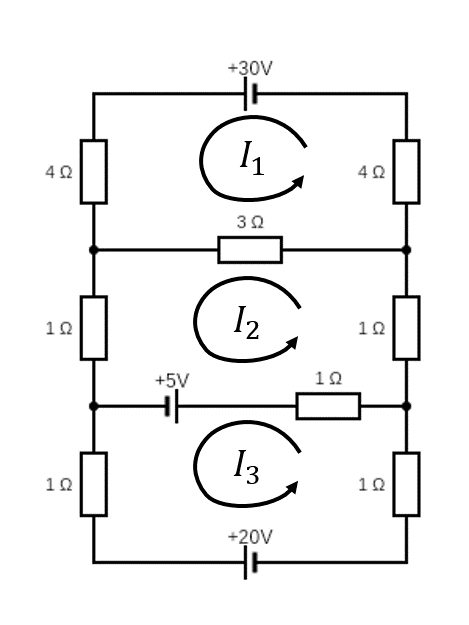

# Exercise Set 7 Answers {.unlisted .unnumbered}

These exercises cover solving linear equations by Gaussian elimination.

1. Use Gaussian elimination (elementary row operations) to determine whether or not the following systems of equations have solutions, and, when they do, to find *all solutions*. In the cases where there is more than one solution, find the general solution and also give one particular solution. (Tip: Choosing the elementary row operations carefully can minimise the use of fractions).
	
    a. $$\begin{align*}
    x + y - z &= -3, \\
    2x + 2y - z &= -2, \\
    3x + 2y - 3z&= -7;
    \end{align*}$$

    a. $$\begin{align*}
    2x - 2y + 3z&= 5, \\
    3x - 2y + 4z&= 6, \\
    4x + y  + 2z&= 2;
    \end{align*}$$

    a. $$\begin{align*}
    3x + 2y + 13z&= 2, \\
    4x + 2y + 16z&= 1, \\
    x  + y  + 5z &= 1;
    \end{align*}$$

    a. $$\begin{align*}
    2x + z &= 3, \\
    x  + y  + z &= 2, \\
    x  + 3y + 2z&= 3;
    \end{align*}$$

    a. $$\begin{align*}
    2x + 4y  + z  - 3t&= 7, \\
    5x + 10y + 6z - 4t&= 14, \\
    7x + 14y + 5z - 9t&= 23;
    \end{align*}$$

    a. $$\begin{align*}
    3x + 4y &= 1, \\
    2x - 4y + 2z&= 4, \\
    3x + z &= 2, \\
    x - 2y + z &= 2;
    \end{align*}$$

    a. $$\begin{align*}
    3x - y  + 2z + t&= 3, \\
    x  + 2y - z  + t&= -3, \\
    3x + y  + z  + t&= 0, \\
    3x + 2y + t&= -1.
    \end{align*}$$

    Answers:

    a. We have the augmented matrix
		$$
        \left(\begin{array}{rrr|r}
            1 & 1 & -1 & -3\\
            2 & 2 & -1 & -2 \\
            3 & 2 & -3 & -7
        \end{array}\right)
		$$
		Eliminate entries below the leading entry in the first column by performing $R_2 \to R_2 - 2 R_1$ and $R_3 \to R_3 - 3R_1$. We have
		$$
        \left(\begin{array}{rrr|r}
            1 & 1  & -1 & -3\\
            0 & 0  & 1  & 4 \\
            0 & -1 & 0  & 2
        \end{array}\right).
		$$
		Swap the bottom two rows, i.e.\ $R_2 \leftrightarrow R_3$, to obtain
		$$
        \left(\begin{array}{rrr|r}
            1 & 1  & -1 & -3\\
            0 & -1 & 0  & 2 \\
            0 & 0  & 1  & 4
        \end{array}\right).
		$$
		The matrix is now in echelon form. Eliminate the entries in column above the leading entry in column $3$, that is applying $R_1 \to R_1 + R_3$ gives
		$$
        \left(\begin{array}{rrr|r}
            1 & 1  & 0 & 1 \\
            0 & -1 & 0 & 2 \\
            0 & 0  & 1 & 4
        \end{array}\right).
		$$
		Then, using $R_2 \to -R_2$, we have
		$$
        \left(\begin{array}{rrr|r}
            1 & 1 & 0 & 1\\
            0 & 1 & 0 & -2 \\
            0 & 0 & 1 & 4
        \end{array}\right)
		$$
		Eliminate entries in the column above the leading entry in column $2$, i.e.\ apply $R_1 \to R_1 - R_2$ to obtain
		$$
        \left(\begin{array}{rrr|r}
            1 & 0 & 0 & 3\\
            0 & 1 & 0 & -2 \\
            0 & 0 & 1 & 4
        \end{array}\right)
		$$
		The matrix is now in reduced echelon form and we read off the solution
		$$
        (x,y,z) = (3,-2,4).
		$$
	a. We have the augmented matrix
		$$
        \left(\begin{array}{rrr|r}
            2 & -2 & 3 & 5\\
            3 & -2 & 4 & 6\\
            4 & 1  & 2 & 2
        \end{array}\right)
		$$
		We eliminate the entries below the leading entry in column $1$. Performing $R_2 \to R_2 - \frac{3}{2}R_1$ and $R_3 \to R_3 - 2R_1$ we arrive at
		$$
        \left(\begin{array}{rrr|r}
            2 & -2 & 3            & 5\\
            0 & 1  & -\frac{1}{2} & -\frac{3}{2}\\
            0 & 5  & -4           & -8
        \end{array}\right).
		$$
		Next, we eliminate the entry below the leading entry in column $2$ via $R_3 \to R_3 - 5R_2$ to get
		$$
        \left(\begin{array}{rrr|r}
            2 & -2 & 3            & 5\\
            0 & 1  & -\frac{1}{2} & -\frac{3}{2}\\
            0 & 0  & -\frac{3}{2} & -\frac{1}{2}
        \end{array}\right).
		$$
		The matrix is now in echelon form. We proceed to bring the matrix into reduced echelon form. Multiply Row $3$ by $- \frac{2}{3}$, i.e.\ $R_2 \to - \frac{2}{3}R_3$, to have
		$$
        \left(\begin{array}{rrr|r}
            2 & -2 & 3            & 5\\
            0 & 1  & -\frac{1}{2} & -\frac{3}{2}\\
            0 & 0  & 1            & \frac{1}{3}
        \end{array}\right).
		$$
		To eliminate the entries above the leading entry in column $3$, we perform the operations $R_2 \to R_2 + \frac{1}{2}R_3$ and $R_1 \to R_1 - 3R_3$, which give
		$$
        \left(\begin{array}{rrr|r}
            2 & -2 & 0 & 4\\
            0 & 1  & 0 & -\frac{4}{3}\\
            0 & 0  & 1 & \frac{1}{3}
        \end{array}\right)
		$$
		To eliminate the entry above the leading entry in column $2$, we perform the operation $R_1 \to R_1 + 2R_2$, which gives
		$$
        \left(\begin{array}{rrr|r}
            2 & 0 & 0 & \frac{4}{3}\\
            0 & 1 & 0 & -\frac{4}{3}\\
            0 & 0 & 1 & \frac{1}{3}
        \end{array}\right).
		$$
		Applying $R_1 \to \frac{1}{2}R_1$ gives
		$$
        \left(\begin{array}{rrr|r}
            1 & 0 & 0 & \frac{2}{3}\\
            0 & 1 & 0 & -\frac{4}{3}\\
            0 & 0 & 1 & \frac{1}{3}
		\end{array}\right).
		$$
		The matrix is now in reduced echelon form and we read off the solution
		$$
        (x,y,z) = \frac{1}{3}(2,-4,1).
		$$
	a. We have the augmented matrix
        $$
        \left(\begin{array}{rrr|r}
            3 & 2 & 13 & 2 \\
            4 & 2 & 16 & 1 \\
            1 & 1 &  5 & 1
        \end{array}\right).
		$$
		We start by swapping rows so that we have a small number in the top-left corner --- this avoids having to deal with fractions --- applying $R_1 \leftrightarrow R_3$ and then $R_2 \leftrightarrow R_3$ gives
		$$
        \left(\begin{array}{rrr|r}
            1 & 1 &  5 & 1 \\
            3 & 2 & 13 & 2 \\
            4 & 2 & 16 & 1
        \end{array}\right).
		$$
		To eliminate the entries below the leading entry in column $1$, we apply $R_2 \to R_2 - 3R_1$ and $R_3 \to R_3 - 4R_1$, which give
		$$
        \left(\begin{array}{rrr|r}
            1 & 1 &   5 & 1 \\
            0 & -1 & -2 & -1 \\
            0 & -2 & -4 & -3
        \end{array}\right).
		$$
		To eliminate the entry below the leading entry in column $2$, we apply $R_3 \to R_3 - 2R_2$, which gives
		$$
        \left(\begin{array}{rrr|r}
            1 & 1  &  5 & 1 \\
            0 & -1 & -2 & -1 \\
            0 &  0 &  0 & -1
        \end{array}\right).
		$$
		The matrix is now in echelon form. There is a leading entry in the right-most column (representing the solution vector), from which we may infer that the system is inconsistent (there are no solutions).
	a. We have the augmented matrix
		$$
        \left(\begin{array}{rrr|r}
            2 & 0 & 1 & 3\\
            1 & 1 & 1 & 2\\
            1 & 3 & 2 & 3
        \end{array}\right)
		$$
		We start by swapping rows, i.e.\ performing $R_1\leftrightarrow R_3$ and $R_2\leftrightarrow R_3$ to get
		$$
        \left(\begin{array}{rrr|r}
            1 & 1 & 1 & 2\\
            1 & 3 & 2 & 3 \\
            2 & 0 & 1 & 3
        \end{array}\right).
		$$
		To eliminate the entries below the leading entry in column $1$, we perform the operations $R_2 \to R_2 - R_1$ and $R_3 \to R_3-2R_1$, arriving at
		$$
        \left(\begin{array}{rrr|r}
            1 & 1  & 1  & 2\\
            0 & 2  & 1  & 1\\
            0 & -2 & -1 & -1
        \end{array}\right).
		$$
		To eliminate the entry below the leading entry in column $2$, we perform the operation $R_3 \to R_3 + R_2$ and arrive at
		$$
        \left(\begin{array}{rrr|r}
            1 & 1 & 1 & 2\\
            0 & 2 & 1 & 1\\
            0 & 0 & 0 & 0
        \end{array}\right).
        $$
		The matrix is now in echelon form --- the last row is consistent. We proceed to bring the matrix into reduced echelon form. Applying $R_2 \to \frac{1}{2}R_2$, we have
		$$
        \left(\begin{array}{rrr|r}
            1 & 1 & 1           & 2\\
            0 & 1 & \frac{1}{2} & \frac{1}{2}\\
            0 & 0 & 0           & 0
        \end{array}\right).
		$$
		To eliminate the entry above the leading entry in column $2$, we perform the operation $R_1 \to R_1 - R_2$, which gives
		$$
        \left(\begin{array}{rrr|r}
            1 & 0 & \frac{1}{2} & \frac{3}{2}\\
            0 & 1 & \frac{1}{2} & \frac{1}{2}\\
            0 & 0 & 0           & 0
        \end{array}\right).
		$$
		Note that there is no leading entry in column three or in the solution vector, so there are infinitely many solutions, and we can take the variable $z$ to be arbitrary, say $z=\lambda$. We then read off the solutions
		$$
        (x,y,z)=\frac{1}{2}(3-\lambda,1-\lambda,2\lambda).
		$$
		For a particular solution, for instance let $\lambda=0$, we get
		$$
        (x,y,z)= \frac{1}{2}(3,1,0).
		$$
	a. We have the augmented matrix
		$$
        \left(\begin{array}{rrrr|r}
        2 &  4 & 1 & -3 & 7 \\
        5 & 10 & 6 & -4 & 14 \\
        7 & 14 & 5 & -9 & 23
        \end{array}\right).
		$$
		Start with $R_2 \to R_2 - \frac{5}{2}R_1$ and $R_3 \to R_3 - \frac{7}{2}R_1$, which give
		$$
			\left(\begin{array}{rrrr|r}
				2 & 4 & 1           & -3          & 7 \\
				0 & 0 & \frac{7}{2} & \frac{7}{2} & -\frac{7}{2} \\
				0 & 0 & \frac{3}{2} & \frac{3}{2} & -\frac{3}{2}
			\end{array}\right),
		$$
		and perform $R_3 \to R_3 - \frac{3}{7}R_2$, to have
		$$
			\left(\begin{array}{rrrr|r}
				2 & 4 & 1           & -3          & 7 \\
				0 & 0 & \frac{7}{2} & \frac{7}{2} & -\frac{7}{2} \\
				0 & 0 & 0           & 0           & 0
			\end{array}\right).
		$$
		The above is in echelon form. We see that the right-most column contains no leading entry and neither does (at least) one of the other columns. In this case, neither column 2 nor 4 of the matrix of coefficients contains a leading entry. This means that there will be infinitely many solutions. We proceed, scaling rows $1$ and $2$, i.e.\ applying $R_1 \to \frac{1}{2}R_1$ and $R_2 \to \frac{2}{7}R_2$, which give
		$$
        \left(\begin{array}{rrrr|r}
        1 & 2 & \frac{1}{2} & -\frac{3}{2} & \frac{7}{2} \\
        0 & 0 & 1           & 1            & -1 \\
        0 & 0 & 0           & 0            & 0
        \end{array}\right).
		$$
		Then, we bring the above matrix into reduced echelon form by performing $R_1 \to R_1 - \frac{1}{2}R_2$, that is
		$$
        \left(\begin{array}{rrrr|r}
            1 & 2 & 0 & -2 & 4 \\
            0 & 0 & 1 & 1  & -1 \\
            0 & 0 & 0 & 0  & 0
        \end{array}\right).
		$$
		Now we can easily read off the solutions. As there are 2 columns of the matrix of coefficients with no leading entry, two of the variables can be chosen arbitrarily. We take $y$ and $t$ to be arbitrary, say $y=\lambda$ and $t=\mu$.  Then the frist and second rows give us the equations
		$$
			x = 4 - 2\lambda + 2\mu \qquad \text{and} \qquad z = -1 - \mu,
		$$
		respectively. So the parameterised solution is
		$$
			(4 - 2\lambda + 2\mu, \lambda, -1-\mu, \mu)
		$$
		where $\lambda$, $\mu$ are arbitrary. For a particular solution, let for instance $\lambda = y = 0$ and $\mu = t = 0$ to give
		$$
			(x,y,z,t) = (4,0,-1,0).
		$$
	a. We swap the rows initially to get the augmented matrix
		$$
        \left(\begin{array}{rrr|r}
            1 & -2 & 1 & 2\\
            3 & 4  & 0 & 1\\
            2 & -4 & 2 & 4\\
            3 & 0  & 1 & 2
        \end{array}\right)
		$$
		To eliminate the entries below the leading entry in column $1$, we perform $R_2 \to R_2 - 3R_1$, $R_3 \to R_3-2R_1$ and $R_4 \to R_4-3R_1$ to arrive at
		$$
        \left(\begin{array}{rrr|r}
            1 & -2 & 1  & 2\\
            0 & 10 & -3 & -5\\
            0 & 0  & 0  & 0\\
            0 & 6  & -2 & -4
        \end{array}\right).
		$$
		To eliminate the entry below the leading entry in column $2$, we perform $R_4 \to R_4 - \frac{3}{5}R_2$ to have
        $$
        \left(\begin{array}{rrr|r}
            1 & -2 & 1            & 2\\
            0 & 10 & -3           & -5\\
            0 & 0  & 0            & 0\\
            0 & 0  & -\frac{1}{5} & -1
        \end{array}\right).
		$$
		Applying $R_3 \leftrightarrow R_4$, we obtain
		$$
        \left(\begin{array}{rrr|r}
            1 & -2 & 1 & 2\\
            0 & 10 & -3 & -5\\
            0 & 0  & - \frac{1}{5} & -1\\
            0 & 0  & 0 & 0
        \end{array}\right).
		$$
		The matrix is now in echelon form. We proceed to bring the matrix into reduced echelon form. Applying $R_3 \to -5R_3$, gives
		$$
        \left(\begin{array}{rrr|r}
            1 & -2 & 1 & 2\\
            0 & 10 & -3 & -5\\
            0 & 0 & 1 & 5\\
            0 & 0 & 0 & 0
        \end{array}\right).
		$$
		To eliminate the entries above the leading entry in column $3$, we perform $R_2 \to R_2 + 3R_3$ and $R_1 \to R_1-1R_3$ to arrive at
		$$
        \left(\begin{array}{rrr|r}
            1 & -2 & 0 & -3\\
            0 & 10 & 0 & 10\\
            0 & 0 & 1 & 5\\
            0 & 0 & 0 & 0
        \end{array}\right).
		$$
		Applying $R_2 \to \frac{1}{10}R_2$, gives
		$$
        \left(\begin{array}{rrr|r}
            1 & -2 & 0 & -3\\
            0 & 1 & 0 & 1\\
            0 & 0 & 1 & 5\\
            0 & 0 & 0 & 0
        \end{array}\right).
		$$
		To eliminate the entry above the leading entry in column $2$, we perform $R_1 \to R_1 + 2R_2$ to arrive at
		$$
        \left(\begin{array}{rrr|r}
            1 & 0 & 0 & -1\\
            0 & 1 & 0 & 1\\
            0 & 0 & 1 & 5\\
            0 & 0 & 0 & 0
        \end{array}\right).
		$$
		This matrix is in reduced echelon form.\par
		Note that even though there is no leading entry in the right hand column, it is the case that every other column contains a leading entry. This means that there is a unique solution to this system of equations. We read off the solution
		$$
			(x,y,z) = (-1,1,5).
		$$
	a. We swap the rows initially to get the augmented matrix
		$$
        \left(\begin{array}{rrrr|r}
            1 & 2  & -1 & 1 & -3\\
            3 & -1 & 2  & 1 & 3\\
            3 & 1  & 1  & 1 & 0\\
            3 & 2  & 0  & 1 & -1
        \end{array}\right)
		$$
		To eliminate the entries below the leading entry in column $1$, we perform $R_2 \to R_2-3R_1$, $R_3 \to R_3-3R_1$ and
		$R_4 \to R_4-3R_1$, which give
		$$
        \left(\begin{array}{rrrr|r}
            1 & 2 & -1 & 1 & -3\\
            0 & -7 & 5 & -2 & 12\\
            0 & -5 & 4 & -2 & 9\\
            0 & -4 & 3 & -2 & 8
        \end{array}\right).
		$$
		To avoid fractions, we now perform $R_4 \to R_4 - R_3$ and then $R_4 \leftrightarrow R_2$ to obtain
		$$
        \left(\begin{array}{rrrr|r}
            1 & 2  & -1 & 1  & -3\\
            0 & 1  & -1 & 0  & -1\\
            0 & -5 & 4  & -2 & 9\\
            0 & -7 & 5  & -2 & 12
        \end{array}\right).
		$$
		To eliminate the entries below the leading entry in column $2$, we perform $R_3 \to R_3 + 5R_2$ and $R_4 \to R_4+7R_2$ to arrive at
		$$
        \left(\begin{array}{rrrr|r}
            1 & 2 & -1 & 1  & -3\\
            0 & 1 & -1 & 0  & -1\\
            0 & 0 & -1 & -2 & 4\\
            0 & 0 & -2 & -2 & 5
        \end{array}\right).
		$$
		To eliminate the entry under the leading entry in column $3$, we perform $R_4 \to R_4 - 2R_3$ to have
		$$
        \left(\begin{array}{rrrr|r}
            1 & 2 & -1 & 1  & -3\\
            0 & 1 & -1 & 0  & -1\\
            0 & 0 & -1 & -2 & 4\\
            0 & 0 & 0  & 2  & -3
        \end{array}\right).
		$$
		The matrix is now in echelon form. We proceed to put the matrix into reduced echelon form. Applyin $R_4 \to \frac{1}{2}R_4$ gives
		$$
        \left(\begin{array}{rrrr|r}
            1 & 2 & -1 & 1  & -3\\
            0 & 1 & -1 & 0  & -1\\
            0 & 0 & -1 & -2 & 4\\
            0 & 0 & 0  & 1  & -\frac{3}{2}
        \end{array}\right).
		$$
		To eliminate the entries above the leading entry in column $4$, we perform $R_3 \to R_3 + 2R_4$ and $R_1 \to R_1 - R_4$ to obtain
		$$
        \left(\begin{array}{rrrr|r}
            1 & 2 & -1 & 0 & -\frac{3}{2}\\
            0 & 1 & -1 & 0 & -1\\
            0 & 0 & -1 & 0 & 1\\
            0 & 0 & 0  & 1 & -\frac{3}{2}
        \end{array}\right).
		$$
		Perform by $R_3 \to -R_3$ to get
		$$
        \left(\begin{array}{rrrr|r}
            1 & 2 & -1 & 0 & -\frac{3}{2}\\
            0 & 1 & -1 & 0 & -1\\
            0 & 0 & 1  & 0 & -1\\
            0 & 0 & 0  & 1 & -\frac{3}{2}
        \end{array}\right).
		$$
		To eliminate the entries above the leading entry in column $3$, we perform $R_2 \to R_2+R_3$ and $R_1 \to R_1+R_3$ which give
		$$
        \left(\begin{array}{rrrr|r}
            1 & 2 & 0 & 0 & -\frac{5}{2}\\
            0 & 1 & 0 & 0 & -2\\
            0 & 0 & 1 & 0 & -1\\
            0 & 0 & 0 & 1 & -\frac{3}{2}
        \end{array}\right).
		$$
		Then, we eliminate the entry above the leading entry in column $2$, performing $R_1 \to R_1 - 2R_2$ and arrive at the reduced echolon form
		$$
        \left(\begin{array}{rrrr|r}
            1 & 0 & 0 & 0 & \frac{3}{2}\\
            0 & 1 & 0 & 0 & -2\\
            0 & 0 & 1 & 0 & -1\\
            0 & 0 & 0 & 1 & -\frac{3}{2}
        \end{array}\right).
		$$
		We read off the (unique) solution
		$$
			(x,y,z,t) = \left(\tfrac{3}{2},-2,-1,-\tfrac{3}{2}\right).
		$$


1. *Balancing chemical equations.* In the combustion of propane gas, propane ($C_3H_8$) combines with oxygen ($O_2$) to form carbon dioxide ($CO_2$) and water ($H_2O$) according to the equation
$$x_1 C_3H_8 + x_2 O_2\to x_3CO_2+x_4H_2O.$$
To balance this equation, we must find natural numbers $x_1, x_2, x_3, x_4$ such that the total numbers of $C$, $H$ and $O$ atoms are equal on both sides. Formulate this problem as a set of linear equations and solve using Guassian elimination.

    Answer:

    Write both the left and the right side of the chemical reaction equation as linear equations:

    $$
    \begin{pmatrix}
    3 & 0 & 0 & 0\\
    8 & 0 & 0 & 0\\
    0 & 2 & 0 & 0\end{pmatrix}
    \begin{pmatrix}x_1\\x_2\\x_3\\x_4\end{pmatrix} 
    = \begin{pmatrix}
    0 & 0 & 1 & 0\\
    0 & 0 & 0 & 2\\
    0 & 0 & 2 & 1\end{pmatrix}\begin{pmatrix}x_1\\x_2\\x_3\\x_4\end{pmatrix}
    $$
    Now subtract one side from the other to give an equation equal to zero
    $$
    \begin{pmatrix}
    3 & 0 & -1 & 0\\
    8 & 0 & 0 & -2\\
    0 & 2 & -2 & -1\end{pmatrix}\begin{pmatrix}x_1\\x_2\\x_3\\x_4\end{pmatrix} = \begin{pmatrix}0\\0\\0\end{pmatrix}
    $$

    with each row stating (respectively) that the number $C$, $H$, and $O$ atoms are conserved as required. Next, we write the augmented matrix and perform Gaussian Elimination.
    $$
    R_2 \rightarrow R_2 - \frac{8}{3}R_1\\
    \left( \begin{array}{c c c c | c}
    3 & 0 & -1 & 0 & 0\\
    0 & 0 & \frac{8}{3} & -2 & 0\\
    0 & 2 & -2 & -1 & 0\end{array} \right)\\
    R_2 \leftrightarrow R_3\\
    \left( \begin{array}{c c c c | c}
    3 & 0 & -1 & 0 & 0\\
    0 & 2 & -2 & -1 & 0\\
    0 & 0 & \frac{8}{3} & -2 & 0
    \end{array} \right)\\
    R_1 \rightarrow \frac{1}{3}R_1,\ R_2 \rightarrow \frac{1}{2}R_2,\ R_3\rightarrow \frac{3}{8}R_3\\
    \left( \begin{array}{c c c c | c}
    1 & 0 & -\frac{1}{3} & 0 & 0\\
    0 & 1 & -1 & -\frac{1}{2} & 0\\
    0 & 0 & 1 & -\frac{3}{4} & 0\end{array} \right).
    $$
    Which is in echelon form. To put into reduced echelon form, we need to work back up the rows and eliminate entries above the pivot, starting with rightmost leading value
    $$
    R_2 \rightarrow R_2 + R_3\\
    \left(\begin{array}{c c c c|c}
    1 & 0 & -\frac{1}{3} & 0 & 0\\
    0 & 1 & 0 & -\frac{5}{4} & 0\\
    0 & 0 & 1 & -\frac{3}{4} & 0\end{array}\right)\\
    R_1 \rightarrow R_1 + \frac{1}{3}R_3\\
    \left( \begin{array}{c c c c|c}
    1 & 0 & 0 & -\frac{1}{4} & 0 \\
    0 & 1 & 0 & -\frac{5}{4} & 0\\
    0 & 0 & 1 & -\frac{3}{4} & 0\end{array}\right)
    $$

    which is now in reduced echelon form with $x_4$ being a free variable, which we call $\alpha$. Hence, the solutions are
    $$
    \begin{align}
    x_1 &= \frac{1}{4}\alpha\\
    x_2 &= \frac{5}{4}\alpha\\
    x_3 &= \frac{3}{4}\alpha\\
    x_4 & = \alpha
    \end{align}
    $$
    The smallest $\alpha$ that gives all $x_i$ as natural numbers is 4. Hence, $(x_1,x_2,x_3,x_4) = (1,5,3,4)$. It makes sense that one of the chemical amounts was a free variable, since it is the ratio of chemicals that is important in balancing the equations, not their absolute value. There were also only three linear equations in four unknowns, so a unique solution was not expected.

1. *Electrical networks.* Consider the circuit diagram below.

    ```{r, out.width="30%"}
    
    ```

    The voltage drop across a resistor is (by Ohm's law) $V=IR$ where $V$ is in volts, the current $I$ is in amps and the resistance $R$ is in ohms.
    Kirchhoff's junction law: the sum of currents flowing into a junction is equal to the sum of currents flowing out of that junction.
    Kirchoff's Voltage law: The sum of the voltage drops in one direction around a loop equals the sum of the voltage sources in the same direction around the loop.
    Using these laws it is possible to derive the following set of linear equations for the currents $I_1, I_2, I_3$:

    \begin{align*}
    11I_1-3I_2&=30\\
    -3I_1+6I_2-I_3&=5\\
    -I_2+3I_3&=-25.
    \end{align*}

    Determine the currents. (Extra challenge: derive the equations!).
      
    Answer:

    Form the linear equations into matrix form, and then perform Gaussian elimination on the augmented matrix.
    $$
    \begin{pmatrix}
    11 & -3 & 0 \\ -3 & 6 & -1 \\ 0 & -1 & 3\end{pmatrix} \begin{pmatrix}I_1\\I_2\\I_3\end{pmatrix} = \begin{pmatrix}30\\5\\-25\end{pmatrix}\\
    \left(\begin{array}{c c c | c}
    11 & -3 & 0 & 30 \\
    -3 & 6 & -1 & 5\\
    0 & -1 & 3 & -25 \end{array}\right)\\
    R_2 \rightarrow R_2 + \frac{3}{11}R_1\\
    \left(\begin{array}{c c c | c}
    11 & -3 & 0 & 30 \\ 0 & \frac{57}{11} & -1 & \frac{145}{11}\\
    0 & -1 & 3 & -25\end{array}\right)\\
    R_3 \rightarrow R_3 + \frac{11}{57}R_2\\
    \left(\begin{array}{c c c | c}
    11 & -3 & 0 & 30\\
    0 & \frac{57}{11} & -1 & \frac{145}{11}\\
    0 & 0 & \frac{160}{57} & -\frac{1280}{57}\end{array}\right)\\
    R_1 \rightarrow \frac{1}{11}R_1,\ R_2 \rightarrow \frac{11}{57}R_2,\ R_3 \rightarrow \frac{57}{160}R_3\\
    \left(\begin{array}{c c c |c}
    1 & -\frac{3}{11} & 0 & \frac{30}{11}\\
    0 & 1 & -\frac{11}{57} & \frac{145}{57}\\
    0 & 0 & 1 & -8\end{array}\right)
    $$
    This is now in echelon form, and can be brought to reduced echelon form by eliminating the column values above the pivot point, starting with the rightmost leading value.
    $$
    R_2 \rightarrow R_2 + \frac{11}{57}R_3\\
    \left(\begin{array}{c c c |c}
    1 & -\frac{3}{11} & 0 & \frac{30}{11}\\
    0 & 1 & 0 & 1\\
    0 & 0 & 1 & -8\end{array}\right)\\
    R_1 \rightarrow R_1 + \frac{3}{11}R_2\\
    \left(\begin{array}{c c c |c}
    1 & 0 & 0 & 3\\
    0 & 1 & 0 & 1\\
    0 & 0 & 1 & -8\end{array}\right)
    $$

    So $I_1 = 3, I_2 = 1, I_3 = -8$.


1. *Network analysis*. The diagram below represents the traffic flow in a one-way road network. Each directed edge represents a one-way road and is labelled with the flow through that road. The nodes represent road junctions.

    ```{r, out.width="30%"}
    knitr::include_graphics("figures/flownetwork.png")
    ```

    By considering the flow in and out of each node and the total flow in and out of the network, formulate a system of linear equations for the unknown flows $x_1,\dotsc,x_5$ and solve them by Gaussian elimination. You will find there is a "free variable", but the requirement for non-negative flows puts some restrictions on the variables. In particular, what are the restrictions on $x_1$ and $x_5$?
    
    Answer:
    The five equations characterising the flow of traffic on the network are
    \begin{align*}
    x_1 + x_2 &= 30\\
    x_2 + x_3 &= 100\\
    x_3 + 20 &= x_4\\
    x_4 + 10 &= x_5\\
    100 + x_1 &= x_5
    \end{align*}
    the first four coming from conservation of flow in and out of each node and the last coming from the total flow in and out of the network.
    Which can be placed into augmented matrix form as
    $$
    \left(\begin{array}{c c c c c |c}
    1 & 1 & 0 & 0 & 0 & 30\\
    0 & 1 & 1 & 0 & 0 & 100\\
    0 & 0 & -1 & 1 & 0 & 20\\
    0 & 0 & 0 & -1 & 1 & 10\\
    -1 & 0 & 0 & 0 & 1 & 100\end{array}\right),
    $$
    which is already not far from echelon form. Due to the simple nature of the matrix, the bottom row can be eliminated with the following operations
    $$
    R_5 \rightarrow R_5 + R_1 - R_2 - R_3 - R_4\\
    \left(\begin{array}{c c c c c |c}
    1 & 1 & 0 & 0 & 0 & 30\\
    0 & 1 & 1 & 0 & 0 & 100\\
    0 & 0 & -1 & 1 & 0 & 20\\
    0 & 0 & 0 & -1 & 1 & 10\\
    0 & 0 & 0 & 0 & 0 & 0\end{array}\right).
    $$
    Now, to move to reduced echelon form
    $$
    R_3 \rightarrow -R_3,\ R_4 \rightarrow -R_4\\
    \left(\begin{array}{c c c c c |c}
    1 & 1 & 0 & 0 & 0 & 30\\
    0 & 1 & 1 & 0 & 0 & 100\\
    0 & 0 & 1 & -1 & 0 & -20\\
    0 & 0 & 0 & 1 & -1 & -10\\
    0 & 0 & 0 & 0 & 0 & 0\end{array}\right).
    $$


    $$
    R_3 \rightarrow R_3 + R_4\\
    \left(\begin{array}{c c c c c |c}
    1 & 1 & 0 & 0 & 0 & 30\\
    0 & 1 & 1 & 0 & 0 & 100\\
    0 & 0 & 1 & 0 & -1 & -30\\
    0 & 0 & 0 & 1 & -1 & -10\\
    0 & 0 & 0 & 0 & 0 & 0\end{array}\right)\\
    R_2 \rightarrow R_2 - R_3\\
    \left(\begin{array}{c c c c c |c}
    1 & 1 & 0 & 0 & 0 & 30\\
    0 & 1 & 0 & 0 & 1 & 130\\
    0 & 0 & 1 & 0 & -1 & -30\\
    0 & 0 & 0 & 1 & -1 & -10\\
    0 & 0 & 0 & 0 & 0 & 0\end{array}\right)\\
    R_1 \rightarrow R_1 - R_2\\
    \left(\begin{array}{c c c c c |c}
    1 & 0 & 0 & 0 & -1 & -100\\
    0 & 1 & 0 & 0 & 1 & 130\\
    0 & 0 & 1 & 0 & -1 & -30\\
    0 & 0 & 0 & 1 & -1 & -10\\
    0 & 0 & 0 & 0 & 0 & 0\end{array}\right).
    $$
    Here, $x_5$ is a free variable, let's call it $\alpha$. This means that the solutions for $x_1,x_2,x_3,x_4,x_5$ are
    $$
    \begin{align}
    x_1 &= \alpha - 100\\
    x_2 &= 130 - \alpha\\
    x_3 &= -30 + \alpha\\
    x_4 &= -10 + \alpha\\
    x_5 &= \alpha\ .
    \end{align}
    $$
    The requirement for non-negative flows of cars means that $100\leq \alpha \leq 130$, hence $0\leq x_1 \leq 30$ and $100 \leq x_5 \leq 130$. This is reasonable since $x_5$ can never be lower than the 100 flowing into the network on the left, and any contribution from $x_1$ must also leave via $x_5$.


