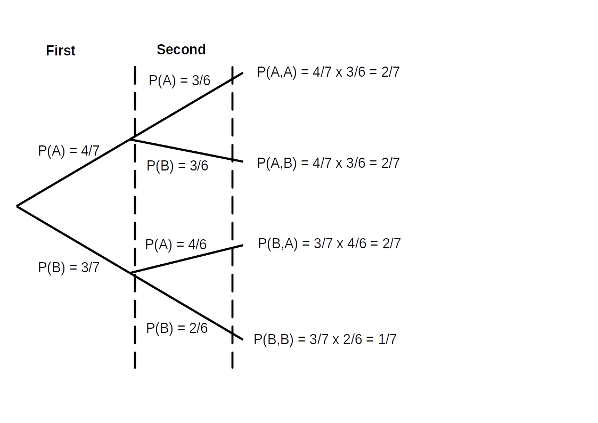
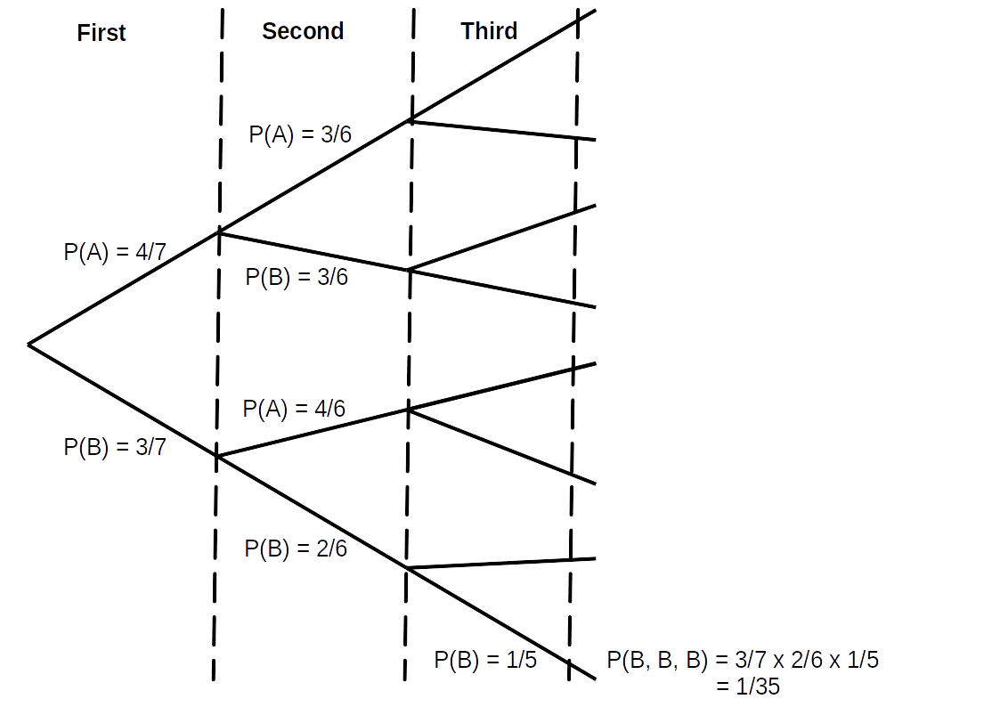

# Exercise Set 15 Answers {.unlisted .unnumbered}

1. Consider the experiment of multiplying the score on two fair dice.
    a. What is the sample space?
    a. What is the event of obtaining an odd number, and what is its probability?
    a. What is the event of obtaining a number that is square and odd?
    a. What is the event of obtaining a number that is square or odd?

    Answers:

    a. $S=\{1,2,3,4,5,6,8,9,10,12,15,16,18,20,24,25,30,36\}$
    a. $A=\{1,3,5,9,15,25\}$, $P(A)=\frac{1+2+2+1+2+1}{36}=\frac{1}{4}$
    a. $B=\{1,4,9,16,25,36\}$, $A\cap B=\{1,9,25\}$ (also $P(A\cap B)=\frac{3}{36}=\frac{1}{12}$)
    a. $A\cup B=\{1,3,4,5,9,15,16,25,36\}$ (also $P(A\cup B)=\frac{1+2+3+2+1+2+1+1+1}{36}=\frac{7}{18}$)

1. Consider the experiment of tossing a fair coin three times. Find the following probabilities:
    a. obtaining 2 heads
    a. obtaining at least 1 head
    a. obtaining at least 1 head and at least 1 tail

    Answers:

    a. There are 4 ways of getting 2 heads and $2^3=8$ equally likely outcomes. Hence $P(\text{2 Heads})=\frac{4}{8}=\frac{1}{2}$.
    a. Obtaining at least one head (call this event $A$) is the same as the complement of obtaining all tails (call this event $B$). Since the coin tosses are independent, $P(B)=\left(\frac{1}{2}\right)^3=\frac{1}{8}$ and then $P(A)=1-P(B)=\frac{7}{8}$.
    a. Obtaining at least 1 head and at least 1 tail (call this event $A$) is the complement of obtaining all tails ($B$) or all heads ($C$), which are mutually exclusive. Hence $P(B\cup C)=P(B)+P(C)$ and $P(A)=1-P(B\cup C)=1-\frac{1}{8}-\frac{1}{8}=\frac{3}{4}$.

1. How many ways are there of arranging the letters in the word MATHS?

    Answer:

    There are 5 distinct letters, hence the number of arrangements is $5!=120$.

1. How many four letter arrangements are there of letters from the word UNCOPYRIGHTABLE?

    Answer:

    There are 15 distinct letters and we are choosing 4. We are interested in the different orders, so this is a question about *permutations*. The number of permutations is:

    $${}_{15} P_4=\frac{15!}{(15-4)!}=\frac{15!}{11!}=32760.$$

1. In a meal deal you can choose any 3 items from: sandwich, wrap, pasta, sushi, crisps, drink, chocolate. How many different meal deals are there?

    Answer:

    In this case, we are not interested in the ordering of the three items when buying them, so this is a question about *combinations*. The number of combinations is

    $${}_7 C_3={7 \choose 3}=\frac{7!}{3!4!}=35.$$

1. How many arrangements of he word MISSISSIPPI are there? How many of these contain the "word" SSSS?

    Answers:

    In this case, we are interested in different orderings, but there are identical letters that do not contribute to the different arrangements. We have the frequencies #M=1, #I=4, #S=4, #P=2, and we need to factor out the repeats. Hence the number of arrangements is
    $$\displaystyle{\frac{11!}{4!4!2!}} = 34650.$$

    The number of these arrangements that contain the word SSSS are the arrangements of the blocks: SSSS, M, I, I, I, P, P, I:
    $$
    \frac{8!}{4!2!} = 840.
    $$

1. You roll ten fair dice. Assume that the scores of each of the ten dice are independent. What are the the probabilities that
    a. you roll exactly two sixes?
    a. you roll no sixes?
    a. you roll at least two sixes?

    Answers:

    a. ${10 \choose 2} \left(\frac{1}{6}\right)^2\left(\frac{5}{6}\right)^8 = 0.29 \text{ to 2 s.f.}$
    a. $\left(\frac{5}{6}\right)^{10} = 0.16 \text{ to 2 s.f.}$
    a. $1 - \left(\frac{5}{6}\right)^{10} - {10 \choose 1} \left(\frac{1}{6}\right)\left(\frac{5}{6}\right)^9 = 0.52 \text{ to 2 s.f.}$

1. A poker hand consists of 5 cards from a standard 52 card deck. How many diferent poker hands are there? How many poker hands are there of each of the following types?
    a. *four-of-a-kind*: four cards of one value, the other being another value, for instance $5\spadesuit\,5\heartsuit\,5\diamondsuit\,5\clubsuit\,7\clubsuit$
    a. *two-pairs*: two cards of the same value, another two cards of a second value, and the last card being of a third value, for instance $Q\heartsuit\, Q\clubsuit\, 8\spadesuit\,8\clubsuit\,9\diamondsuit$
    a. *straight*: five cards of sequential rank, but not all of the same suit, for instance, $A\spadesuit\,2\heartsuit\,3\spadesuit\,4\clubsuit\,5\diamondsuit$

    Answers:

    a. *four-of-a-kind*: There are ${13 \choose 1}$ way of choosing the number on the four-of-a-kind, and then given the number, there are ${4 \choose 4} = 1$ ways to choose the suits. Then we have ${12 \choose 1}$ ways to choose the number for the remaining card, and ${4 \choose 1}$ ways to choose the suit. Hence the answer is:
        $$
        {13 \choose 1}{12 \choose 1}{4 \choose 1} = 13 \times 12 \times 4 = 624.
        $$

    a. *two pairs*: Here we have ${13 \choose 2}$ ways of choosing two distinct numbers from 13, corresponding to the numbers on both pairs. Then we have ${4 \choose 2}$ ways of choosing the suits for each pair in turn. Then we have ${11 \choose 1}$ ways of choosing the number for the remaining card, and ${4 \choose 1}$ ways of choosing the suit. Hence the answer is:
        $$
        {13 \choose 2}{4 \choose 2}^2{11 \choose 1}{4 \choose 1} = 78 \times 36 \times 11 \times 4 = 123552.
        $$
    
    a. *straight*: Here there are ${10 \choose 1}$ ways to choose the value of the starting card for the straight ($A, 2, 3, \dots, 10$). Once the starting card is chosen, then there is only one way to choose the remaining values for the straight. If we include straight flushes, then there are then ${4 \choose 1}^5$ ways to choose the combination of suits for the straight. However, ${10 \choose 1} \times 4 = 40$ of these correspond to straight (and royal) flushes (i.e. all with the same suit), hence the answer is:
        $$
        {10 \choose 1}{4 \choose 1}^5 - 40 = (10 \times 1,024) - 40 = 10200.
        $$


1. A box contains 7 rock samples; 4 have an independent property set A and the other 3 have a property set B. We withdraw two rock samples one at a time without replacement. Find the probabilities:
    a. the samples have different property sets
    a. at least one rock sample has property set A
    a. if a third sample is drawn from the box, the probability of all the samples having property set B.

    Answers:

    Perhaps the easiest way of answering this question is by drawing out a "probability tree" and adding together the probabilities that give the required outcomes.

    ```{r probtree1}
    
    ```

    ```{r probtree2}
    
    ```

    a. $P(\text{A,B})+P(\text{B,A})=\frac{2}{7}+\frac{2}{7}=\frac{4}{7}$
    a. $P(\text{A,B})+P(\text{B,A})+P(\text{A,A})=1-P(\text{B,B})=1-\frac{1}{7}=\frac{6}{7}$
    a. $P(\text{B,B,B})=\frac{1}{35}$


    We can also think in terms of arrangements. Firstly, if we were to pick out all 7 rocks the number of arrangements would be
    $$
    \frac{7!}{4!\times 3!}=35
    $$
    where we have divided by $4!$ to account for the 4 arrangements of rocks with property A being the same, and similarly by $3!$ to account for the rocks with property set B. Now we have:
    a. The first two rocks are either (A, B) or (B, A) -- 2 mutually exclusive possibilities. The number of arrangements of the remaining 5 rocks are
    $$
    \frac{5!}{3!\times 2!}=10.
    $$
    Hence the probability is
    $$
    \frac{2 \times 10}{35}=\frac{4}{7}
    $$
    a. Now we have the three possibilities (A, B), (B, A) or (A, A). This is the complement of obtaining (B, B), then looking for all arrangements of the remaining 5 rocks:
    $$
    \frac{5!}{4!\times 1!}=5.
    $$
    So the number of ways of getting at least one A are $35 - 5 = 30$ and the probability is
    $$\frac{30}{35}=\frac{6}{7}.$$

    a. In this case we obtain (B, B, B) and there is only 1 arrangement of the remaining 4 rocks, (A, A, A, A). Hence the probability is
    $$\frac{1}{35}.$$

1. Derive Bayes' Theorem from the definition of conditional probability.

    Answer:

    From the definition of conditional probability we have
    $$P(A|B)=\frac{P(A\cap B)}{P(B)}$$
    and swapping $A$ and $B$, also
    $$P(B|A)=\frac{P(A\cap B)}{P(A)}$$
    where we have used $B\cap A=A\cap B$. Re-arranging the first equation to give
    $$P(A\cap B)=P(A|B)P(B)$$
    and substituting this into the second equation gives
    $$P(B|A)=\frac{P(A|B)P(B)}{P(A)}$$
    which is Bayes' Theorem.

1. A test is 99% effective at detecting drug use in active users and 99% effective at finding negative results for non-drug users. At a given time, 0.1% of the population are active drug users. What is the probability that a randomly selected individual who tests positive is actually a drug user?

    Answer:

    Here, drug users and non-users form a partition of the sample space. Let $+$ denote the event of a positive test result, so by the law of total probability we have:
    \begin{eqnarray*}
    P(+) &=& P(+ | \mbox{user})P(\mbox{user}) + P(+ | \mbox{non-user})P(\mbox{non-user})\\
    &=& 0.99 \times 0.001 + 0.01 \times 0.999\\
    &=& 0.011 \text{ to 2 s.f.}
    \end{eqnarray*}

    By Bayes' Theorem we have:
    $$
    P(\mbox{user} | +) = \frac{P(+ | \mbox{user})P(\mbox{user})}{P(+)}.
    $$
    Hence the answer is:
    \begin{eqnarray*}
    P(\mbox{user} | +) &=& \frac{0.99 \times 0.001}{0.99 \times 0.001 + 0.01 \times 0.999}\\
    &=& 0.090 \text{ to 2 s.f.}
    \end{eqnarray*}


1. A product tester employed by the Gizmo Corporation tests the company's gizmos. A gizmo has 3% probability of being defective. The tester's test registers a defective gizmo as being defective with 95% probability, but it registers a non-defective gizmo as being defective with 2% probability. The tester performs a test on a gizmo drawn at random. Their test indicates the gizmo is defective.What is the probability that it really is defective?

    Answers:

    Let $A$ be the event that the gizmo is defective, and let $B$ be the event that the test picks this up. We have:
    \begin{eqnarray*}
    P(A) &=& 0.03\\
    P(A^c) &=& 0.97\\
    P(B | A) &=& 0.95\\
    P(B | A^c) &=& 0.02,
    \end{eqnarray*}
    and we want $P(A | B)$, and by Bayes' Theorem:
    \begin{eqnarray*}
    P(A | B) &=& \frac{P(B | A)P(A)}{P(B)}\\
    &=& \frac{P(B | A)P(A)}{P(B | A)P(A) + P(B | A^c)P(A^c)}\qquad \mbox{by law of total probability}\\
    &=& \frac{0.95 \times 0.03}{0.95 \times 0.03 + 0.02 \times 0.97}\\
    &=& 0.59\text{ to 2 s.f.}.
    \end{eqnarray*}
