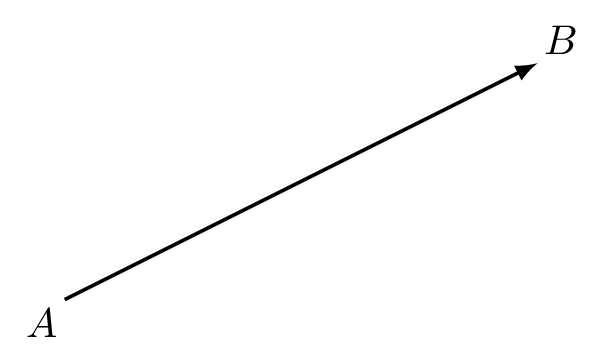
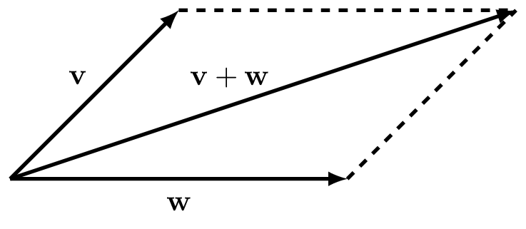

--- 
title: "Mathematics for Scientists and Engineers"
author: "Dr Mark Callaway"
date: "`r Sys.Date()`"
site: bookdown::bookdown_site
output: bookdown::gitbook
documentclass: book
bibliography: [book.bib]
biblio-style: apalike
link-citations: yes
github-repo:  maths-sci-eng/maths-sci-eng.github.io 
description: "Mathematics Lecture Notes for UoE Penryn Science and Engineering Disciplines."
---

# Preface {-}

These notes have been compiled for use alongside the University of Exeter modules CSM1027, CSM1033, CSM1040 and CSM1041. They are a work in progress -- please let me know if you find any errors or have any feedback.

Contact: m.callaway@exeter.ac.uk

Recommended text: Engineering Mathematics, John Bird. Available online through the UoE library here: <https://encore.exeter.ac.uk/iii/encore/record/C__Rb4511752>


```{r, include=FALSE}
knitr::opts_chunk$set(
  comment = "#>", echo = FALSE, fig.align = 'center'
)
```

<!--chapter:end:index.Rmd-->

# Foundations

We begin with some foundational material that forms the basis of all applied mathematics.

## Numbers

We deal with various number systems in mathematics.

* The set of *natural numbers* are the familiar counting numbers:
    $$1, 2, 3,\dotsc$$
    We denote these by the symbol $\mathbb{N}$.

* The *integers* are the "whole numbers", which include zero and negative numbers:
    $$\dots,-2,-1,0,1,2,\dots$$
    We denote these by the symbol $\mathbb{Z}$.

* We sometimes want to focus on just the *positive integers*, which is another name for the natural numbers.

* The *non-negative integers* are the numbers:
    $$0, 1, 2, 3,\dotsc$$
    (the natural numbers and zero).

* The *negative integers* are the numbers:
    $$-1, -2, -3,\dotsc$$

* The *rational numbers* are numbers which can be written in the form $\frac{a}{b}$ where $a$ and $b$ are integers, with $b\neq 0$, so numbers like
    $$\frac{1}{2}, \frac{3}{2}, -\frac{4}{5}, \dotsc$$
    Note these include the integers since they can be written as $\frac{a}{1}$. Rational numbers are denoted $\mathbb{Q}$.

* The ancient Greeks discovered that there are numbers that are not rational -- so-called *irrational numbers*. For example, $\sqrt{2}, \pi$ and $e$ are all irrational numbers. One way of characterising irrational numbers is that they have a decimal representation that never repeats...
    $$
    \pi=3.141592653589793238462643383279502884197169399375105820\dots
    $$
    In contrast, all rational numbers have an eventually repeating decimal expansion (after perhaps some initial jumble of digits, there is a repeating pattern), for example:
    
    |Rational Number| Repeating pattern|
    |---|---|
    |$\frac{1}{3}=0.333\dots$|repeating $3$'s|
    |$\frac{3}{2}=1.5000\dots$|repeating $0$'s after the first decimal digit, which we normally don't write down!|
    |$\frac{219}{1750}=0.125142857142857\dots$|repeating sequence $142857$ of length $6$ after the first $3$ decimal digits|    

* The *real numbers* consist of all rational and irrational numbers together. We can think of real numbers as points on a continuous straight line, or as numbers that possibly have a decimal representation requiring an infinite number of digits^[Real numbers require quite a bit of work to define in a rigorous mathematical way and we will not do this here; the interested reader should look up "construction of real numbers by Dedekind cuts" or "construction of real numbers by Cauchy sequences".].
    The set of real numbers is denoted by $\mathbb{R}$.

* We learn about all of the above numbers early on in our mathematical education. However, there is a further set of numbers that is very useful in science and engineering that you may not have encountered before: the *complex numbers*, denoted by $\mathbb{C}$. These are not as intuitive as real numbers and we explore them in detail in section \@ref(complex).


## Algebra

This section contains some basic algebraic rules. Fluency with notation and manipulations allows us to progress to higher level mathematics with ease.

We are familiar with the basic rules of arithmetic: $+, -, \times, \div$. When an expression contains multiple operations we can use brackets to indicate the order in which the operations are executed. We also commonly use powers (exponents). When evaluating an expression, remember to use the mnemonic BEDMAS, which defines the precedence of these operations:

B - Brackets

E - Exponents

D - Division

M - Multiplication

A - Addition

S - Subtraction

Division and Multiplication can be carried out in either order, as can Addition and Subtraction. We'll recap the rules of Brackets and Exponents in the next sections.

:::{.example name="BEDMAS" #BEDMAS}
We have
$$3+2\times 4=11,$$
whilst
$$(3+2)\times 4 = 20.$$
:::

### Rules of Exponents {#exponents}

In their most basic form, we use exponents as a shorthand for multiplication of a number by itself some positive integer number of times. For example:

$5\times 5 = 5^2$ spoken as "5 squared"

$5\times 5\times 5=5^3$ spoken as "5 cubed"

and more generally, for any real number $x$ and positive integer $n$,
$\underbrace{x\times \dotsb \times x}_{\text{with }n\, x\text{'s}} = x^n$ spoken as "x to the power $n$"

The number $x$ is known as the *base* and the number $n$ is known as the *power*, *index* or *exponent*.

Now for any real number $x$ and positive integers $a$ and $b$, it should be clear that the following rule holds:

::: {.theorem #exprule1 name="Rule 1"}
$$x^ax^b=x^{a+b}$$
:::

since we are multiplying $a$ $x$'s by a further $b$ $x$'s to give a total of $a+b$ $x$'s multiplied together. Extending this idea, we also have:

::: {.theorem #exprule1 name="Rule 2"}
$$(x^a)^b=x^{ab}$$
:::

::: {.exercise #rule2}
Why does Rule 2 hold? Can you prove it using Rule 1? Furthermore, show that $(x^a)^b=(x^b)^a$.
:::

So far we have allowed the exponents to be positive integers. Can we make sense of negative integers as exponents? Consider for $a$ and $b$ as positive integers the product

$$x^a\frac{1}{x^b}=\frac{x^a}{x^b}$$

For arguments sake let's take $a>b$, then since we have $a$ $x$'s on the top and $b$ $x$'s on the bottom, we can cancel the common factors to leave $a-b$ $x$'s. So,

\begin{equation}
x^a\frac{1}{x^b}=\frac{x^a}{x^b}=x^{a-b} (\#eq:divexps)
\end{equation}

and following Rule 1 we could think of this as $x^{a-b}=x^{a+(-b)}=x^ax^{-b}$, and therefore using a negative exponent $-b$ gives the reciprocal of $x^b$.

::: {.theorem #exprule1 name="Rule 3"}
$$x^{-a}=\frac{1}{x^a}$$
:::

Next, we can consider the value of $x^0$. In \@ref(eq:divexps) with the particular case $b=a$, we have

$$1=\frac{x^a}{x^a}=x^{a-a}=x^0$$

so we get that for any non-zero^[We need to be more careful when $x=0$, since we would have $\frac{0^a}{0^a}=\frac{0}{0}$, which is an indeterminate form so the argument is not valid; it turns out $0^0$ is also an indeterminate form.] value of $x$:

::: {.theorem name="Rule 4"}
$$x^0=1$$
:::

Now lets try to make sense of a power of the form $x^{\frac{a}{b}}$ where $a$ is an integer and $b$ is a positive integer. That is, we now allow for fractional (otherwise known as *rational*) exponents. Since we have $\frac{a}{b}=a\frac{1}{b}$ we can write (using Rule 2):

$$x^{\frac{a}{b}}=(x^a)^{\frac{1}{b}}.$$

In the case $b=a$, we therefore have

$$x=x^1=x^{\frac{a}{a}}=(x^{\frac{1}{a}})^a.$$

This means that raising $x^\frac{1}{a}$ to the power $a$ gets us back to $x$, hence the number $x^\frac{1}{a}$ is the $a^\text{th}$ root of $x$. For example $(3^\frac{1}{2})^2=3^{2\frac{1}{2}}=3^1=3$, so we must have $3^\frac{1}{2}=\sqrt{3}$.

::: {.theorem name="Rule 5"}
$$x^{\frac{1}{a}}=\sqrt[a]{x}.$$
:::

In particular the square root is $x^{\frac{1}{2}}=\sqrt{x}$ and the cube root is $x^{\frac{1}{3}}=\sqrt[3]{x}$; we tend to use the root notation for expressions containing square or cube roots on their own, and use the power notation when combining different roots.

It turns out that we can extend exponents beyond rational numbers to any *real* number, with all of the above rules still holding. Proving this is beyond the scope of these notes.

Something's missing: we said $x$ can be any real number, but then how do we interpret something like $y=(-1)^\frac{1}{2}$? That is, $y$ must be a number such that when it is multiplied by itself it gives the negative number $-1$, but this is impossible for a real number! Answering this conundrum requires us to invent a new set of numbers, called *complex numbers* -- see section \@ref(complex).


A summary of the rules:

::: {.theorem #exprules name="Rules of Exponents"}


1. $x^ax^b=x^{a+b}$
2. $(x^a)^b=x^{ab}$
3. $x^{-a}=\frac{1}{x^a}$
4. $x^0=1$
5. $x^{\frac{1}{a}}=\sqrt[a]{x}.$

:::


### Brackets

We use brackets to set the precedence (or order) of evaluating the different parts of an expression. We evaluate the innermost brackets first. Note we usually omit the multiplication sign when multiplying a bracketed expression.

::: {.example name="Evaluating brackets"}
$$5(((2+4)\div (5-2))+1)=5((6\div 3)+1)=5(2+1)=5\times 3 = 15$$
:::

Sometimes you might find it helpful to add "redundant" brackets to make the calculation clearer. For example, we could write
$$3+2\times 4=11$$
as
$$3+(2\times 4)=11.$$
The brackets are not really needed in the second version since we get the same result from following BEDMAS, but adding brackets can make an expression easier to read and evaluate.

#### Expansion
Recall that we can expand expressions involving multiplication of brackets such as the following:

$$a(b+c)=ab+ac$$
$$(a+b)(c+d)=ac+ad+bc+bd$$
$$(a+b)^2=(a+b)(a+b)=a^2+ab+ba+b^2=a^2+b^2+2ab$$
$$(ab)^2=(ab)(ab)=a^2b^2.$$

We often want to expand expressions in order to simplify them by grouping together like-terms, for example:

$$(a+b)(b+c)+2ac=ab+ac+b^2+bc+2ac=ab+3ac+b^2+bc.$$

In the case of the sum of two numbers (a *binomial* term) to a postive integer power we have a general formula for the expansion, i.e. something of the form

$$(a+b)^n.$$

which involves multiplying out the brackets $n$ times. We start by looking at a slightly simpler form
$$(1+x)^n.$$

Let's take a look at the expansion for the first few values of $n$.

$n=0:$ $(1+x)^0 = 1$

$n=1:$ $(1+x)^1=1+x$

$n=2:$ $(1+x)^2=(1+x)(1+x)=x^2+2x+1$

$n=3:$ $(1+x)^3=(1+x)(1+x)^2=(1+x)(x^2+2x+1)=x^3+3x^2+3x+1$

The coefficients of $x$ form the $n^\text{th}$ row of Pascal's triangle.

The general formula is:

$$(1+x)^n = \binom{n}{0}x^0+\binom{n}{1}x^1+\binom{n}{2}x^2+\dotsb+\binom{n}{n-1}x^{n-1}+\binom{n}{n}x^n$$

where $\binom{n}{k}$ is the binomial coefficient

$$\binom{n}{k}=\frac{n!}{k!(n-k)!}$$

and $n!$ is the *factorial* of $n$:

$$n!=n\times(n-1)\times(n-2)\times\dotsb \times3\times 2\times 1$$.

Given the more general form $(a+b)^n$, we can first extract a factor of $a$ to give

$$(a+b)^n=(a(1+\frac{b}{a}))^n=a^n(1+\frac{b}{a})^n$$

so we now just need to evaluate $(1+\frac{b}{a})^n$ using the formula and substituting $x$ with $\frac{b}{a}$. Alternatively, the full formula is:

$$(x+y)^n = \binom{n}{0}x^ny^0+\binom{n}{1}x^{n-1}y^1+\binom{n}{2}x^{n-2}y^2+\dotsb+\binom{n}{n-1}x^1y^{n-1}\binom{n}{n}x^0y^n.$$

#### Factorisation

At other times, we wish to simplify by extracting common factors from an expression, which we call *factorisation*. In the simplest form, this could just be factorising a single number

$$2x+2y=2(x+y)$$

Or, it could involve extracting more complicated factors, for example

$$2xy+6x^2y=2xy(1+3x)$$
$$x^2-3x-10=(x+2)(x-5)$$

The second example here is *factorising a quadratic* which we can do systematically by finding the roots -- we will see how to do this later in section \@ref(quad-eqs).


### Simplifiying Expressions

In order to simplify an expression we can carry out the following proceedures:

* Expand brackets
* Collect together any like-terms, e.g. $2a+3b+a=3a+3b$, or $a^3a^2+b^2=a^5+b^2$
* Simplify any fractions: use common denominators, e.g. $\frac{a}{b}+\frac{c}{d}=\frac{da+bc}{bd}$;  cancel any common factors, e.g. $\frac{ab}{ac}=\frac{b}{c}$
* Factorise

Note: these are "rules of thumb", as there usually does not exist such a thing as a "simplest" form for a given algebraic expression. The meaning of "simple" is dependent on what we want to gain from it. The intention is to put the expression in a form that is easier to understand (in the given context) and which usually uses fewer symbols (but not always).


<!--chapter:end:01-foundations.Rmd-->

# Equations and Inequalities

## Equations

An equation indicates the *equality* of two mathematical expressions: what is on the left of the $=$ sign is the same as what is on the right of the $=$ sign. When manipulating equations, we must perform the same operation to each side in order to maintain equality -- think about a traditional mechanical balance scale, where if we were to change the mass on one side of the balance we would need to do the same to the other side in order to maintain balance. We will use the abreviations l.h.s. for left-hand-side and r.h.s. for right-hand-side. There are a few subtly different types of equations; the main two are *formulas* and *conditional equations*.

### Formulas

Equations are often regarded as *formulas*, which can be used to calculate the value of a mathematical or physical quantity in terms of other known quantities. In this case, we write a single *dependent* variable on the left hand side and the right hand side will contain *independent* variables and constants. The value of the dependent variable *depends* on the values of the independent variables and is obtained by evaluating the right hand side when the values of the independent variables are known. For example, the formula for the area $A$ of a circle is

$$A=\pi r^2$$

where the independent variable $r$ is the radius of the cirle and $\pi$ is the mathematical constant $3.141...$. By plugging in a particular value for $r$ we then obtain a value for the area $A$.  We often want to re-arrange equations to make a different variable the dependent variable, or *subject*, of the formula, i.e. to place it alone on the left hand-side. Re-arranging formulae is also known as *transposition*. For example, if we knew the area of a cirlce and wanted to calculate the corresponding radius, we can re-arrange the equation to make $r$ the subject:

$$r=\sqrt{\frac{A}{\pi}}.$$

In obtaining this, we carry out the "opposite" of the operations on the right hand side to both sides of the equation. These opposites are:

* addition and subtraction;
* multiplication and division;
* powers and roots.

Let's see this step by step in our example. We start with 

$$A=\pi r^2.$$

Then, divide both sides by $\pi$

$$\frac{A}{\pi}=\frac{\pi}{\pi}r^2=r^2$$

so that $r^2$ is no longer multiplied by $\pi$. Now, to get from $r^2$ to $r$ we need to take the square root of both sides

$$\sqrt{\frac{A}{\pi}}=\sqrt{r^2}=r$$

and finally, we put the subject on the left hand side (since we read from left to right it is simply convention to do this, but mathematically it makes no difference since it is still an equality).

### Conditional equations

Another type of equation is a *conditional* equation. These may not hold true for all values of the variables and we will want to find the values for which equality is true. For example,
$$5x+4=19$$
is only true when $x=3$. We can solve this equation by making $x$ the subject:

subract $4$ from both sides

$$5x=15$$

divide both sides by $5$

$$x=3.$$

Note that an equation may have more than one solution, or perhaps no solutions. For example,

$$x^2=4$$

has two possible solutions, either $x=2$ or $x=-2$. On the other hand, the equation

$$x+2=x+3$$

has no solutions. To see this, subtract $x+2$ from both sides and we obtain

$$0=1$$

which is false, so no value of $x$ can give us equality.

### Quadratic equations {#quad-eqs}

A particularly common form of equations that arise in science and engineering are *quadratic* equations. These are equations of the form

$$ax^2+bx+c=0$$

where $a$, $b$ and $c$ are constants and we wish to find the values of $x$ satisfying this equation. We explore three different methods below.

#### Factorisation by inspection

First consider a quadratic where $a=1$, that is

$$x^2+bx+c=0.$$

If we can write a quadratic equation as a product of two simple linear factors in the form^[In fact, any quadratic can be factorised as a product of two linear factors, but we may need complex numbers to do this; more on this in section \@ref(complex).]:

$$x^2+bx+c = (x+\alpha)(x+\beta)$$

then $x=-\alpha$ and $x=-\beta$ are solutions to $ax^2+bx+c=0$, since for $x=-\alpha$

$$(-\alpha+\alpha)(-\alpha+\beta)=0(-\alpha+\beta)=0$$

and similarly for $x=-\beta$. Furthermore, these will be the only two solutions: it is possible there are two different solutions $\alpha\neq\beta$, one "repeated" solution where $\alpha=\beta$ so that the quadratic factorises as $(x+\alpha)(x+\alpha)=(x+\alpha)^2$, or there may be no solutions^[That is, no solutions for which $\alpha$ and $\beta$ are real numbers, but there will instead be complex number solutions.]. In many cases it is easy to spot the values of $\alpha$ and $\beta$. To see this, let's work backwards and expand the brackets:

$$(x+\alpha)(x+\beta)=x^2+\beta x +\alpha x +\alpha\beta = x^2 + (\alpha + \beta)x + \alpha\beta$$

so we just need to find the values of $\alpha$ and $\beta$ that sum to $b$ and multiply together to give $c$.

::: {.example #factorise}
If we have
$$x^2+5x+6=0$$
we are looking for two numbers that sum to make $5$ and multiply to make $6$, so the answer is clearly $x=2$ and $x=3$, giving the factorisation
$$x^2+5x+6=(x+2)(x+3).$$
:::

If we have a more general quadratic where $a\neq1$, then we could start by taking out a factor of $a$
$$ax^2+bx+c=a\left(x^2+\frac{b}{a}x+\frac{c}{a}\right)=0$$
and then dividing both sides by $a$
$$x^2+\frac{b}{a}x+\frac{c}{a}=0$$
The values of $x$ satisfying this new equation will be the same as those for the original, so we can now use the above method to find the solutions. However, sometimes we not only want the solution, but also want to know how to factorise the quadratic. In this case we shall have to keep the factor of $a$. To factorise we just need to find the values of the coefficients in the factorisation that will give the answer we need when we expand the brackets.

::: {.example #factorise2}
Solve $4x^2 + 8x + 3 = 0$ by factorising.

We need the $x$ terms to multiply together to make $4x^2$, so we could have either
$$(4x + \star)(x + \star)$$
or
$$(2x + \star)(2x + \star)$$
and we need the constant terms to multiply together to make $3$, so we could have either
$$(\star + 3)(\star + 1)$$
or
$$(\star - 3)(\star - 1).$$
The sum of the products of the outer terms and inner terms needs to be $8x$ and the only way this is possible is with
$$(2x+3)(2x+1).$$

The solutions then come from solving for each factor being $0$, giving
$$x=-\frac{3}{2}\quad\text{ or }\quad x= -\frac{1}{2}$$
:::

Not all quadratics will factorise "nicely", that is to say, where the coefficients in the linear factors will be integers. We can first test if the quadratic will factorise with integer coefficients by computing the quantity

$$\Delta = b^2 - 4ac$$

which is known as the *discriminant* of a quadratic: if this number is a perfect square, then the linear factors will have integer coefficients; if it is not a perfect square, the coefficients will not be integers.

In the case where the coefficients are not integers it can be difficult to determine the coefficients by inspection and the following two methods can be applied instead.

#### Completing the square

In this method, we first rewrite a quadratic equation
$$ax^2+bx+c=0$$
into the form
$$a(x-h)^2+k=0$$
that is, a squared term plus a constant, hence the name "completing the square".

We then solve by rearranging and taking sqaure roots
\begin{align*}
(x-h)^2+k&=0\\
(x-h)^2&=-k\\
x-h&=\pm\sqrt{-k}\\
x&=h\pm\sqrt{-k}
\end{align*}
where $\pm$ means there is one solution coming from taking the $+$ option and the other from taking the $-$ option.

We just need to find $h$ and $k$. They are given by
$$h=-\frac{b}{2a},\quad k=c-\frac{b^2}{4a}.$$

It is not necessary to remember these formulae, we can instead figure out the coefficients as we go along.

::: {.example #completesqr name="Completing the Square"}
Consider the quadratic equation
$$2x^2+12x-26=0.$$
We first take out the factor $a=2$
$$2x^2+12x-26=2(x^2+6x-13)$$
Next we can make a square term that agrees with the first two terms by taking half the $x$ coefficient (i.e. $6\div2=3$):
$$(x+3)^2=x^2+6x+9.$$

This differs from the required result in the constant term by
$$-13-9=-22$$
and so we need to "complete the square" by adding $-22$, to obtain
$$2x^2+6x+13=2[(x+3)^2-22]=2(x+3)^2-44.$$

The solutions are then
\begin{align*}
2(x+3)^2-44&=0\\
2(x+3)^2&=44\\
(x+3)^2&=22\\
x&=-3\pm\sqrt{22}.
\end{align*}
:::


#### The quadratic formula

Sometimes it is difficult to find the solutions using the above methods and so thankfully we have a forumula for finding them (or to determine if there are no real number solutions).

::: {.theorem #quadform name="Quadratic Formula"}
The solutions to the quadratic equation
$$ax^2+bx+c=0$$
are given by
$$x=\frac{-b\pm\sqrt{b^2-4ac}}{2a}.$$

If the quantity $\Delta = b^2-4ac$, known as the *discriminant*, is such that $\Delta = 0$ then there will be one repeated solution; if $\Delta$ is negative, then there are no real number solutions (since we cannot take the square root of a negative number).
:::

::: {.exercise #quadform}
Derive the quadratic formula. Hint: use the method of "completing the square" on a general quadratic equation.
:::

### Simultaneous equations

Sometimes a problem will be formulated in terms of multiple equations with multiple, shared variables. The set of equations usually represent constraints between the variables and we need to determine which values of the variables are valid solutions, i.e. which values satisfy all of the equations *simultaneously* -- hence such sets of equations are known as *simultaneous equations*. Sometimes we can solve simultaneous equations by rearranging one equation to set one of the variables as the subject and then substitute this into another equation in order to eliminate one of the variables.

::: {.example #simul-lin}
Given the following two simultaneous equations in the variables $x$ and $y$
\begin{align*}
3x+2y&=5\\
x-4y&=1
\end{align*}
we could rearrange the second equation to make $x$ the subject
$$x=1+4y$$
and then substitute this back in for $x$ in the first equation
$$3(1+4y)+2y=5$$
and then solve for $y$
\begin{align*}
3(1+4y)+2y&=5\\
3+12y+2y&=5\\
14y&=2\\
y&=\frac{1}{7}.
\end{align*}
Now that we have the value for $y$ we can substitute this back into either equation to find $x$. Since we already rearranged the second equation to make $x$ the subject, we might as well use that one:
$$x=1+4y=1+\frac{4}{7}=\frac{11}{7}.$$
Hence the solution is
$$x=\frac{11}{7},\quad y=\frac{1}{7}.$$
:::

The above example shows a particular type of simultaneous equations called *linear* simultaneous equations (if we were to plot a graph of each of the equations we would see that they form straight lines, hence the term *linear*). We shall look at a systematic way to deal with linear simultaneous equations in section \@ref(linear).

::: {.example #simul-nonlin}
Given the following two simultaneous equations in the variables $x$ and $y$
\begin{align*}
2x+y&=7\\
x^2-xy&=6
\end{align*}
it will be easiest to rearrange the first equation for $y$, to get
$$y=7-2x$$
and then substituting this into the second equation
\begin{align*}
x^2-x(7-2x)&=6\\
3x^2-7x-6&=0\\
(3x+2)(x-3)&=0\\
\end{align*}
so the factorisation tells us
$$x=-\frac{2}{3},\text{ or } x = 3.$$
Now substiting these two possibilities back into the first equation gives
\begin{align*}
2(-\frac{2}{3})+y&=7\\
y&=\frac{25}{3}
\end{align*}
and
\begin{align*}
2(3)+y&=7\\
y&=1.
\end{align*}
To summarise, the solutions are:
$$x = -\frac{2}{3},\quad y = \frac{25}{3}$$
and
$$x=3,\quad y=1.$$
:::

The examples presented above are relatively simple, and in some real-world scenarios equations might be very complicated, or even impossible, to solve by hand. In these cases we need to turn to computational techniques. We'll look at some computational techniques in section \@ref(numerics).


## Inequalities

We are familiar with the symbols $<, \leq, >$ and $\geq$, (less than, less than or equal to, greater than and greater than or equal to) which are used to define inequalities.

::: {.example #ineqs}
$$x<5$$ denotes all numbers that are strictly less that $5$ (so not including $5$ itself).
$$-1< x \leq 1$$ denotes all numbers that are strictly greater than $-1$ but less that or equal to $1$ (so $x=1$ is a possibility).
:::

When solving inequalities (i.e. finding values of $x$ which satisfy the expression) we need to be a bit more careful with their manipulation than with equalities. If we perform the same operation to both sides in an equality then the equality still holds true, but this is not the case in general for inequalities -- in particular we need to be careful with multiplication by negative numbers which "flips" the inequality.

Let $a,u,v,x,y,z$ be real numbers, then some basic relations that hold true are:

* if $x>y$ and $y>z$, then $x>z$;
* if $x>y$, then $x+z>y+z$ and $x-z>y-z$;
* if $x>y$ and $u>v$, then $x+u>y+v$;
* if $x>y$, then $ax>ay$ if $a>0$, and $ax < ay$ if $a<0$;
* if $x>y$, then $\dfrac{x}{a}>\dfrac{y}{a}$ if $a>0$, and $\dfrac{x}{a}<\dfrac{y}{a}$ if $a<0$;
* if $x>y>0$ and $u>v>0$, then $xu>yv$ and $\dfrac{x}{v}>\dfrac{y}{u}$;
* if $x>y>0$, then $\dfrac{1}{x}<\dfrac{1}{y}$.

It should not be necessary to memorise all of these, it just requires a little thought when manipulating inequalities: the important ones to be careful with are multiplying or dividing by negative values.

Assume we are comparing two expressions $P$ and $Q$ that depend on the variable $x$ and need to find, for example, the values of $x$ for which $P>Q$. Let us take a look at a range of examples to see how to solve these types of problems.

::: {.example #solvineqs}
We wish to find all values of $x$ satisfying the following inequalities.

1. $2x+6<18.$

    Here we can easily re-arrange the inequality (subtract $6$ from each side and divide by the positive number $2$ -- which preserves the direction of the inequality) to obtain
    $$x<6.$$

1. $x^2-7x+12>0$

    Factorise the l.h.s. to give $(x-3)(x-4)>0$, so to be positive the factors on the left need to be either both positive or both negative, i.e.:

    a. $(x-3)>0$ and $(x-4)>0$, so we must have both $x>4$ and $x>3$, which means that we must take $x>4$.

    a. $(x-3)<0$ and $(x-4)<0$, so we require both $x<3$ and $x<4$, which means we must take $x<3$.
    
    Since either situation a or b satisfies the inequality the solution is $x<3$ or $x>4$.

1. $\left|10-3x\right|\leq 8$, where $|\cdot|$ denotes the absolute value. We must have both:
    a.
        \begin{align*}
        10-3x&\leq 8\\
        -3x&\leq-2\\
        x&\geq \frac{2}{3}
        \end{align*}
        
        i.e. the interval $x\geq\dfrac{2}{3}.$
        And,

	a. $-(10-3x)\leq 8$, leading to $x\leq 6$.

    Hence $\dfrac{2}{3}\leq x \leq 6$.

1. $\dfrac{1}{x-3}>\dfrac{1}{x-2}$
   
    Let's first do this the wrong way to illustrate a point. Let's multiply both sides by $(x-2)$ to obtain
    \begin{gather*}
    \frac{x-2}{x-3}>1\\
    \frac{x-2}{x-3}-1>0\\
    \frac{(x-2)-(x-3)}{x-3}=\frac{1}{x-3}>0
    \end{gather*}
    giving the solution $x>3$.

    We can check the solution graphically by plotting the l.h.s. and r.h.s. and seeing where the l.h.s. is greater than the r.h.s.

    ```{r, ineq, echo=FALSE, fig.cap="A plot of the inequality $\\frac{1}{x-3}>\\frac{1}{x-2}$: the solid red line is the l.h.s and the dashed blue line is the r.h.s.. We are interested in finding the values of $x$ where the red line is above the blue line (the red-shaded region). [[Open graph in browser.]](https://www.desmos.com/calculator/ld9jyh4z3y)"}
    knitr::include_url("https://www.desmos.com/calculator/ld9jyh4z3y?embed")
    ```

    It would appear that something has gone wrong! There is a second interval $x<2$ where the inequality holds true. The problem is that we multiplied by the factor $(x-2)$ forgetting the fact that $x$ is a variable, so this factor could be positive or negative depending on the value of $x$ and hence can flip the inequality. We could still perform this multiplication so long as we keep track of the two possible cases when $(x-2)$ is positive or negative. However, a safer strategy is to first subtract the r.h.s. from the l.h.s., then factorise as much as possible:
    
    $$\frac{1}{x-3}-\frac{1}{x-2}=\frac{(x-2)-(x-3)}{(x-3)(x-2)}=\frac{1}{(x-3)(x-2)}>0.$$

    Hence for the denominator to be positive we must have either $x>3$ and $x>2$, or $x<3$ and $x<2$. Together these yield the solution $x<2$ or $x>3$.
:::

The general strategy for finding $P>Q$ (or similar) is therefore: (1) Consider $P-Q$ and factorise as much as possible; (2) Determine the sign of each factor of $P-Q$ for varying $x$; (3) Determine when $P-Q>0$ (and hence when $P>Q$).


## Common mistakes!

We finish this section with some common algebraic errors to watch out for! Invent your own examples to convince yourself that these things are true.

**Fractions:** $\frac{a}{b+c}\neq \frac{a}{b}+\frac{a}{c}$ and $\frac{a+b}{c+b}\neq\frac{a}{c}$ (can't "cancel" the $b$'s.).

**Inequalities:** $ab>c$ does not imply that $a>\frac{c}{b}$ (what happens if $b$ is negative?).

**Powers:** $(a+b)^2\neq a^2+b^2$.

**Roots:** $\sqrt{a+b}\neq \sqrt{a}+\sqrt{b}$.

<!--chapter:end:02-eqs_and_ineqs.Rmd-->

# Functions and Graphs

A function $f$ can be thought of as a machine that takes an input value $x$ and returns an output value $y$. The output value $y$ corresponding to the input $x$ is also denoted by $f(x)$ (read "$f$ of $x$"). We most commonly encounter functions whose input is a real number and output is a real number, but there are many other types of functions in mathematics. We are familiar with plotting such functions on a graph, where we draw the coordinates $(x,f(x))$, or $(x,y)$, against perpendicular axes -- this is known as the *Cartesian coordinate system*. In this section we shall take a look at some useful functions, their graphs, and some of their other interesting properties.

## Lines
Consider the set of coordinates $(x,y)$ that satisfy the equation
$$ax+by+c=0$$
for some fixed values $a,b$ and $c$. When $b\neq0$, solving the equation gives $y=-\dfrac{a}{b}x-\dfrac{c}{b}$, which is of the form
$$y=mx+d$$
i.e. it is a straight line with gradient $m$ which intercepts the $y$-axis at the value $d$.

On the other hand, when $b=0$ we have the solution $x=-\dfrac{c}{a}$. This is a straight vertical line; let's set the constant $A=-\dfrac{c}{a}$, then it is all of the coordinates where $x=A$, and since this equation does not depend on $y$ it includes all possible $y$ values. Note that we cannot write such a line in the form $y=mx+d$, since it effectively has an "infinite" gradient.

We can also have horizontal lines. This corresponds to an equation of the form $y=B$ (this happens when $a=0$ and where we have set $B=-\dfrac{c}{b}$), so that $y$ does not depend on $x$ and equals the constant value $B$ for all possible values of $x$.

```{r, lines, echo=FALSE, fig.cap="A general line $ax+by+c=0$ (red line) a line specified by a gradient and intercept $y=mx+d$ (blue line), a vertical line $x=A$ (green line) and a horizontal line $y=B$ (orange line). Adjust the sliders to change the constants and check which values of $m,d,A,$ and $B$ correspond to $a,b$ and $c$. [[Open graph in browser.]](https://www.desmos.com/calculator/ao47bht5xb)"}
knitr::include_url("https://www.desmos.com/calculator/ao47bht5xb")
```

Specifying a single point $(x_1,y_1)$ and a gradient $m$ is enough to define a (non-vertical) line and we can write the equation of this line as
$$
y-y_1=m(x-x_1).
$$

Also, a line can be defined by specifying any two points $(x_1,y_1)$ and $(x_2,y_2)$ that lie on the line. We can calculate the gradient of this line from
$$
m=\frac{y_2-y_1}{x_2-x_1}
$$
but there is a problem if $x_2=x_1$ and we have an "infinite" gradient -- since $x_1=x_2$ this, of course, corresponds to a vertical line, which we can write as the equation $x=x_1$.

The form $ax+by+c=0$ is a general way to express any line in the plane and includes both vertical and non-vertical lines. The $y=mx+d$ form is useful when thinking about non-vertical lines as we can easily identify the gradient and intercept. In section \@ref(linear) we will be using the more general form for solving simultaneous linear equations.

### Parallel lines

A line makes an angle $\theta$ from the positive $x$-axis, the *angle of inclination*. This is related to the gradient $m$ by
$$
m=\frac{\Delta y}{\Delta x}=\tan(\theta).
$$
Two lines are parallel if they have the same angle of inclination $\theta$, or same gradient $m$.

```{r inclination, echo=FALSE, fig.cap = "The angle of inclination of a line.", fig.alt = "Diagram showing the angle of inclination of a line."}
knitr::include_graphics("figures/inclination.png")
```

Hence if two (non-vertical) lines are parallel they are of the form
\begin{align*}
y&=mx + d_1\\
y&=mx + d_2
\end{align*}

### Perpendicular lines
	
Two lines are perpendicular, or *normal*, if they meet at a right angle. We have
\begin{align*}
m_1&=\tan(\theta)\quad\text{and,}\\
m_2&=\tan\Big(\theta + \frac{\pi}{2}\Big)=\frac{\sin(\theta + \frac{\pi}{2})}{\cos(\theta + \frac{\pi}{2})}\\
&=\frac{\sin(\theta)\cos(\frac{\pi}{2}) + \cos(\theta)\sin(\frac{\pi}{2})}{\cos(\theta)\cos(\frac{\pi}{2}) - \sin(\theta)\sin(\frac{\pi}{2})}\\
&=\frac{\cos(\theta)}{-\sin(\theta)}\\
&=-\cot(\theta)
\end{align*}

```{r perpendicular, echo=FALSE, fig.cap = "Perpendicular lines.", fig.alt = "Diagram showing a pair of perpendicular lines."}
knitr::include_graphics("figures/perpendicular.png")
```

Thus, two (non-vertical) lines are perpendicular if
\begin{equation*}
m_1m_2=-1
\end{equation*}
and hence they have the forms
\begin{align*}
y&=mx + d_1,\\
y&=-\frac{1}{m}x + d_2.
\end{align*}

Alternatively, if we describe a line by $ax+by+c=0$ then
\begin{align*}
ax+by+p&=0\quad\text{is a parallel line}\\
bx+ay+q&=0\quad\text{is a perpendicular line}
\end{align*}
where $p$ and $q$ are constants.

[Exercise: Verify this last statement.]


## Polynomials

A *polynomial* is a function made up of non-negative integer powers of the independent variable $x$ multiplied by constant coefficients, i.e. it has the form

$$f(x)=a_0 + a_1 x + a_2 x^2 + \dotsb + a_n x^n$$

where the fixed numbers $a_0,\dots,a_n$ are the coefficients (which could be positive, negative or zero). For example, the following are all polynomials:
\begin{align*}f(x)&=x^2\\
g(x)&=2+\frac{1}{3}x^4 - x^5\\
h(x)&=-3.6 + x^2 -2x^10
\end{align*}
The number $n$ corresponding to the highest power in the polynomial is called the *order* or *degree* of the polynomial. For the functions $f, g$ and $h$ above the degrees are $2, 5$ and $10$. We have a few special names for polynomials of low degree:

* Degree 1: a *linear* polynomial, since its graph is a line
* Degree 2: a *quadratic* polynomial
* Degree 3: a *cubic* polynomial
* Degree 4: a *quartic* polynomial
* Degree 5: a *quintic* polynomial

The higher the degree of the polynomial, the more "wavey" its graph can be; in fact, a degree $n$ polynomial can have at most $n-1$ turning points.

A polynomial which has only one term is called a *monomial*, for example

$$f(x)=2\\
g(x)=3x^2\\
h(x)=-4x^5
$$

are all monomials.

```{r, polynom, echo=FALSE, fig.cap="A plot of a polynomial of at most degree 5, $f(x)=a_0 + a_1 x + a_2 x^2 + a_3 x^3 + a_4 x^4 + a_5 x^5$. Adjust the sliders to change the coefficients $a_0$ to $a_5$ to get a feel for the possible shapes of a degree 5 polynomial; set the higher degree coefficients to $0$ to look at lower degree polynomials; also take a look at the monomials up to degree 5. [[Open graph in browser.]](https://www.desmos.com/calculator/fxiq9a83fp)"}
knitr::include_url("https://www.desmos.com/calculator/fxiq9a83fp")
```

We are often interested in finding the values of $x$ for which $f(x)=0$, known as the *roots* of a polynomial. We already know how to find roots of a quadratic using the quadratic formula (section \@ref(quad-eqs)). We will now look at the more general *factor theorem* that can help in finding roots of higher degree polynomials.

If we factorise the quadratic equation
$$x^2-3x-10=0$$
we obtain
$$(x+2)(x-5)=0.$$
If the product of two numbers is zero, then either one or both of the numbers must be zero. So the possible roots are
$$(x+2)=0 \quad \implies\quad x=-2$$
or
$$(x-5)=0\quad \implies\quad x=5.$$
More generally, a factor $(x-a)$ corresponds to a root $x=a$. Knowing the factors tells us the roots, and vice versa. It turns out this holds more generally for any degree polynomial.

::: {.theorem #factors name="Factor Theorem"}
The value $x=a$ is a root of the polynomial equation $f(x)=0$ if and only if $(x-a)$ is a factor of the polynomial $f(x)$.
:::

We already have a fool-proof way to solve quadratic equations -- use the quadratic formula. There are also formulae for [cubic](https://en.wikipedia.org/wiki/Cubic_equation#General_cubic_formula) and [quartic](https://en.wikipedia.org/wiki/Quartic_equation#The_general_case) polynomials, but these are a bit more complicated. Furthermore, it turns out it is **impossible** to derive a formula for [quintic](https://en.wikipedia.org/wiki/Abel%E2%80%93Ruffini_theorem) and higher degree polynomials! The factor theorem can be helpful in finding roots of polynomials greater than degree 2. Here is an example.

::: {.example #factorthmcubic name="Factor theorem applied to a cubic polynomial"}
Find the roots of the cubic polynomial $$f(x)=x^3-7x-6.$$

After a little trial and error with small integer values of $x$ we find
$$f(3)=3^3-7(3)-6=0$$
which by the factor theorem implies that $(x-3)$ is a factor. Now applying polynomial division by the factor $(x-3)$ we find
$$\frac{x^3-7x-6}{x-3}=x^2+3x+2$$
so that
$$x^3-7x-6=(x-3)(x^2+3x+2).$$
Now that we have taken out one linear factor we are left with a quadratic factor, which we know how to deal with. Factorising the quadratic factor yields
$$x^3-7x-6=(x-3)(x+1)(x+2).$$
Hence the roots are
$$x=3, x=-1,\,\text{ and } x=-2.$$
:::

## Rational functions

A *rational function* is one that can be expressed as the quotient of two polynomials, for example

$$f(x)=\frac{1+x}{2-x+3x^2}$$

is the quotient of a degree 1 polynomial and a degree 2 polynomial.

They often have values of $x$ where they are undefined due to the denominator evaluating to zero. Furthermore, they often have *asymptotes*, which means the graph approaches a straight line.

For example, the function $f(x)=\frac{x^{2}}{x^{2}-4}$ has asmptotes at the vertical lines $x=2$ and $x=-2$ and at the horizontal line $y=1$.

```{r, asymp, echo=FALSE, fig.cap="A plot of the rational function $f(x)=\\frac{x^{2}}{x^{2}-4}$ (solid red line) and its asymptotes (dashed blue lines). [[Open graph in browser.]](https://www.desmos.com/calculator/m4ssgias64)"}
knitr::include_url("https://www.desmos.com/calculator/m4ssgias64")
```

## Root functions

Taking the $n^\text{th}$ root of a number $\sqrt[n]{x}$ returns the answer to the question "what number multiplied by itself $n$ times equals $x$?". We saw in section \@ref(exponents) that this is the same as taking the power $x^\frac{1}{n}$. Taking the $n^\text{th}$ root can also be thought of as reversing the operation of taking the $n^\text{th}$ power (and vice versa). In this sense, the functions $f(x)=x^n$ and $g(x)=\sqrt[n]{x}$ are *inverse* functions -- they each "undo" the action of the other to return to the original value $x$. If we first apply $f$ and then $g$ (known as the *composition* of $f$ and $g$), or the other way around, then the result is to get back to $x$:

$$g(f(x)) = \sqrt[n]{x^n}=x$$
and
$$f(g(x)) = (\sqrt[n]{x})^n=x.$$

Note that when $n$ is even the root function only makes sense for positive values of $x$, whilst if $n$ is an odd number then it also makes sense for negative values of $x$ (Why? Think about this!). Graphically, the inverse of a function is the reflection in the line $y=x$ (Why?).

```{r, roots, echo=FALSE, fig.cap="The functions $f(x)=x^2$ (red line) $g(x)=\\sqrt{x}$ (blue) are reflections of each other in the line $y=x$ (dashed black). [[Open graph in browser.]](https://www.desmos.com/calculator/j3elzr5cks)"}
knitr::include_url("https://www.desmos.com/calculator/j3elzr5cks")
```


## Trigonometric functions

The three basic trigonometric functions are sine ($\sin$), cosine ($\cos$) and tangent ($\tan$), which we are familiar with from trigonometry for calculations involving angles. We shall explore trigonometry in more detail in section \@ref(trigonometry). For now, we will just look at some of their properties as functions.

Sine and cosine look similar, like "waves", with one graph shifted along the $x$ axis from the other. They oscillate between their maximum value of $1$ and minimum value of $-1$.

```{r, sincos, echo=FALSE, fig.cap="The functions $\\sin(x)$ (red curve) and $\\cos(x)$ (blue dashed line). [[Open graph in browser.]](https://www.desmos.com/calculator/gyj6vrtzbu)"}
knitr::include_url("https://www.desmos.com/calculator/gyj6vrtzbu")
```

In figure \@ref(fig:sincos) we have plotted the functions with the $x$ axis in units of *radians*. This is the natural mathematical choice of units, but in applications we tend to use *degrees*. We'll understand more about radians see how these units are related to degrees in section \@ref(trigonometry). Note the graphs repeat every $2\pi$ radians -- they are *periodic* functions with *period* $2\pi$.
We'll understand more about radians see how these units are related to degrees in section \@ref(trigonometry). Note the graphs repeat every $2\pi$ radians -- they are *periodic functions* with *period* $2\pi$.

The tangent function is defined via sine and cosine as:

\begin{equation}
\tan(x)=\frac{\sin(x)}{\cos(x)}
(\#eq:tan)
\end{equation}

It's graph looks rather different to sine and cosine.

```{r, tangent, echo=FALSE, fig.cap="The function $\\tan(x)$ (green curve). [[Open graph in browser.]](https://www.desmos.com/calculator/ncqey1cfus)"}
knitr::include_url("https://www.desmos.com/calculator/ncqey1cfus")
```

Like sine and cosine it is periodic with period $2\pi$. It is undefined at $x=\frac{\pi}{2}$ (and repeatedly every $2\pi$) since at this value $\cos(\frac{\pi}{2})=0$ so we have division by zero. Close to these points, where we are dividing by a very small value of $\cos$, it takes arbitrarily large positive and negative values and we have a vertical asymptote.

Close to these points, the value of $\cos(x)$ in the denominator of \@ref(eq:tan) is very small, whilst the value of $\sin(x)$ is close to $1$ or $-1$, which results in very large positive or negative values of $\tan(x)$ and we have vertical asymptotes at these points.

## Exponentials and logarithms

An exponential function is one of the form
$$
f(x)=a^x
$$
where the positive number $a$ is called the \emph{base}.

```{r, exponentialfunc, echo=FALSE, fig.cap="The function $f(x)=a^x$ for varying positive values of $a$. [[Open graph in browser.]](https://www.desmos.com/calculator/5d0shgjfag)"}
knitr::include_url("https://www.desmos.com/calculator/5d0shgjfag")
```

The term "exponential growth" corresponds to such functions; this is where the instantaneous rate of change of a quantity is proportional to its current magnitude and this is the characteristic property of exponential functions. More mathematically, the instantaneous rate of change is given by the derivative^[See section \@ref(derivatives).], so we have
\begin{equation}
\frac{d(a^x)}{dx}=ka^x
(\#eq:daxdx)
\end{equation}
where $k$ is the constant of proportionality^[The phrase "exponential growth" is sometimes used in a casual way to talk about anything that increases "quickly", but mathematicians, scientists and engineers are more precise and would only use the term in its strict mathematical sense, as relating to an exponential function!] (which we shall find in section \@ref(derivatives)).

Exponential growth is a common occurance in physical systems, at least in the early stages of a process. For example, it can describe the early stages of population growth well, when there are no limits on resources and a constant birth rate; in reality, limits (on food, space, impact of disease etc.) mean that uncurbed exponential growth cannot take place forever.

Any exponential function with any base $a>1$ will grow faster than any polynomial; although a polynomial can be larger for some small range of $x$ values, eventually the exponential graph will "overtake" the polynomial.

```{r, expvspoly, echo=FALSE, fig.cap="The functions $f(x)=a^x$ for varying $a>1$ (red curve) and the monomial $g(x)=x^n$ for varying power $n$ (blue dashed curve); for any value of $a$ and any value of $n$, if you scroll up far enough you will see that the red curve overtakes the dashed blue curve. [[Open graph in browser.]](https://www.desmos.com/calculator/g22ec0pwpq)"}
knitr::include_url("https://www.desmos.com/calculator/g22ec0pwpq")
```

There is a special value of the base $a$ for which the constant of proportionality is $k=1$. This is known as Euler's number and is denoted as $e$. It is an irrational number (has an infinite, never repeating decimal expansion):

$$e=2.71828182846...$$

The function $e^x$ is referred to as *the natural exponential function* or just *the exponential function*. It is also commonly denoted by $\exp(x)$. Since by definition $k=1$ we have:

$$\frac{de^x}{dx}=1e^x=e^x.$$

The inverse of an exponential function $f(x)=a^x$ is called the *logarithm to the base $a$*, denoted by $\log_a(x)$. Since it is the inverse, the exponential and logarithm "undo" the action of each other, so that
$$\log_a(a^x)=x$$
and
$$a^{\log_a(x)}=x$$.

For the base $a=e$, we call the logarithm $\log_e(x)$ the *natural logarithm* and use the notation

$$\ln(x)=\log_e(x)$$

$\ln(x)$ is usually spoken as *lun x* or *L.N. of x*.

```{r, expln, echo=FALSE, fig.cap="The functions $f(x)=a^x$ for varying $a>1$ (red curve) and the inverse $g(x)=\\log_a(x)$ (blue curve) together with the line $y=x$ to show the symmetry of the function and its inverse. [[Open graph in browser.]](https://www.desmos.com/calculator/wlp8muzfqk)"}
knitr::include_url("https://www.desmos.com/calculator/wlp8muzfqk")
```

In engineering applications it is also common to use base $2$ and base $10$. For base $10$, the following notation is sometimes used

$$\log(x)=\log_{10}(x)$$

but we should always check what the author intends as sometimes $\log(x)$ is used to mean $\ln(x)$. We have the following rules for manipulating logarithms (these follow from the laws of exponents; try to derive them yourself):

::: {.theorem #logrules name="Rules of Logarithms"}

1. $\log_a(xy)=\log_a(x)+\log_a(y)$
2. $\log_a(x^p)=p\log_a(x)$
3. $\log_a(\frac{x}{y})=\log_a(x)-\log_a(y)$
4. $\log_a(1)=0$
5. $\log_a(a)=1$
:::

We can also change between bases in logarithms with the following rule

::: {.theorem #changebase name="Change of Base Rule"}

Let $y=a^x$, then $x=\log_a(y)$. Also, $\log_b(y)=x\log_b(a)$, and so $x=\dfrac{\log_b(y)}{\log_b(a)}$. Therefore,
\begin{equation*}
\log_a(y)=\dfrac{\log_b (y)}{\log_b (a)}.
\end{equation*}
This allows us to calculate $\log_a$ of a number in terms of $\log_b$.
:::

An exponential function with base $a$ can be re-written in any other base $b$ with a constant factor in the argument as follows:
\begin{align*}
a^x&=b^{\log_b (a^x)} \quad \text{(note that $b^{\log_b y}=y$)} \\
&=b^{x\log_b (a)}\\
&=b^{kx},\quad \text{where }k=\log_b(a).
\end{align*}
The "natural" choice of base for mathematical use is $b=e$ and hence we usually only consider exponential functions in the form $e^{kx}$ where $k=\log_b(a)$.

### Logarthmic plots

When we have quatities that change over a large range of magnitudes, it can be more convenient to plot them on a "logarthmic scale" so that they do not take up so much space on the page. For example, the Ricther Magnitude Scale for measuring earthquakes is a logarthmic scale, which takes the logarithm to the base 10 of the amplitude of waves recorded by seismographs.

The following is a "semi-log" plot, where the $y$-axis is the logarithmic scale and the $x$-axis is a (normal) linear scale. This means that every unit moved up along the $y$-axis actually represents a power of 10 increase in the amplitude of the seismograph waves.

```{r earthquake, echo=FALSE, fig.cap = "Magnitude of the August 2016 Central Italy earthquake (red dot) and aftershocks (which continued to occur after the period shown here). From [Wikipedia - Phoenix7777](https://commons.wikimedia.org/w/index.php?curid=50891603).", fig.alt = "Plot showing 2016 Central Italy Earthquake Data."}
knitr::include_graphics("figures/2016_Central_Italy_earthquake_(magnitude).png")
```

The logarithmic nature of the scale is sometimes made clearer by labelling the axis with an exponentially increasing scale and drawing in the minor gridlines. In figure \@ref(fig:semilog) the major grid lines on the $y$-axis increase by a power of $10$. The minor grid lines between $1$ and $10$ represent increments of $1$ unit, then the minor grid lines between $10$ and $10^2=100$ represent increments of $10$ units, and so on.

```{r semilog, echo=FALSE, fig.cap = "Semi log graph paper (base 10). From [wikimedia](https://commons.wikimedia.org/w/index.php?curid=79843775).", fig.alt = "Semi log graph paper (base 10)."}
knitr::include_graphics("figures/Semilog_graph_paper.png")
```

## Hyperbolic functions

The hyperbolic functions are defined in terms of the exponential function. They are named after the trigonometric functions due to possessing some similar properties, although their graphs are quite different.

Hyperbolic sine, usually spoken as "shine" is defined as
$$\sinh(x)=\frac{e^x-e^{-x}}{2}$$

Hyperbolic cosine or "cosh" is defined as
$$\cosh(x)=\frac{e^x+e^{-x}}{2}$$

Hyperbolic tangent or "tanch" is defined as
$${\tanh(x)=\dfrac{\sinh(x)}{\cosh(x)}=\dfrac{e^x-e^{-x}}{e^x+e^{-x}}}$$

```{r, hyperbol, echo=FALSE, fig.cap="The functions $\\sinh(x)$ (red curve), $\\cosh(x)$ (blue curve) and $\\tanh(x)$ (green curve). [[Open graph in browser.]](https://www.desmos.com/calculator/xrpc0in171)"}
knitr::include_url("https://www.desmos.com/calculator/xrpc0in171")
```

The usual trigonometric identities also hold for the corresponding hyperbolic functions, except that where ever there is a $\sin^2$ we replace it with a $-\sinh^2$. For example:

\begin{align*}
&\text{Trigonometric}           &\text{Hyperbolic}\\
&\sin^2(x)+\cos^2(x)=1          &\cosh^2(x)-\sinh^2(x)=1          \\
&\sin(2x)=2\sin(x)\cos(x)       &\sinh(2x)=2\sinh(x)\cosh(x)       \\
&\cos(2x)=\cos^2(x)-\sin^2(x)   &\cosh(2x)=\cosh^2(x)+\sinh^2(x)   \\
&1+\tan^2(x)=\sec^2(x)          &1-\tanh^2(x)=\text{sech}^2(x)
\end{align*}

As an example of where these functions arise in the real-world, the shape formed by a flexible cable or chain hanging from its ends under its own weight has the general form
\begin{equation*}
y=a\cosh\left(\frac{x}{a}\right)
\end{equation*}
and is known as a *catenary curve*.

```{r catenary, echo=FALSE, fig.cap = "A chain hanging from points forms a catenary. From [Wikipedia - Kamel15](https://commons.wikimedia.org/w/index.php?curid=5609313)", fig.alt = "A chain hanging from points forms a catenary."}

```

<!--chapter:end:03-funcs_graphs.Rmd-->

# Trigonometry

## Pythagoras

The most fundamental result in trigonometry is the Pythagorean Theorem:

::: {.theorem #pythag name="Pythagorean Theorem"}


In a right-angle triangle, the *hypotenuse* is the side opposite the right angle.

In any right-angle triangle, the square of the hypotenuse is equal to the sum of the squares of the other two sides.

With reference to figure \@ref(fig:pythag), we have

$$c^2=a^2+b^2$$

```{r pythag, echo=FALSE, fig.cap = "A right-angled triangle with sides $a, b$ and $c$, with $c$ being the hypotenuse.", fig.alt = "A right-angled triangle labelled with sides $a, b$ and $c$, with $c$ being the hypotenuse."}

```
:::

One particular application is finding the distance between two points in a Cartesian coordinate system.

## Degrees and radians

We can measure an angle in two different units: degrees or radians.

In *degrees*, we split a full circle into 360 segments and then call the angle bewteen each segment 1 degree, or $1^\circ$. Of course a full circle is $360^\circ$.

An alternative measure of angle is *radians*. In this case, we start from the fact that the circumference of a circle is given by
$$
C=2\pi r
$$
where $r$ is the radius of the circle. If we had a circle with radius $r=1$, then the circumference is $C=2\pi$. Now we consider this circle to be split into $2\pi$ segments^[Note this is not an integer number of segments! It is approximately 6.283 segments.], with each segment being 1 radian, or $1 \text{ rad}$. A full circle is then $2\pi \text{ rad} = 6.283 \text{ rad}$ (to 3 sig. fig.).

Sometimes it is more convenient to work in degrees, and other times it is more convenient to work in radians. We can easily convert between degrees and radians as follows. If we have an angle $D^\circ$ in degrees, then the corresponding angle in radians $R \text{ rad}$ is:
$$
R \text{ rad}=\frac{2\pi}{360}\times D^\circ
$$
and in the other direction
$$
D^\circ=\frac{360}{2\pi}\times R \text{ rad}.
$$

Where possible, we would state radians as multiples of $\pi$, so in particular:

|Degrees|Radians|
|---|---|
|$360^\circ$|$2\pi\text{ rad}$|
|$270^\circ$|$\frac{3}{2}\pi\text{ rad}$|
|$180^\circ$|$\pi\text{ rad}$|
|$120^\circ$|$\frac{2}{3}\pi\text{ rad}$|
|$90^\circ$|$\frac{\pi}{2}\text{ rad}$|
|$60^\circ$|$\frac{\pi}{3}\text{ rad}$|
|$45^\circ$|$\frac{\pi}{4}\text{ rad}$|
|$30^\circ$|$\frac{\pi}{6}\text{ rad}$|

Note that a scientific calculator will have a button to switch between using degrees and radians: make sure your calculator is in the correct mode!

## Trigonometric ratios

Calculating angles and side lengths of right-angled triangles is of fundamental importance in science and engineering applications.

```{r rh-triangle, echo=FALSE, fig.cap = "A right-angled triangle.", fig.alt = "A right-angled triangle labelled with the angle $\theta$ and corresponding sides: hypotenuse, opposite and adjacent."}
knitr::include_graphics("figures/rh-triangle.png")
```

Recall that we can calculate relationships between angles and side lengths of a right-angled triangle (as described in figure \@ref(fig:rh-triangle)) using sine, cosine and tangent:

\begin{align*}
\sin(\theta)&=\frac{Opp.}{Hyp.}\\
\cos(\theta)&=\frac{Adj.}{Hyp.}\\
\tan(\theta)&=\frac{Opp.}{Adj.}
\end{align*}

A useful way to remember these relationships is the mnemonic "SOH CAH TOA":

SOH - Sine equals Opposite over Hypotenuse

CAH - Cosine equals Adjacent over Hypotenuse

TOA - Tan equals Opposite over Adjacent

These are most commonly used to determine angles by using the *inverse* functions:

\begin{align*}
\theta&=\sin^{-1}(\frac{Opp.}{Hyp.})\\
\theta&=\cos^{-1}(\frac{Adj.}{Hyp.})\\
\theta&=\tan^{-1}(\frac{Opp.}{Adj.})
\end{align*}

**WARNING**: the notation suggests we are taking $\sin$ to the power $-1$, so that $\sin^{-1}=\frac{1}{\sin}$, but this is NOT how the inverse is defined. Remember that the inverse "undoes" the action of the function. Scientific calculators will have buttons to apply these functions. The inverses are also sometimes called

\begin{align*}
\arcsin&=\sin^{-1},\\
\arccos&=\cos^{-1},\\
\arctan&=\tan^{-1}.
\end{align*}


::: {.example #inversetrig name="Applying inverse trig. functions"}
Calculate the angle $\theta$ in the following triangle.

```{r inversetrigexmp, fig.cap = "A right angled triangle with hypotenuse legth 14 units and adjacent length 8 units.", fig.alt = "A right angled triangle with hypotenuse legth 14 units and adjacent length 8 units."}
knitr::include_graphics("figures/rh-triangleexmp.png")
```

Since we have the lengths of the hypotenuse and adjacent, we can use $\cos^{-1}$ to find $\theta$. Using a calculator we find

$$\theta=\cos^{-1}\left(\frac{8}{14}\right)=55.15^\circ \text{(to 2 d.p.)}$$
:::


We also have special names for the reciprocal trigonometric functions:

\begin{align*}
\operatorname{cosec}(\theta)&=\frac{1}{\sin(\theta)},\\
\sec(\theta)&=\frac{1}{\cos(\theta)},\\
\cot(\theta)&=\frac{1}{\tan(\theta)}.
\end{align*}

## Sine and cosine rules

The Pythagorean Theorem and Trigonometric ratios above only apply to right-angle triangles. For general triangles, the sine and cosine rules give us useful relationsips between angles and side lengths.

```{r tri, echo=FALSE, fig.cap = "A general triangle with angles $A, B,$ and $C$ and the corresponding opposite sides as $a, b$ and $c$.", fig.alt = "A general triangle with angles $A, B,$ and $C$ and the corresponding opposite sides as $a, b$ and $c$."}
knitr::include_graphics("figures/triangle.png")
```

::: {.theorem #sinerule name="Sine Rule"}
Label a triangle with angles $A, B,$ and $C$ and the corresponding opposite sides as $a, b$ and $c$ (as in figure \@ref(fig:tri)). Then,

$$\frac{a}{\sin(A)}=\frac{b}{\sin(B)}=\frac{c}{\sin(C)}.$$

This is useful when we have:

1. one side and any two angles, or
1. two sides and an angle (but not the included angle).

:::

::: {.theorem #cosinerule name="Cosine Rule"}
Label a triangle with angles $A, B,$ and $C$ and the corresponding opposite sides as $a, b$ and $c$ (as in figure \@ref(fig:tri)). Then,

\begin{align*}
a^2&= b^2 +c^2 -2bc\cos(A)\quad\text{ or,}\\
b^2&=a^2+c^2-2ac\cos(B)\quad\text{ or,}\\
c^2&=a^2+b^2-2ab\cos(C).
\end{align*}

This is useful when we have:

1. two sides and the included angle, or
2. three sides.

:::


## Trigonometric waveforms

The trigonometric functions often arise in applications in the context of *waves*. Whilst there are different forms of waves, trigonometric waves are arguably the most ubiquitous. 

In general, a function of the form
$$
f(x)=A\sin(\omega x + \phi)
$$
with parameters $A,\omega$ and $\phi$ is known as a *sinusoidal function*.

```{r sinusoid, echo=FALSE, fig.cap = "A sinusoidal wave form plotted in radians.", fig.alt = "A sinusoidal wave form labelled with amplitude $A$, phase $\\phi$ and period $T$."}
knitr::include_graphics("figures/sinusoid.png")
```

* $A$ is called the *amplitude* -- this determines the range of values, from $-A$ to $A$;
* $\omega$ is the *angular frequency* -- the rate of change of the sine function argument in units of radians per second or degrees per second;
* $\phi$ is the *phase* -- this determines the offset of the sine function at $x=0$ in units of radians or degrees.
* $T=\frac{2\pi}{\omega}$ is the length of one cycle e.g. measured from peak to peak, or trough to trough. If $x$ represents time, then $T$ is called the *period*. If $x$ represents distance, then $T$ is usually denoted by $\lambda$ and called the *wavelength*.

```{r, sinusoidal, echo=FALSE, fig.cap="The function $f(x)=A\\sin(\\omega x + \\phi)$ (blue curve). [[Open graph in browser.]](https://www.desmos.com/calculator/l0f1omebm2)"}
knitr::include_url("https://www.desmos.com/calculator/l0f1omebm2")
```

## Trigonometric identities

Recall that there are a number of useful relationships between the trigonometric functions. Here are some key ones.


### Pythagorean identities

These follow from the Pythagorean theorem.

\begin{gather*}
\sin^2(\theta)+\cos^2(\theta)=1\\
1+\tan^2(\theta)=\sec^2(\theta)\\
\cot^2(\theta)+1=\operatorname{cosec}^2(\theta)
\end{gather*}

### Compound angle formulae

The following formulae allow us to manipulate sines, cosines and tangents of the sum or difference of two angles.

\begin{align*}
\sin(\theta+\phi)&=\sin(\theta)\cos(\phi)+\cos(\theta)\sin(\phi)\\
\sin(\theta-\phi)&=\sin(\theta)\cos(\phi)-\cos(\theta)\sin(\phi)\\
\cos(\theta+\phi)&=\cos(\theta)\cos(\phi)-\sin(\theta)\sin(\phi)\\
\cos(\theta-\phi)&=\cos(\theta)\cos(\phi)+\sin(\theta)\sin(\phi)\\
\tan(\theta+\phi)&=\frac{\tan(\theta)+\tan(\phi)}{1-\tan(\theta)\tan(\phi)}\\
\tan(\theta-\phi)&=\frac{\tan(\theta)-\tan(\phi)}{1+\tan(\theta)\tan(\phi)}
\end{align*}

### Double angle formulae

Setting $\phi=\theta$ in the compound angle formulae gives the following double angle formulae:

\begin{align*}
\sin(2\theta)&=2\sin(\theta)\cos(\theta)\\
\cos(2\theta)&=\cos^2(\theta)-\sin^2(\theta)\\
\tan(2\theta)&=\frac{2\tan(\theta)}{1-\tan^2(\theta)}
\end{align*}

### Product to sum formulae

From the compound angle formulae we can derive the following.

\begin{align*}
\sin(\theta)\cos(\phi)&=\frac{1}{2}[\sin(\theta+\phi)+\sin(\theta-\phi)]\\
\cos(\theta)\sin(\phi)&=\frac{1}{2}[\sin(\theta+\phi)-\sin(\theta-\phi)]\\
\cos(\theta)\cos(\phi)&=\frac{1}{2}[\cos(\theta+\phi)+\cos(\theta-\phi)]\\
\sin(\theta)\sin(\phi)&=-\frac{1}{2}[\cos(\theta+\phi)-\cos(\theta-\phi)]\\
\end{align*}

### Sum to product formulae

In the other direction (also derived from the compound angle formulae) we have the following.

\begin{align*}
\sin(\theta)+\sin(\phi)=2\sin\left(\frac{\theta+\phi}{2}\right)\cos\left(\frac{\theta-\phi}{2}\right)\\
\sin(\theta)-\sin(\phi)=2\cos\left(\frac{\theta+\phi}{2}\right)\sin\left(\frac{\theta-\phi}{2}\right)\\
\cos(\theta)+\cos(\phi)=2\cos\left(\frac{\theta+\phi}{2}\right)\cos\left(\frac{\theta-\phi}{2}\right)\\
\cos(\theta)-\cos(\phi)=-2\sin\left(\frac{\theta+\phi}{2}\right)\sin\left(\frac{\theta-\phi}{2}\right)
\end{align*}

<!--chapter:end:04-trigonometry.Rmd-->

# Complex Numbers {#complex}

We are familiar with integers ($\dots, -5, -4, -3, -2, -1, 0, 1 \dots$), denoted by $\mathbb{Z}$, and rational numbers ($1/2, 4/5$, etc.), denoted by $\mathbb{Q}$. We also know about irrational numbers such as $e$, $\pi$ (the area of a circle with radius equal to $1$) or $\sqrt{2}$ --- one solution of the quadratic equation
$$
x^2 - 2 = 0.
$$
The collection of natural numbers, integers, rational and irrational numbers make up what we call the *real numbers*, denoted by $\mathbb{R}$.

But do we have "enough" numbers? The answer is no! We do not have to look hard for why we do not have enough numbers. The simple equation
$$
x^2 + 1 = 0
$$
does not have real solutions. The answer would be $\pm \sqrt{-1}$, if that would make sense. More generally, the quadratic equation
$$
a x^2 + b x + c = 0, \quad \text{with}\quad b^2 - 4 ac < 0
$$
does not have real number solutions! 

## $i$ and complex numbers

Our fix is to define the *imaginary number* $i$ by^[Engineers often use the notation $j$ instead of $i$.]
$$
i = \sqrt{-1},\quad \text{ so that }\quad i^2 = -1.
$$
With this definition in mind, consider the quadratic equation
$$
x^2 + 4 x + 13 = 0.
$$
Completing the square gives
$$
(x+2)^2 + 9 = 0 \quad \implies \quad
x+2 = \pm \sqrt{-9} = \pm 3 \sqrt{-1} = \pm 3 i \quad \implies \quad
x = -2 \pm 3 i.
$$

This leads us to *Complex Numbers*, denoted by $\mathbb{C}$, defined as the set of all numbers
$$
z = x + i y, \quad \text{where $x$ and $y$ are real numbers}.
$$
This form is also called the *Cartesian representation* of a complex number. It has a *real part* $\mathbf{Re}(z) = x$ and an *imaginary part* $\mathbf{Im}(z) = y$. We can then represent a complex number graphically by plotting the real and imaginary parts as coordinates in a Cartesian coordinate system, as in figure \@ref(fig:complexcart), known as the *complex plane*. The $x$-axis is called the *real axis* and the $y$-axis is called the *imaginary axis*.

```{r complexcart, echo=FALSE, fig.cap = "The complex number $z = x + iy$ in Cartesian coordinates.", fig.alt = "The complex number $z = x + iy$ in Cartesian coordinates."}
knitr::include_graphics("figures/complexcart.png")
```

Note that any real number $x$ can also be considered as a complex number, since it is a complex number that happens to have $0$ imaginary part: $x = x +0i$; it is a complex number that lies on the real axis.

We know from experience that a quadratic equation can have at most 2 roots. Once we have accepted complex numbers as part of our everyday lives, we see that they complete the picture of roots of polynomials.

::: {.theorem #FTA name="Fundamental Theorem of Algebra"}
Every non-zero, complex, single variable, degree $n$ polynomial, has exactly $n$ roots.
:::

To clarify the above theorem, we are talking about a polynomial of the form
$$f(x)=a_0 + a_1 x + a_2 x^2 + \dotsb + a_n x^n$$
where the variable $x$ can be a complex number (so can also be a real number) and the coefficients $a_i$ are complex numbers (so can also be real numbers) and at least one of these coefficients is not $0$. Since we allow the single variable $x$ to be a complex number, the roots may be complex numbers. Note that some of the $n$ roots might be *repeated roots*, for example, according to the theorem the quadratic
$$x^2-4x+4=(x-2)(x-2)$$
must have two roots and in this case they happen to be repeated roots; we say the root is $x=2$ with *multiplicity* 2.

## Complex arithmetic

We can add, subtract and multiply complex numbers $z = x+iy$ and $w = u+iv$, using usual algebraic rules for expanding brackets --- just remembering that $i^2 = -1$:
\begin{align*}
z + w &= (x + iy) + (u + iv) = (x+u) + i (y+v),\\
z - w &= (x + iy) - (u + iv) = (x-u) + i (y-v),\\
z \times w &= (x + iy) \times (u + iv) = x u + i x v + i yu + i^2 y v = (xu - yv) + i (xv + yu).
\end{align*}

::: {.example #complexarithmetic name="Complex Arithmetic"}
Let $z = 3 - 5i$ (that is, $z = 3 + (-5)i$) and $w = 2 + i$ then
$$
z + w = 5 - 4i, \qquad z - w = 1 - 6i,
$$
and
$$
z\times w = (3 - 5i)\times (2+i) = 6 + 3i - 10i - 5i^2 = 11 - 7i.
$$
Thus $\mathbf{Re}(z\times w) = 11$ and $\mathbf{Im}(z\times w) = -7$.
:::

The *complex conjugate* of $z = x + iy$ is the complex number
$$
\overline{z} = x - iy.
$$
This is the "mirror image" of $z$ in the real axis.

The *modulus* of $z = x + iy$ is
$$
|z| = \sqrt{x^2 + y^2} \qquad \text{(the non-negative square root).}
$$
Geometrically, this is the distance of $z$ (i.e. the point $P$) from the origin -- See figure \@ref(fig:complexcart). Note that if $b = 0$ (so that $z$ is actually a real number), then this definition of $|z|$ agrees with the usual modulus (absolute value) for real numbers.

::: {.example #conjugate name="Complex conjugate"}
For $z = 2 - i$, we have $\overline{z} = 2 + i$ and $|z| = \sqrt{2^2 + (-1)^2} = \sqrt{5}$.
:::

Some properties of modulus and conjugate: For any complex numbers $z, w$,

* $\overline{\overline{z}} = z$;
* $\overline{z \pm w} = \overline{z} + \overline{w}$;
* $\overline{z\times w} = \overline{z}\times \overline{w}$;
* $|z|$ is a positive real number unless $z = 0$ with $|0| = 0$;
* $z\times \overline{z} = |z|^2$;
* $|z\times w| = |z|\,|w|$.

What about division of complex numbers? This is made easy using the complex conjugate as follows:
$$\frac{z}{w}=\frac{z}{w}\frac{\overline{w}}{\overline{w}}=\frac{z\times \overline{w}}{|w|^2}.$$

::: {.example #complexdiv name="Complex division"}
Let $z = 2 + 3i$ and $w = 4 - 2i$.

\begin{align*}
\frac{z}{w}&=\frac{2 + 3i}{4 - 2i}\frac{4+2i}{4+2i}\\
&=\frac{8+4i+12i+6i^2}{16+4}\\
&=\frac{2+16i}{20}\\
&=\frac{1}{10}+\frac{4}{5}i
\end{align*}
:::

A useful fact: if a polynomial has *real* coefficients and has a complex root $z$, then its complex conjugate $\overline{z}$ is also a root; we say that complex roots appear in *complex conjugate pairs* in real polynomials.

## The argument, polar and exponential form for complex numbers

If we think of the complex number $z = x + iy$ as a point $P = z$ in the $(x,y)$-plane, then it is natural to think also of representing $P$ in *polar coordinates* $(r,\theta)$ -- see figure \@ref(fig:complexpolar).

```{r complexpolar, echo=FALSE, fig.cap = "The complex number $z = x + iy$ in polar coordinates.", fig.alt = "The complex number $z = x + iy$ in polar coordinates."}
knitr::include_graphics("figures/complexpolar.png")
```

Here, $r = |z| = \sqrt{x^2 + y^2}$ is the distance from the origin $O$ and $\theta$ is the angle between the positive real axis and the line $OP$. We call $\theta$ the *argument* of $z$, denoted $\theta = \arg(z)$. We have that
$$
P = (x,y) \quad \text{(in Cartesian coordinates)}\quad \text{or} \quad
P = (r,\theta) \quad \text{(in Polar coordinates)}
$$
with
$$\begin{array}{rrclcrcl}
& r &=& \sqrt{x^2 + y^2} & \quad\text{and}\quad & \tan(\theta) &=& \frac{y}{x},\\
\text{or} \qquad & x &=& r \cos(\theta) & \quad\text{and}\quad & y &=& r \sin(\theta).
\end{array}$$

Therefore, we can recover the Cartesian coordinates of $P$ from the polar form $(r, \theta)$ of a complex number $z$ as
$$
z = r \cos(\theta) + i (r \sin(\theta)) = r (\cos(\theta) + i \sin(\theta)),
$$

::: {.theorem #euler name="Euler's formula"}
For any real number $\theta$,
$$
e^{i\theta}=\cos (\theta) + i \sin(\theta).
$$
:::

This can be derived from the power series of $e^\theta, \sin(\theta)$ and $\cos(\theta)$. Eulers formula allows us to write any complex number $z$ in yet another form, the *exponential form* of $z$:
$$
z = r (\cos (\theta) + i \sin (\theta)) = re^{i\theta}.
$$

Note that since $\sin$ and $\cos$ are periodic with period $2\pi$, there are actually an infinite number of ways of expressing a complex number in polar or exponential form; for any integer value of $m$
$$re^{i(\theta+2m\pi)}=r(\cos(\theta+2m\pi)+i\sin(\theta+2m\pi))=r(\cos(\theta)+i\sin(\theta))=re^{i\theta}=w$$
so we can add any multiple of $2m\pi$ to $\theta$ and get the same complex number. Graphically, this corresponds to going around a full circle $m$ times in the complex plane and back to the same point.

```{r, complexpolargeo, echo=FALSE, fig.cap="A complex number $w=re^{i\\theta}$ plotted in the complex plane. Drag the sliders to vary $\\theta$ and $r$. [[Open graph in browser.]](https://www.geogebra.org/calculator/mvgafsek)"}
knitr::include_url("https://www.geogebra.org/calculator/mvgafsek")
```

The usual rules of exponents hold for complex exponentials, now using the rules of complex arithmetic. The exponential form is particularly nice when taking the product of two complex numbers. For $z = re^{i\theta}$ and $w = se^{i\phi}$, we have
\begin{align*}
u &= (re^{i\theta}) \times (se^{i\phi})\\
&= rs e^{i(\theta + \phi)} \\
&= R e^{i\alpha},
\end{align*}
where $R = rs$ is the distance of $u$ from the origin and $\alpha = \theta + \phi$ is the argument of $u$.

**Caution**: For $z = x + iy$ (with $x \neq 0$), if $\theta = \arg(z)$ then we always have $\tan (\theta) = y/x$. However, this does not mean that $\theta = \tan^{-1}(y/x)$. The $\tan^{-1}$ (or $\arctan$) function can only give values in the first and fourth quadrants (between $-\pi/2$ and $\pi/2$), but the argument of a complex number could be in any of the four quadrants (between $-\pi$ and $\pi$). Therefore, to find the argument of a complex number always draw a diagram. (A quick sketch is all that is needed.)

## Roots of complex numbers

We know that square roots of positive real numbers have two solutions, for example $\sqrt{4}=\pm 2$. This agrees with Theorem \ref@(thm:FTA) as we could formulate this as a solution to the equation

$$x^2=4$$

which is the quadratic

$$x^2-4=0$$

and so must have two roots. More generally, the $n^\text{th}$ root of any number $w$ can be formulated as the solutions to the polynomial equation

$$z^n-w=0.$$

Theorem \ref@(thm:FTA) implies that there are $n$ solutions, allowing for these to be complex numbers. Furthermore, it turns out that these roots will be distinct (no repeated roots). The easiest way to find these roots is using the exponential form. We can write $w$ as

$$w=re^{i\theta}$$

then the first $n^\text{th}$ root is

$$w^{\frac{1}{n}}=(re^{i\theta})^\frac{1}{n}=r^\frac{1}{n}e^{i\frac{\theta}{n}}$$

but where are the remaining $n-1$ roots? Well, since we can also write $w=re^{i(\theta+2m\pi)}$, so

$$w^{\frac{1}{n}}=r^{\frac{1}{n}}e^{i(\frac{\theta}{n}+\frac{2m}{n}\pi)}$$

and we have a distinct solution for all values of $m=0,\dotsc,n-1$. Once we reach $m=n$ we have gone full circle and are back to the original solution. To double check these are solutions, we can take them to the power $n$

\begin{align*}
(r^{\frac{1}{n}}e^{i(\frac{\theta}{n}+\frac{2m}{n}\pi)})^n&=re^{in(\frac{\theta}{n}+\frac{2m}{n}\pi)}\\
&=re^{i(\frac{n\theta}{n}+\frac{2mn}{n}\pi)}\\
&=re^{i(\theta+2m\pi)}\\
&=re^{i\theta}\\
&=w.
\end{align*}

Geometrically, these $n$ solutions are evenly spaced around a circle of radius $r^{\frac{1}{n}}$ in the complex plane, with an angle of $\frac{2}{n}\pi$ between them.

::: {.example #complexroots name="Complex roots"}
Find the cube roots of $z=2$ and sketch them in the complex plane.

We first write $z=2+0i$ in exponential form
$$z=2e^{i0}$$
then the solutions are
\begin{align*}
w_1&=\sqrt[3]{2}e^{i0}=\sqrt[3]{2}\\
w_2&=\sqrt[3]{2}e^{i(0+\frac{2\pi}{3})}=\sqrt[3]{2}e^{i\frac{2\pi}{3}}\\
w_3&=\sqrt[3]{2}e^{i(0+\frac{2(2)\pi}{3})}=\sqrt[3]{2}e^{i\frac{4\pi}{3}}
\end{align*}

```{r complexrootsexmp, echo=FALSE, fig.cap = "The cube roots of $2$ in the complex plane. Note they are evenly spaced around a circle of radius $\\sqrt[3]{2}$.", fig.alt = "The cube roots of $2$ in the complex plane. Note they are evenly spaced around a circle of radius $\\sqrt[3]{2}$."}
knitr::include_graphics("figures/complexroots.png")
```
:::

## $e^{i\theta}$ and trigonometric identities

There are many double angle, and similar, formulas relating the various trig. functions. Remembering them can be quite a struggle. In fact we can recover them easily using complex numbers in polar form:
$$
e^{i \theta} = \cos (\theta) + i \sin (\theta).
$$
So for arbitrary $\theta$ and $\phi$
$$
e^{i \theta} e^{i \phi} = \begin{cases} (\cos (\theta) + i \sin (\theta)) \times (\cos (\phi) + i \sin (\phi)) & \text{or} \\ 
e^{i (\theta + \phi)} = \cos (\theta + \phi) + i \sin (\theta + \phi). \end{cases}
$$
It follows that
\begin{align*}
(\cos (\theta) + i \sin (\theta)) \times (\cos (\phi) + i \sin (\phi)) 
&= \cos (\theta) \cos (\phi) - \sin (\theta) \sin (\phi) + i (\cos (\theta) \sin (\phi) + \sin (\theta) \cos (\phi))\\
&= \cos (\theta + \phi) + i \sin (\theta + \phi)
\end{align*}
and equating real and imaginary parts on the left and right hand sides gives:
$$
\cos (\theta) \cos (\phi) - \sin (\theta) \sin (\phi)	= \cos (\theta + \phi) \qquad
\text{and}\qquad \cos (\theta) \sin (\phi) + \sin (\theta) \cos (\phi) = \sin (\theta + \phi)
$$

<!--chapter:end:05-complex.Rmd-->

# Vectors

In physics, we distiguish between *scalar* quantities and *vector* quantities:
* Scalars are defined by a single numeric value. Examples include distance, speed, time, temperature, pressure, mass and energy.
* Vectors have associated both a numeric value and a direction. Examples include displacement, velocity, acceleration, force, and momentum.

We depict vectors by arrows whose length is proportional to the magnitude of the quantity in question and whose direction is that of the action of the quantity. In symbols, we will use bold typeface to indicate a vector, such as $\mathbf{v}$, and we will denote a vector from point $A$ to $B$ by $\overrightarrow{AB}$. See figure \@ref(fig:vector).


```{r vector, echo=FALSE, fig.cap = "The vector $\\mathbf{v} = \\overrightarrow{AB}$ is the vector from $A$ to $B$.", fig.alt = "A vector $\\mathbf{v}$ between points $A$ and $B$.", out.height= "120%"}

```


## Vector addition

Geometrically, to add two vectors together we can place the tail of one vector at the head of the other and take the vector that goes from the starting point to the finish point.

```{r label, echo=FALSE, fig.cap = "Addition of two vectors $\\textbf{v}$ and $\\textbf{w}$ by aligning them tail to head.", fig.alt = "Geometric addition of two vectors $\\textbf{v}$ and $\\textbf{w}$ by aligning them tail to head.", out.height= "120%"}
knitr::include_graphics("figures/vecadd.png")
```

::: {.example #vecadd name="Vector addition"}
A swallow is flying at 40 km/h due north with an easterly wind blowing at a speed of 20 km/h. The swallow's groundspeed can be found by adding the velocity vectors:
\begin{align*}
\mathbf{v} &= 40 \text{ km/h North}\\
\mathbf{w} &= 20 \text{ km/h West}\\
\mathbf{v}+\mathbf{w}&=20\sqrt{5} \text{ km/h North by North West}.
\end{align*}
:::

Alternatively, we can use the parallelogram rule (which amounts to the same thing): we draw a parallelogram with two of the non-parallel sides given by the vectors and take the diagonal as the resultant vector, as in figure \@ref(fig:vecaddpara).


```{r vecaddpara, echo=FALSE, fig.cap = "Parallelogram for addition of two vectors $\\textbf{v}$ and $\\textbf{w}$.", fig.alt = "Parallelogram for addition of two vectors $\\textbf{v}$ and $\\textbf{w}$.", fig.align = 'center', out.height = "150%"}

```

## Scalar multiplication

If we multiply a vector by a positive scalar, we change only the magnitude of the vector and keep its direction. For example, if the sparrow in example \@ref(exmp:vecadd) starts flying twice as fast, we have the velocity vector
$$2\mathbf{v} = 80 \text{ km/h North}.$$
If we multiply by a negative value, the vector now points in the opposite direction:
$$-2\mathbf{v} = 80 \text{ km/h South}.$$

```{r scalarmult, echo=FALSE, fig.cap = "Scalar multiplication of a vector $\\mathbf{v}$.", fig.alt = "Scalar multiplication of a vector $\\mathbf{v}$.", out.height= "120%"}
knitr::include_graphics("figures/scalarmult.png")
```

Finally, if we multiply by $0$, we get the *zero-vector* $\mathbf{0}$, which has magnitude $0$ and no direction:
$$0\mathbf{v}=\mathbf{0}$$.


## Vectors in Cartesian coordinates

We mostly deal with vectors in a Cartesian coordinate system. We then define vectors of length 1 that point out from the origin along the coordinate axes. In three dimensions we label these as $\mathbf{i}$ along the $x$-axis, $\mathbf{j}$ along the $y$-axis and $\mathbf{k}$ along the $z$-axis. In two dimensions we simply drop the $\mathbf{k}$ vector.

We can then write any vector $\overrightarrow{OA}$ from the origin $O$ to a point $A$ as some combination of the these vectors. For example, the vector in the plane from the origin to the point $A=(2,3)$ is given by:
$$\overrightarrow{OA}=2\mathbf{i} + 3\mathbf{j}.$$
We can reconcile this with our geometric understanding of addition of two vectors: we place the vector $2\mathbf{i}$ from the origin to the point $(2,0)$ and then place the tail of the vector $3\mathbf{j}$ at the head of $2\mathbf{i}$ to get to the point $(2,3)$; or, in terms of the parallelogram rule we have a rectangle with sides $2\mathbf{i}$ and $3\mathbf{j}$.

Yet another way to write this vector is as a *column vector*
$$\overrightarrow{OA}=
\begin{pmatrix}
2\\
3
\end{pmatrix}.
$$
Such a representation is called a *coordinate vector*.
More generally, the vector
$$\mathbf{v}=x\mathbf{i}+y\mathbf{j}+z\mathbf{k}$$
can be written as the column
$$\begin{pmatrix}
x\\
y\\
z
\end{pmatrix}.
$$

Now addition and scalar multiplication can be carried out component-wise as follows. If we have
$$\mathbf{v}=x\mathbf{i}+y\mathbf{j}+z\mathbf{k}$$
and
$$\mathbf{w}=x'\mathbf{i}+y'\mathbf{j}+z'\mathbf{k}$$
then
$$\mathbf{v}+\mathbf{w}=(x+x')\mathbf{i}+(y+y')\mathbf{j}+(z+z')\mathbf{k}$$
and with $a$ a scalar,
$$a\mathbf{v}=ax\mathbf{i}+ay\mathbf{j}+az\mathbf{k}.$$

Or, as column vectors with
$$
\mathbf{v} = 
\begin{pmatrix}
x\\
y\\
z
\end{pmatrix},
\qquad
\mathbf{w} = 
\begin{pmatrix}
x'\\
y'\\
z'
\end{pmatrix}
$$
we have
$$\mathbf{v}+\mathbf{w}= \begin{pmatrix}
x+x'\\
y+y'\\
z+z'
\end{pmatrix}.
$$
and
$$
a\mathbf{v} = 
\begin{pmatrix}
ax\\
ay\\
az
\end{pmatrix}.
$$

<!--chapter:end:06-vectors.Rmd-->

`r if (knitr:::is_html_output()) '
# References {-}
'`

<!--chapter:end:07-references.Rmd-->

# Notation {-}

A summary of notation used in these notes.


"$A \implies B$" is read as "statement $A$ implies statement $B$".


We often use Greek letters for mathematical symbols.

| Capital letter | Small letter | Name |
|---|---|---|
| $A$ | $\alpha$ | Alpha |
| $B$ | $\beta$ | Beta |
| $\Gamma$ | $\gamma$ | Gamma |
| $\Delta$ | $\delta$ | Delta |
| $E$ | $\epsilon$, $\varepsilon$ | Epsilon |
| $Z$ | $\zeta$ | Zeta |
| $H$ | $\eta$ | Eta |
| $\Theta$ | $\theta$, $\vartheta$ | Theta |
| $I$ | $\iota$ | Iota |
| $K$ | $\kappa$ | Kappa |
| $\Lambda$ | $\lambda$ | Lambda |
| $M$ | $\mu$ | Mu |
| $N$ | $\nu$ | Nu |
| $\Xi$ | $\xi$ | Xi |
| $O$ | $\omicron$ | Omicron |
| $\Pi$ | $\pi$ | Pi |
| $R$ | $\rho$, $\varrho$ | Rho |
| $\Sigma$ | $\sigma$ | Sigma |
| $T$ | $\tau$ | Tau |
| $Upsilon$ | $\upsilon$ | Upsilon |
| $\Phi$ | $\phi$, $\varphi$ | Phi |
| $X$ | $\chi$ | Chi |
| $\Psi$ | $\psi$ | Psi |
| $\Omega$ | $\omega$ | Omega |

<!--chapter:end:08-notation.Rmd-->

# Exercise Set 1 {-}


These exercises cover the topics of Algebra, Equations and Inequalities.  

1. Simplify each of the following (*Hint*: use the rules of exponents where needed).
    a. $x = 3pq+5pr=2qr+qp-6rp$
    a. $y = 5l^2mn+2nl^2m-3mln^2+l^2nm+4n^2ml-nm^2$
    a. $z = \frac{(s^\frac{1}{3})^\frac{3}{4}\times (t^\frac{1}{4})^{-1}}{(t^\frac{1}{2}\times (s^{-\frac{1}{4}})^{-1})}$  

1. Expand the brackets in each of the following and simplify the expression.
    a. $-4x(2x-y)(3x+2y)$
    a. $(a-2b)(2a-3b)(3a-4b)$
    a. $-\{-2[x-3(y-4)]-5(z+6)\}$
    a. $(v^3-v^2-2)(1-3v+2v^2)$  

1. Simplify each of the following.
    a. $\frac{p}{q^3}\div\frac{p^3}{q}$
    a. $\frac{a^2b}{2c}\times\frac{ac^2}{2b}\div\frac{b^2c}{2a}$
    a. $\frac{8x^{-3}\times 3x^2}{6x^{-4}}$
    a. $\frac{3x}{3x^2+6x}$  

1. Factorise the following expressions.
    a. $18x^2y-12xy^2$
    a. $x^3+4x^2y-3xy^2-12y^3$
    a. $25x^2-4y^2$
    a. $3x^2-14x+8$
    a. $x^2+10x+25$  

1.  The characteristic equation of a perfect gas is given by $P V = mRT$ where $m$ is the mass, $P$ is the pressure, $V$ is the volume, $T$ is the temperature and $R$ is the universal gas constant. Make temperature the subject of the formula.  

1.  The airflow over a turbine blade causes drag $D$, which is given by $D= \frac{\rho C v^2 A}{2}$, where $\rho$ is fluid density, $C$ is the drag coefficient, $v$ is fluid velocity and $A$ is the frontal area of the blade. Make the frontal area the subject of the formula.  

1. Make $b$ the subject of the following formula.
    $$W=\frac{t\sqrt{a+b^2}}{2\pi}$$  

1. Solve the following quadratic equations by factorisation.
    a. $x^2-28x-60=0$
    a. $p^2=8p-15$
    a. $-2y^2(3+y^2)=(2y^2+2y-3)(-y^2+y-4)-2$  

1. Solve the following quadratic equations, giving results correct to 2 d.p.
    a. $4x^2+x-3=0$
    a. $x^2+x=5$
    a. $x+\frac{1}{x}=5$  

1. Solve the following sets of simultaneous equations.
    a. $3x+4y=7$, $5x+6y=11$
    a. $2x+y=7$, $x^2-xy=6$
    a. $x + y=2$, $w^2-xy+y^2 = 1$  

1. Solve the following inequalities.
    a. $7-3x>x-5$
    a. $x^2\ge 4$
    a. $x^2-x-6<0$
    a. $x^2-3x-12\le 2x+2$
    a. $\frac{2}{2x-1} > \frac{3}{3x+1}$
    a. $\frac{2x}{x-5}\le 3$
    a. $x^3-9x^2<0$  
    

<!--chapter:end:09-exercises01.Rmd-->

# Exercise Set 4 {-}

1. Let $u=2+3i$ and $v=5+8i$. Determine the following.
    a. $u+v$
    a. $u-v$
    a. $uv$
    a. $vu$
    a. $\frac{u}{v}$
    a. $\frac{v}{u}$
    a. $u^2$
    a. $v^2$
    a. $u^2+v^2$

1. State the complex conjugates of the following numbers. Also caclulate their modulus.
    a. $3-4i$
    a. $2+2i$
    a. $2+15i$
    a. $3i$
    a. $i$
    a. $5$

1. Let $z=3-i$. Find $z^2+7z+13$ in Cartesian form.

1. Find the roots of the following quadratic equations.
    a. $z^2+2z+26=0$
    a. $z^2-2z+3=0$
    a. $3z^2-7z+13=0$

1. Express the following complex numbers in polar form and exponential form.
    a. $1+i$
    a. $-1+i$
    a. $\sqrt{3}-i$
    a. $z_1=2-3i$
    a. $z_2=3+4i$
    a. $\frac{z_1-2}{z_2}$
    a. $z_1z_2-\frac{z_1-z_2}{z_2}$
    a. $w_1=-\sqrt{2}+\sqrt{2}i$
    a. $w_2=-\frac{1}{2}+\frac{\sqrt{3}}{2}i$
    a. $w_1w_2$
    a. $\frac{w_1}{w_2}$

1. Express the following complex numbers in Cartesian form.
    a. $2e^{i\frac{\pi}{12}}$
    a. $5e^{i 23^\circ}$
    a. $2e^{i (-45^\circ)}$

1. Find the following roots and express them in Cartesian form.
    a. $1^\frac{1}{3}$
    a. $1^\frac{1}{4}$
    a. The cube roots of $\sqrt{2}-\sqrt{2}i$
    a. The square roots of $3-4i$

1. Sketch the following complex numbers in the complex plane.
    a. $2+3i$
    a. $-1-i$
    a. $-1+i$
    a. $-2i$
    a. $-3$

1. What is $i^i$ in Cartesian form?

1. Find all complex numbers $z$ such that $\overline{z}=z^2$.

<!--chapter:end:10-exercises04.Rmd-->

